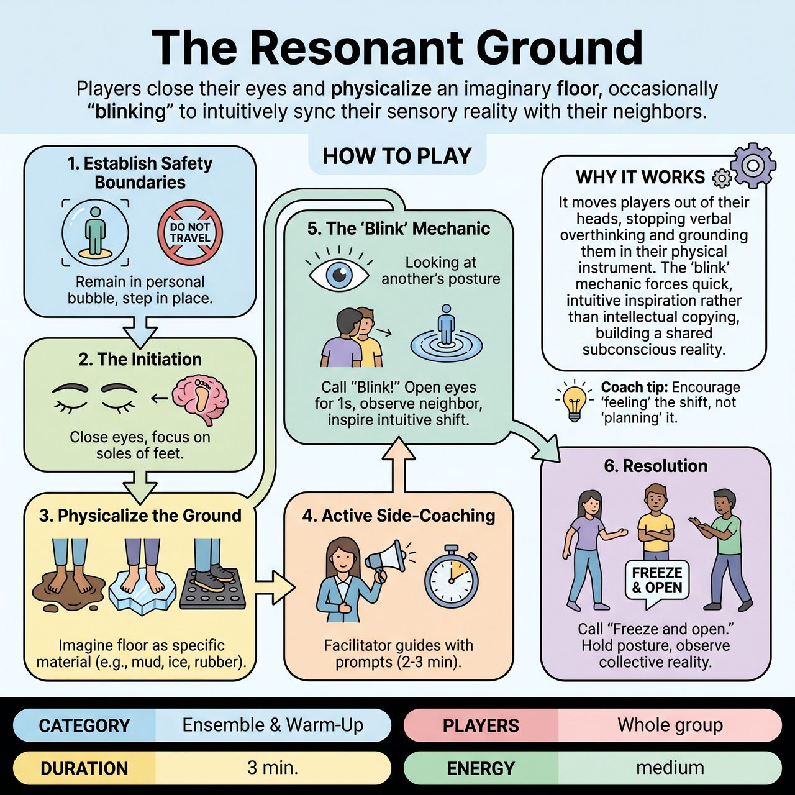

# The Resonant Ground

{ .game-hero }

> Players close their eyes and physicalize an imaginary floor, occasionally 'blinking' to intuitively sync their sensory reality with their neighbors.

## Overview
A 2-3 minute physical warm-up where players close their eyes and use their entire bodies to physicalize the texture, temperature, and consistency of an imaginary floor. Guided by facilitator side-coaching, players occasionally 'blink' to catch a glimpse of a neighbor's environment, letting it inspire an intuitive shift in their own sensory reality.

## Setup
Players spread out across the room. Each player must have a 'yoga mat' sized area of personal space where they can swing their arms without touching anyone or anything. The facilitator stands centrally where their voice can be easily heard.

## How to Play
1. Establish Safety Boundaries: Instruct players that they must remain in their designated personal bubble. They may step in place, but they cannot travel across the room. Hands should be kept up at chest level as 'bumpers' just in case.
2. The Initiation: On the facilitator's cue, players close their eyes and bring their focus to the soles of their feet.
3. Physicalize the Ground: Players imagine the floor beneath them transforming into a specific material (e.g., sticky mud, hot coals, slippery ice, bouncy rubber). They must continuously physicalize this through their posture, weight shifts, and foot movements.
4. Active Side-Coaching: The facilitator continuously guides the room for 2 to 3 minutes, using specific prompts to deepen the physical exploration without letting the energy drop.
5. The 'Blink': Every 30-40 seconds, the facilitator calls out 'Blink!' Players open their eyes for exactly one second, observe the physical choices of a nearby player, and immediately close their eyes again. They then let their own imaginary ground morph to match or react to what they just saw.
6. Resolution: After 2-3 minutes, the facilitator calls 'Freeze and open.' Players hold their final posture, open their eyes, and observe the collective physical sculpture the ensemble has created.

## Coaching Notes
- Use prompts like: 'Notice the temperature of the floor.' / 'How much effort does it take to lift your foot?' / 'Is the ground stable or shifting?' / 'Let the texture travel up your legs and change your spine.' / 'Breathe in the environment.'
- Keep the focus purely on process, presence, and non-verbal connection, as this is a non-competitive ensemble-building exercise without an audience or scoring.
- Ensure the energy doesn't drop during the 2-3 minutes of continuous physical exploration.

## Variations
- Guided Journey: Instead of players inventing their own ground, the facilitator dictates the environment for the whole room to explore simultaneously (e.g., 'You are walking on marshmallows... now shattered glass... now a giant trampoline').
- Vocalized Ground: Players add continuous, non-verbal sounds (squelches, cracks, hums, sighs) that match the texture of their floor, creating a collective, evolving soundscape.

## Why It Works
It moves players out of their heads, stopping verbal overthinking and grounding them in their physical instrument. The 'blink' mechanic forces quick, intuitive inspiration rather than intellectual copying, building a shared subconscious reality.

## Safety & Inclusion
Strictly enforce the 'personal bubble' rule or require players to keep one 'anchor foot' planted at all times to prevent collisions while eyes are closed. Hands should be kept up at chest level as 'bumpers'. Ensure the floor is entirely clear of bags, cords, or tripping hazards before starting. If a player has mobility limitations or uses a wheelchair, they can explore the textures using their hands on a table/lap, or focus entirely on upper-body posture, breath, and facial reactions.

