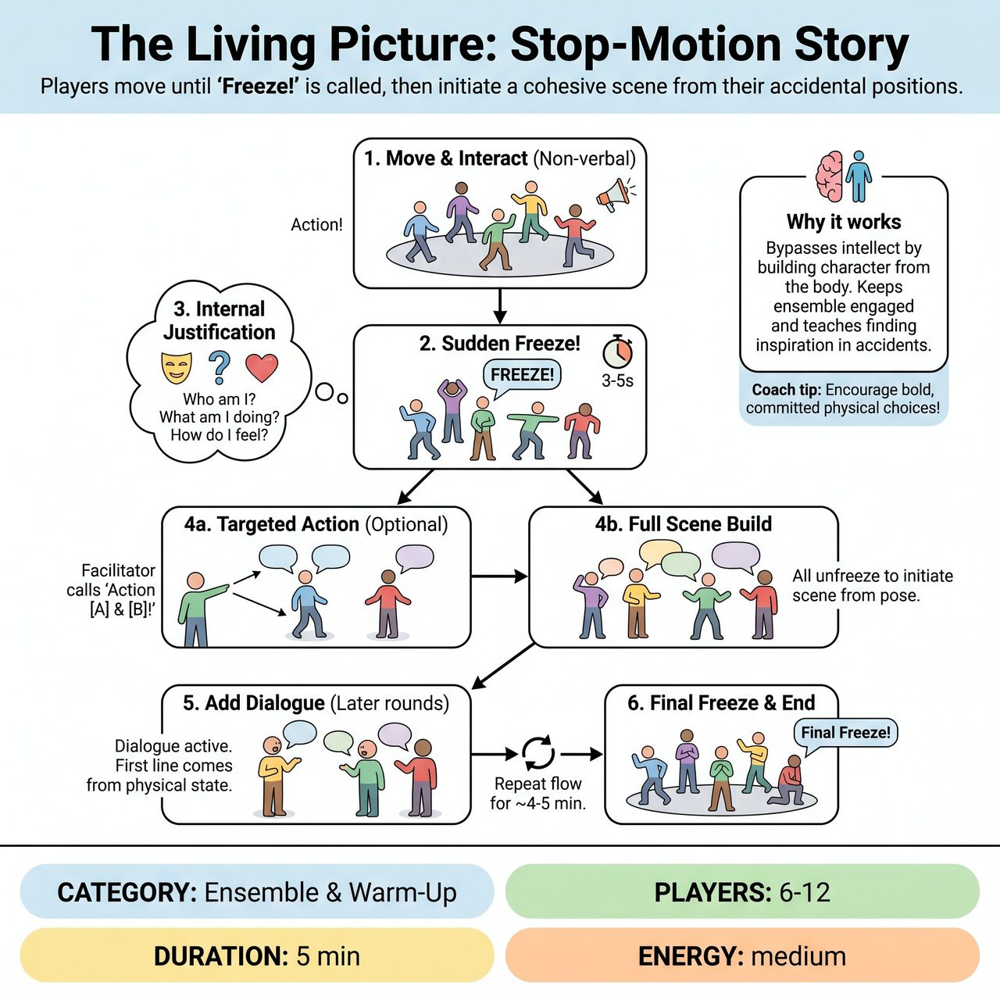

# The Living Picture: Stop-Motion Story

{ .game-hero }

> Players move organically until 'Freeze!' is called, then use their accidental physical positions to initiate a cohesive scene.

## Overview
A facilitator-led ensemble exercise that blends the 'stop-and-go' mechanic of childhood games with spontaneous tableau work. Players move organically until the facilitator calls 'Freeze!', then internally justify their exact physical position. When 'Action!' is called, they use that physical justification to initiate a cohesive scene, bypassing the intellect to build characters from pure physical impulse.

## Setup
Clear an open floor space with no props or chairs. The facilitator stands on the perimeter where they can see everyone. If the group is larger than 12, split them into two groups that take turns observing and playing.

## How to Play
1. The facilitator gives the ensemble a broad location or theme to inspire initial movement (e.g., 'A busy town square,' 'Waiting for important news,' or 'A secret laboratory').
2. The facilitator calls 'Action!' Players move through the space, interacting non-verbally. At any moment, the facilitator calls 'Freeze!' Players must instantly lock their bodies, facial expressions, and eye contact.
3. During the freeze (held for 3-5 seconds), players must silently ask themselves: 'Who am I? What am I doing? How do I feel about the person I am looking at?' based only on their current, accidental physical posture.
4. To prevent a chaotic stage and highlight specific relationships, the facilitator can call 'Action [Player A] and [Player B]!' Only those named players unfreeze and interact, while the rest of the group remains frozen as the background environment. The facilitator can then call 'Freeze!' and activate a different pair, or call 'Action All!' to resume full ensemble movement.
5. After a few rounds of silent movement, the facilitator announces that dialogue is now active. On the next 'Action!', players must speak, but their first line of dialogue must directly justify the exact physical position they were just frozen in. This bridges abstract movement into grounded, cohesive scene work.
6. The exercise runs for a set time limit (e.g., 4 to 5 minutes), or concludes when the facilitator calls 'Final Freeze!' and instructs the ensemble to make one last micro-adjustment to create a single, unified tableau that visually resolves the narrative.

## Coaching Notes
- The facilitator acts as an active side-coach, offering prompts during the freezes such as: 'Hold that physical tension,' 'Look at who is nearest to you and decide how you feel about them,' or 'Let your body dictate your emotion, don't plan it.'
- Remind players to find inspiration in accidents and spontaneous physical positioning.
- Encourage strong stage picture awareness and spatial relationship skills.

## Variations
- Blind Freeze: Players close their eyes during the 'Action' phase (moving slowly and safely with hands up as bumpers) and open them only on 'Freeze' to discover their unexpected relationships and proximity to others.
- Status Shift: On 'Action,' players must alter their movement and dialogue to play the exact opposite status (high vs. low) of whatever they were playing during the previous freeze.

## Why It Works
It bypasses the intellect by forcing players to start character creation from the body rather than the mind. It keeps the entire ensemble engaged simultaneously without elimination, and teaches players to find inspiration in accidents and spontaneous physical positioning while developing strong stage picture awareness and spatial relationship skills.

## Safety & Inclusion
Physical Safety: Remind players to freeze in safe, sustainable positions (no mid-air jumps, precarious balancing, or bearing another person's weight). Consent: Players must respect personal bubbles during the 'Action' phase; no physical contact without prior group consent. Accessibility: Players with mobility limitations can easily participate by focusing on facial expressions, upper body gestures, or vocalizations. The game can also be played entirely seated, focusing on posture and eye contact.

