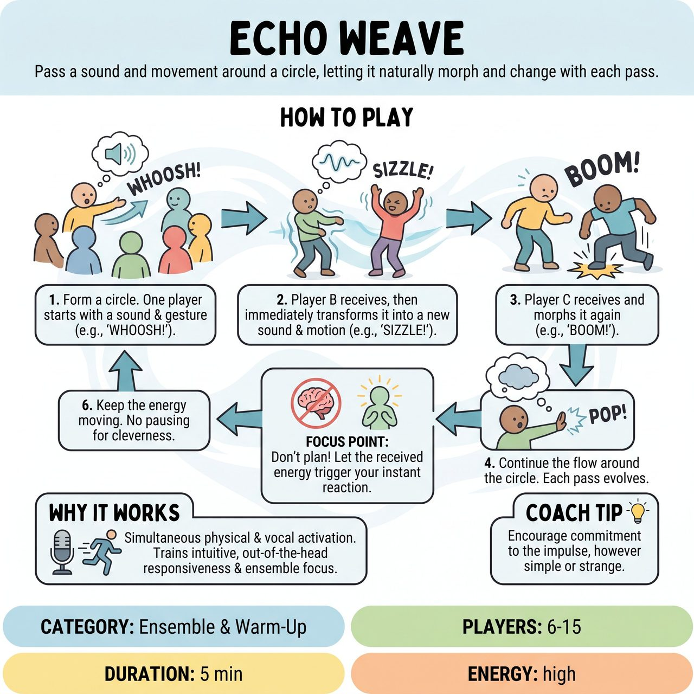

# Echo Weave

{ .game-hero }

> Pass a sound and movement around a circle, letting it naturally morph and change with each pass.

## Overview
Echo Weave is a high-energy circle warm-up where players pass a sound and movement to the person next to them, letting it naturally morph and change with each pass. By focusing on instantly reacting to the energy they receive, players get out of their heads, warm up their physical and vocal instruments, and build ensemble connection without the pressure of being clever.

## Setup
Players stand in a circle, about an arm's length apart to allow for full-body movement. No props or specific stage setup are required.

## How to Play
1. Form a circle. The facilitator designates one player to start.
2. Player A turns to Player B (on their left) and delivers a distinct, spontaneous sound and physical gesture. For example, a loud 'Whoosh!' while sweeping their arms forward.
3. Player B receives this energy, letting it physically affect them for a split second.
4. Player B immediately turns to Player C and delivers a new sound and motion inspired by what they just received. For example, the sweeping 'Whoosh!' might morph into a high-pitched 'Sizzle!' as Player B wiggles their fingers upward.
5. Player C receives the 'Sizzle!' and turns to Player D, transforming it again. For example, the upward wiggle becomes a heavy, downward stomping 'Boom!'.
6. The impulse continues around the circle. The Point of Concentration is simple: do not plan your move. Let the energy of the person before you trigger your instant reaction.

## Coaching Notes
- If the flow stops or someone freezes, the facilitator simply says 'Keep it moving!' and the player passes whatever sound or motion comes out of them in that exact moment, without judgment.
- The goal is purely developmental: achieving a seamless, unthinking flow of energy around the circle.
- Emphasize that there are no wrong sounds or motions, creating a safe, judgment-free zone.

## Variations
- Speed Weave: The facilitator challenges the group to pass the impulse as fast as humanly possible, completely eliminating the time needed for the brain to overthink or judge the transformation.
- Cross-Circle Weave: Instead of passing to the person next to them, players must make strong eye contact with someone across the circle and 'throw' the sound and motion to them. The receiver catches it, transforms it, and throws it to someone else.

## Why It Works
It provides simultaneous physical and vocal activation, training intuitive, out-of-the-head responsiveness. It builds ensemble focus and energy by forcing players to react instantly to the energy they receive.

## Safety & Inclusion
This game is entirely non-contact. Players should be encouraged to keep movements within their own physical comfort zones and mobility limits. The game is highly adaptable: players who are seated or have limited mobility can easily participate by focusing the transformations on their upper body, facial expressions, and vocalizations.

