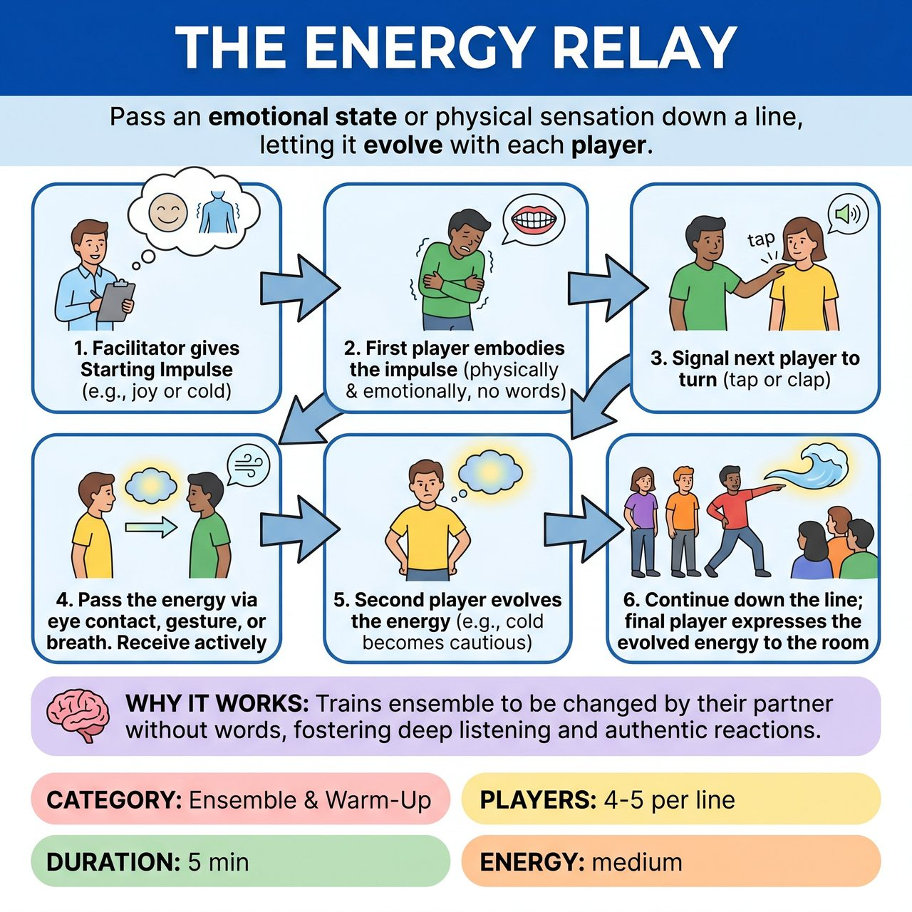

# The Energy Relay

{ .game-hero }

> Pass an emotional state or physical sensation down a line, letting it evolve with each player.

## Overview
A facilitator-led warm-up where players stand in a line and pass an emotional state or physical sensation down the row. Each player receives the energy, lets it change them, and passes a slightly evolved version to the next person. It trains the ensemble to actively listen, react authentically, and allow themselves to be altered by their scene partners without using words.

## Setup
Divide the group into lines of 4-5 players. Players stand single-file, facing the back of the person in front of them. Leave enough space between players for free movement. No props, chairs, or special staging are required.

## How to Play
1. The facilitator gives a 'Starting Impulse' to the first person in each line. This can be an emotion (e.g., joy, anxiety, relief) or a physical sensation (e.g., heavy, floating, freezing).
2. The first player embodies this impulse physically and emotionally, letting it affect their posture, breathing, and facial expression. No words are allowed, but non-verbal sounds (sighs, gasps, laughs) are encouraged.
3. When ready, the first player signals the second player to turn around. This is done via a shoulder tap if physical contact is consented to, or a sharp breath/clap if playing no-touch.
4. The first player 'passes' the energy to the second player through sustained eye contact, a gesture, or a shared breath. The second player must actively receive it, mirroring or absorbing the feeling.
5. The second player lets the received energy affect them, subtly shifting its intensity or reacting to it. For example, receiving 'anger' might evolve into 'defensiveness', or 'joy' might intensify into 'euphoria'. Crucially, the change must make logical emotional sense.
6. The second player then signals the third player to turn around, passing this newly evolved energy. This continues down the line.
7. When the final player receives the energy, they express its final form to the whole room. The facilitator then asks the group to trace the emotional journey backward to see how it evolved.

## Coaching Notes
- Observers (or players waiting their turn) practice active witnessing, noting how the energy shifts from person to person and identifying where the most authentic transformations occurred.
- Ensure the change makes logical emotional sense as a reaction or a shift, not a random jump to an unrelated feeling, to avoid the 'telephone' effect.
- Keep the Point of Concentration extremely well-defined, keeping players focused on non-verbal transmission rather than inventing narrative.
- Encourage deep ensemble listening and sustained eye contact.

## Variations
- Speed Circle: Instead of lines, the group stands in a circle facing inward. The facilitator throws an impulse in, and it is passed rapidly around the circle with quick, exaggerated sounds and motions. Great for high-energy warm-ups.
- Opposites React: Instead of absorbing and evolving the emotion, the receiving player must instantly embody the exact opposite emotional state (e.g., receiving 'frantic' and reacting with 'calm'). This trains quick emotional pivoting.

## Why It Works
It isolates the specific improv skill of allowing oneself to be physically and emotionally changed by a partner, fostering deep ensemble listening and authentic reactions without the pressure of inventing narrative.

## Safety & Inclusion
Consent check required: Explicitly establish physical boundaries before playing. Default to 'no-touch' (using eye contact, proximity, and sound to pass the energy) unless the group has explicitly consented to shoulder taps or hand-holding. Emotional safety: Players can always opt out of an intense or triggering emotion by simply passing a 'neutral breath' to the next person. Facilitators should avoid trauma-related prompts and keep impulses grounded in universal sensations.

