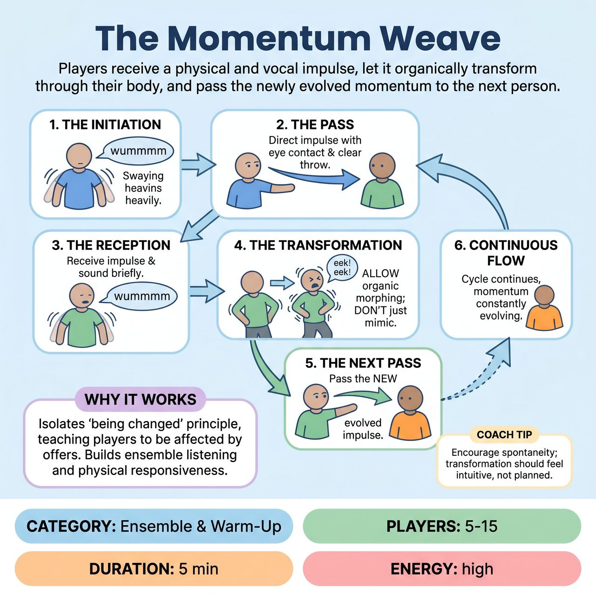

# The Momentum Weave

{ .game-hero }

> Players receive a physical and vocal impulse, let it organically transform through their body, and pass the newly evolved momentum to the next person.

## Overview
An evolution of classic 'Pass the Energy' or 'Sound and Motion' exercises, The Momentum Weave is a non-competitive, facilitator-led warm-up that isolates the improv principle of 'being changed.' Instead of simply mimicking a passed sound and gesture, players must receive an impulse, allow it to physically and vocally transform through their own body's intuition, and pass the newly evolved momentum to the next person. It builds deep ensemble listening, physical responsiveness, and gets players out of their heads.

## Setup
5 to 15 players stand or sit in a circle in an open space. No props or special staging are required. The facilitator stands just outside the circle to observe and side-coach.

## How to Play
1. The Initiation: Player A begins by creating a distinct, repetitive physical motion and an accompanying sound (e.g., a slow, heavy sway with a low, resonant 'wummmm'). This is the initial 'momentum'.
2. The Pass: Player A makes clear eye contact with any other player in the circle (Player B) and physically 'directs' or 'throws' this momentum toward them.
3. The Reception: Player B immediately receives the impulse, taking on the heavy sway and the 'wummmm' sound for just a brief second.
4. The Transformation: Crucially, Player B does not just repeat the motion. They allow the momentum to organically morph. The heavy sway might speed up into a frantic jitter, and the 'wummmm' might rise into a high-pitched 'eek-eek-eek'. The player must let their body react instinctively rather than planning the change.
5. The Next Pass: Once the momentum has transformed into this new state, Player B makes eye contact with Player C and passes the new jitter/'eek' impulse to them.
6. Continuous Flow: The cycle continues, with the momentum constantly evolving as it weaves across the circle. The goal is a continuous, unbroken chain reaction.

## Coaching Notes
- The facilitator actively manages the energy. If players get stuck in their heads, call out: 'Don't plan it, just let it change!', 'React first, think later!', or 'Speed it up, pass it hot!'
- If the energy drops, coach: 'Breathe it in!', 'Make it bigger!', or 'Let the sound move your spine!'
- The sender focuses on a clear, generous offering; the receiver focuses on physical sensation and instinctive reaction.
- Active side-coaching keeps the exercise dynamic and prevents the intellectualization of physical impulses.

## Variations
- Emotional Weave: Instead of abstract sounds and motions, players pass emotional states. A passed 'angry stomp' is received, felt, and organically transforms into a 'joyful skip' or a 'paranoid twitch' before being passed on.
- Environmental Weave: The facilitator calls out specific environments during the flow (e.g., 'Underwater!', 'Zero gravity!', 'Moving through thick mud!'). The players must instantly adapt the physics of the momentum they are passing and receiving to fit the new environment.

## Why It Works
It provides excellent isolation of the 'being changed' principle, teaching players to be affected by offers. It builds deep ensemble listening, physical responsiveness, and gets players out of their heads.

## Safety & Inclusion
This game requires no physical contact, making it highly safe. It is fully accessible to players using mobility devices or those who prefer to remain seated; the 'momentum' can be expressed entirely through facial expressions, upper-body posture, and vocalizations. If a player struggles with eye contact, the group can agree to use a clear pointing gesture or say the receiver's name to pass the momentum.

