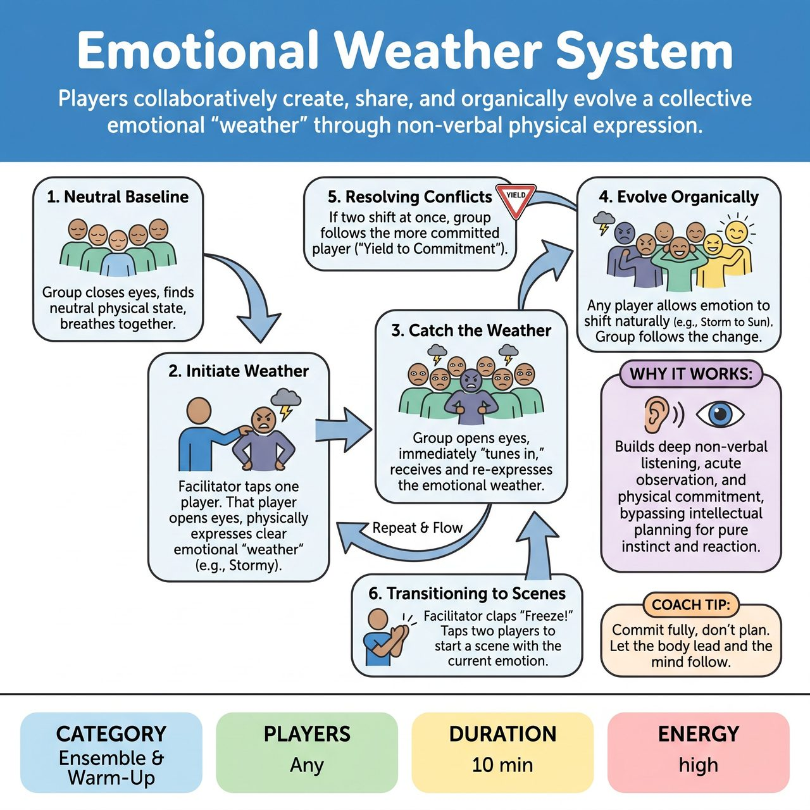

# Emotional Weather System

{ .game-hero }

> Players collaboratively create, share, and organically evolve a collective emotional 'weather' through non-verbal physical expression.

## Overview
A non-verbal, facilitator-led ensemble exercise where players collaboratively create, share, and evolve a collective emotional 'weather.' Starting with one player's physical and vocal expression, the emotion ripples through the group, organically shifting and transforming. It builds deep non-verbal listening, physical commitment, and group mind, serving as a powerful warm-up for emotionally grounded scene work.

## Setup
Players stand scattered throughout the space in a neutral position, with enough room to move freely. No props or chairs are needed. The facilitator stands on the perimeter to observe and side-coach.

## How to Play
1. The facilitator asks the group to close their eyes, take a deep breath together, and find a neutral physical baseline.
2. The facilitator taps one player on the shoulder to initiate. That player opens their eyes and begins expressing a clear emotional 'weather' using their entire body and non-verbal sounds (e.g., a simmering tension, a breezy joy, a heavy sorrow).
3. The rest of the group opens their eyes and immediately 'tunes in' to this player. They receive the emotional weather and re-express it through their own bodies, acting as a resonance chamber to amplify the feeling.
4. Once the baseline is established, any player can organically allow the emotion to shift or evolve (e.g., tension turning into frantic anxiety, or joy mellowing into peacefulness). The group must hyper-listen and follow these shifts.
5. RESOLVING CONFLICTS: If two players initiate different emotional shifts simultaneously, the group follows the principle of 'Yield to Commitment.' Players should intuitively gravitate toward the choice with the highest physical commitment, or allow the two emotions to naturally merge into a hybrid state.
6. TRANSITIONING TO SCENES: To turn the exercise into scene work, the facilitator claps and calls 'Freeze!' The facilitator then taps two players. Those two players step forward, retain their exact emotional posture and internal energy, and immediately begin a spoken scene using that feeling as their starting relationship dynamic.

## Coaching Notes
- To prevent stagnation, the facilitator should actively call out prompts during play.
- Call out: 'Breathe together!'
- Call out: 'Let the emotion reach your fingertips!'
- Call out: 'Amplify what you see!'
- Call out: 'Don't plan the next feeling, let it surprise you!'
- Call out: 'If you feel stuck, copy your neighbor exactly!'

## Variations
- The Volume Dial: The facilitator calls out numbers from 1 to 10 to dictate the intensity of the current emotional weather, forcing players to explore the subtle micro-expressions (1) and the maximum theatrical expressions (10) of a single feeling.
- Contagion: Instead of the whole group shifting at once, the emotion must be passed eye-to-eye. A player makes eye contact with someone else to infect them with the new emotion, which then spreads exponentially through the group.

## Why It Works
It forces deep non-verbal listening and acute visual observation while bypassing intellectual planning, rooting players in pure instinct and reaction. It also requires full physical and emotional commitment from every player, generating strong emotional baselines for the resulting scenes.

## Safety & Inclusion
Players should interpret emotions within their own physical mobility limits; full commitment means energetic commitment, not necessarily large acrobatic movements. Traumatic or genuinely distressing personal emotions should be avoided in favor of playable theatrical states. No physical contact is required, ensuring personal space boundaries are respected.

