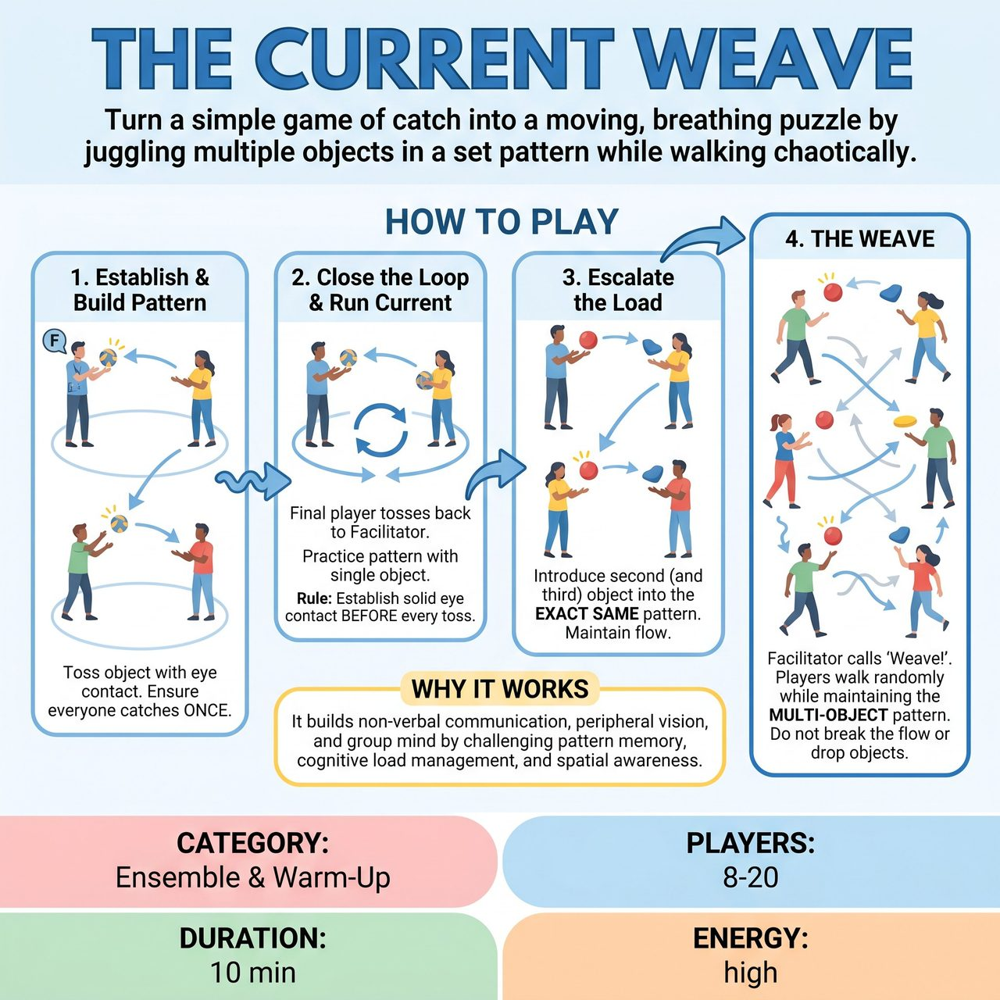

# The Current Weave

{ .game-hero }

> Turn a simple game of catch into a moving, breathing puzzle by juggling multiple objects in a set pattern while walking chaotically.

## Overview
A high-focus ensemble warm-up where players establish a set passing pattern with a single object, then must maintain that exact pattern as multiple objects are added and players begin moving chaotically around the space. It builds non-verbal communication, peripheral vision, and group mind by turning a simple game of catch into a moving, breathing puzzle.

## Setup
Gather 8-20 players in a large circle in an open space. You will need 3 to 5 soft, easily catchable objects (e.g., soft fabric balls, beanbags, rolled-up socks, or rubber chickens). A facilitator stands in the circle to lead the exercise and side-coach.

## How to Play
1. Establish the Pattern: The facilitator holds one soft object, makes strong eye contact with a player across the circle, and gently underhand-tosses it to them.
2. Build the Circuit: That receiving player makes eye contact with someone who has NOT yet received the object, and tosses it to them. Players should hold their hands up if they haven't received it yet, and drop their hands once they have.
3. Close the Loop: This continues until everyone has caught the object exactly once. The final person tosses it back to the facilitator. Everyone must memorize exactly who they caught the object from, and who they threw it to.
4. Run the Current: Practice this established pattern a few times with the single object. The core rule is: You must make solid, non-verbal eye contact with your target BEFORE the object leaves your hands.
5. Escalate the Load: Once the single object is flowing smoothly, the facilitator introduces a second object into the exact same pattern, waiting a few seconds between throws. Then add a third, and a fourth. If an object drops, players simply pick it up and continue the flow without stopping or apologizing.
6. The Weave: Once the group is successfully juggling multiple objects, the facilitator calls out 'Weave!' Players must begin walking slowly and randomly around the room, abandoning the circle. They must maintain the exact same passing sequence, tracking their specific sender and receiver as everyone moves.

## Coaching Notes
- Prompt players to 'Make eye contact first!' and 'Throw to the person, not the space!'
- Remind the group to 'Breathe together!' and 'See the whole room!'
- If an object drops, encourage players to celebrate the mistake and keep going.
- Ensure players are managing their cognitive load and maintaining strict non-verbal communication.

## Variations
- Reverse the Current: Once the pattern is established and flowing, the facilitator claps their hands and calls 'Reverse!' The entire pattern must instantly flow backwards.
- Sound Weave: Instead of physical objects, pass a specific sound, word, or physical gesture in the established pattern. Add multiple different sounds to 'juggle' them verbally.

## Why It Works
It builds non-verbal communication, peripheral vision, and group mind by challenging pattern memory, cognitive load management, and spatial awareness.

## Safety & Inclusion
Use only soft, lightweight objects to prevent injury. Emphasize gentle, underhand tosses. For players with limited mobility, they may remain stationary while the rest of the group 'weaves' around them, or the movement phase can be skipped entirely.

