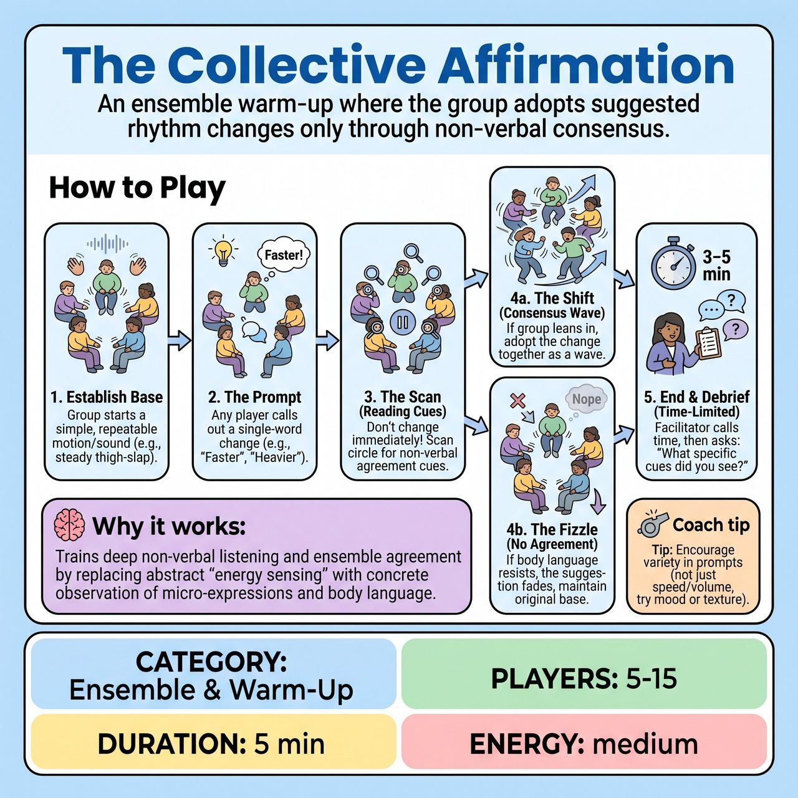

# The Collective Affirmation

{ .game-hero }

> An ensemble warm-up where the group adopts suggested rhythm changes only through non-verbal consensus.

## Overview
A focused ensemble warm-up where the group maintains a shared physical or vocal rhythm. Anyone can suggest a one-word change, but the group only adopts it if they non-verbally agree. It trains deep listening and 'group mind' by forcing players to read micro-expressions and body language before acting, moving as a single organism.

## Setup
Players stand in a circle where everyone has a clear line of sight to all other participants. No props or special staging are required.

## How to Play
1. Establish the Base: The facilitator or a designated player starts a simple, repeatable motion and/or sound (e.g., a steady thigh-slap, a gentle sway, or a low hum). Everyone joins in exact unison, creating a shared 'pulse'.
2. The Prompt: At any time, any player can call out a single-word modifier suggesting a change (e.g., 'Faster', 'Heavier', 'Joyful', 'Staccato', 'Fluid').
3. The Scan (Reading Cues): Players must resist the urge to change their motion immediately. Instead, they scan the circle for concrete, non-verbal cues of agreement. Players should look for: widened eyes, a collective sharp inhale, a slight lean forward, or micro-movements that hint at the suggested change.
4. The Shift or Fizzle: If a player sees the group physically leaning into the change, they adopt it, creating a wave of consensus. If the group's body language remains neutral, hesitant, or out of sync, the group maintains the original pulse and the prompt simply dies.
5. Ending Condition: To prevent the exercise from dragging, the facilitator sets a strict time limit (usually 3 to 5 minutes). The facilitator ends the game by calling 'And... Neutral!' while the group is still highly engaged.
6. Structured Debrief: The facilitator immediately leads a brief discussion, asking: 'When a prompt was accepted, what specific physical cues did you see?' and 'When a prompt failed, what did the group's resistance look like?' This aligns the ensemble's understanding of their own non-verbal dynamics.

## Coaching Notes
- Side-coach by reminding players to 'look at the eyes', 'breathe together', or 'wait for the group'.
- Ensure the focus remains on ensemble connection rather than individual performance.

## Variations
- Blind Affirmation: Players close their eyes and rely purely on auditory cues (shifts in collective breathing, volume, or tempo) to sense agreement and execute the shift.
- Character Pulse: Instead of abstract qualities, prompts are character archetypes or states (e.g., 'Zombies', 'Royalty', 'Thieves'), requiring the group to shift their entire physical center and attitude together.

## Why It Works
It trains deep non-verbal listening and ensemble agreement by replacing abstract 'energy sensing' with concrete observation of micro-expressions and body language.

## Safety & Inclusion
Highly inclusive and physically safe. Instruct the group that all base pulses and shifts must be physically accessible to everyone in the circle. Players are encouraged to adapt any motion to their own mobility needs (e.g., tapping a shoulder instead of jumping). No physical contact is required.

