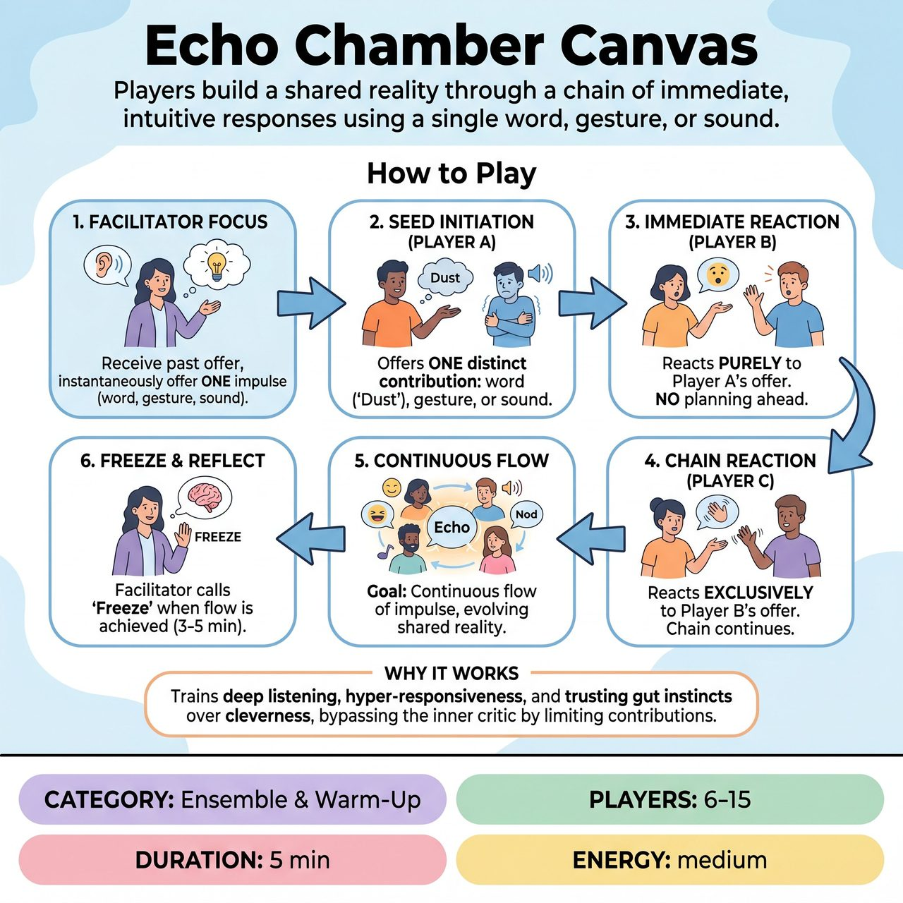

# Echo Chamber Canvas

{ .game-hero }

> Players build a shared reality through a chain of immediate, intuitive responses using a single word, gesture, or sound.

## Overview
Echo Chamber Canvas is a facilitator-led ensemble warm-up where players build a shared reality—an environment, mood, or situation—through a chain of immediate, intuitive responses. Bypassing intellectual planning, players in a circle offer a single word, gesture, or sound that organically reacts only to the immediately preceding contribution.

## Setup
Players stand or sit in a circle. The facilitator stands just outside the circle to observe and side-coach. No props, chairs, or special staging are required.

## How to Play
1. The facilitator explains the primary focus: 'Receive the immediate past contribution, and instantaneously offer a single word, gesture, or sound that feels like a natural extension or reaction to it.'
2. Player A initiates the 'seed' with one distinct contribution. This can be a single word (e.g., 'Dust'), a single gesture (e.g., a quick shiver), or a single sound (e.g., a heavy sigh).
3. Moving clockwise, Player B immediately offers their own single contribution. They must not plan ahead; they must react purely to Player A's offer.
4. Player C then reacts exclusively to Player B's offer, and the chain continues around the circle. The goal is a continuous flow of impulse, creating an evolving mosaic of a shared reality.
5. The exercise continues until the group achieves a state of flow and shared group mind, usually after 3-5 minutes, at which point the facilitator calls 'Freeze and release.'

## Coaching Notes
- FACILITATOR PACING: If players naturally speed up into a frantic panic, side-coach: 'Breathe, take your time, stay in the rhythm.' If the rhythm drags and players are overthinking, side-coach: 'Trust your gut, first thought, go.'
- COURSE-CORRECTING: If the chain becomes disjointed because players are 'gagging' (making jokes for a laugh) or trying to force a clever narrative, the facilitator should side-coach: 'Let go of the joke, just react to the sound or movement.'
- RESETTING: If the chain completely breaks or stalls, the facilitator gently calls 'Reset' and points to the next player in the circle to start a brand new seed, keeping the energy moving without judgment.
- As a non-competitive format, there are no points, judges, or audience suggestions. The 'win' is the process itself: achieving a state of flow, bypassing the inner critic, and functioning as a unified ensemble.

## Variations
- Canvas to Scene (Transition): The circle builds the abstract canvas as usual. When a clear environment, mood, or relationship emerges in the chain, the facilitator calls 'Step in!' The last two players to contribute immediately step into the center of the circle and begin a grounded, 2-person scene inspired by the canvas they just built, using full dialogue and movement.
- Center-Step Canvas: Instead of passing the impulse around the circle's edge, players step into the center to make their contribution (sound/gesture/word), leaving it there, and stepping back. The center becomes a physical, evolving 'sculpture' of the canvas.
- Eyes Closed: For advanced groups, play the game with eyes closed, relying entirely on auditory cues (words and sounds) and the physical sense of presence in the room.

## Why It Works
It trains deep listening, hyper-responsiveness, and the ability to trust gut instincts over cleverness. It brilliantly isolates the principle of immediate, unfiltered response and bypasses the 'inner critic' by limiting contributions to a single word, sound, or gesture, training players to let go of controlling the narrative and trust the group mind.

## Safety & Inclusion
Highly inclusive and safe for players of all physical abilities and experience levels, as gestures can be as small as a facial expression and sounds can be quiet. To reduce performance anxiety, the facilitator must establish that there are 'no wrong answers.' If a player completely freezes, they can simply tap their chest to 'pass' the energy to the next person, keeping the rhythm alive without feeling put on the spot.

