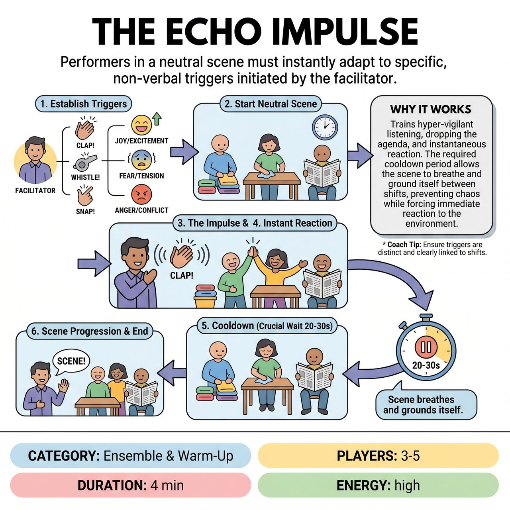

# The Echo Impulse

{ .game-hero }

> Performers in a neutral scene must instantly adapt to specific, non-verbal triggers initiated by the facilitator.

## Overview
A facilitator-led ensemble exercise where performers start a neutral scene and must instantly adapt to one of three specific, non-verbal triggers initiated by the facilitator. The scene shifts states based on the cues, with built-in cooldowns to let the scene breathe and ground itself between shifts.

## Setup
3 to 5 performers on stage. No props or chairs are needed. The facilitator stands downstage or in the house where they are clearly visible and audible, but not physically in the scene.

## How to Play
1. Establish Triggers: The facilitator teaches the performers exactly THREE non-verbal triggers, each tied to a specific emotional or physical shift (e.g., A Clap = Extreme Sadness; A Foot Stomp = Move in Slow Motion; A Finger Snap = Intense Paranoia/Suspicion).
2. Start Neutral: Performers begin a grounded, mundane scene (e.g., folding laundry, waiting for a bus, working in a kitchen). No specific plot is assigned.
3. The Impulse: At any point, the facilitator triggers one of the three sounds.
4. Instant Reaction: Upon hearing the signal, all performers must immediately and simultaneously adopt the new state without dropping the scene's context or breaking character. They must justify the sudden shift using the reality of the scene.
5. The Cooldown (Crucial): The facilitator must wait at least 20 to 30 seconds before initiating another trigger. This cooldown period is essential; it allows the performers to establish the new reality, explore the emotional shift, and prevent the scene from devolving into chaos.
6. Scene Progression: The scene continues, shifting states based on the facilitator's cues, until the facilitator calls 'Scene!' (usually after 3-5 minutes or once all triggers have been thoroughly explored).

## Coaching Notes
- The facilitator acts as the sole caller to maintain pacing and prevent cognitive overload.
- Ensure the 'cooldown' periods are respected; this built-in pacing control ensures scenes remain grounded.
- The observing audience should focus on the performers' ability to justify the sudden shifts and maintain ensemble connection.
- Encourage players to surrender intellectual planning and rely on immediate reactions.

## Variations
- The Caller: Rotate a student into the facilitator role to practice pacing, reading a scene's needs, and learning when a scene has earned its next shift.
- Genre/Style Echo: Change the three triggers to represent genres or theatrical styles (e.g., Clap = Western, Stomp = Sci-Fi, Snap = Soap Opera) instead of emotions or physicalities.

## Why It Works
It trains hyper-vigilant listening, dropping the agenda, and instantaneous reaction. The required cooldown period allows the scene to breathe and ground itself between shifts, preventing chaos while forcing immediate reaction to the environment outside the immediate scene.

## Safety & Inclusion
Physical Safety: Ensure the playing space is clear of tripping hazards, especially if physical shifts (like slow motion) are used. Emotional Safety: Triggers should avoid trauma-inducing states; emotions like 'Sadness' or 'Paranoia' should be played theatrically, and players can always opt out or modify if a state feels unsafe. Accessibility: Triggers can be easily adapted for Deaf/HoH players (using colored visual flags instead of sounds) or for players with mobility needs (focusing purely on vocal/emotional shifts rather than physical movement).

