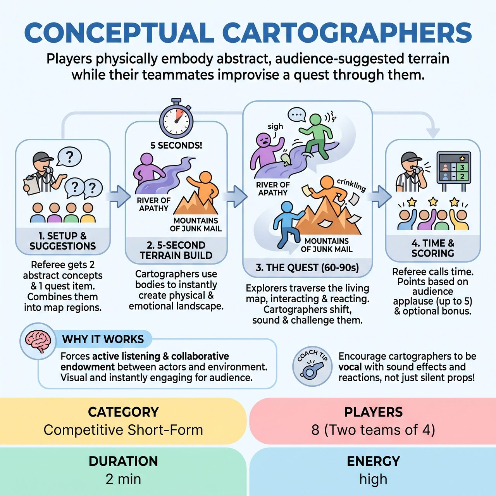

# Conceptual Cartographers

{ .game-hero }

> Players physically embody abstract, audience-suggested terrain while their teammates improvise a quest through them.

## Overview
A fast-paced, competitive short-form game where players physically embody abstract, audience-suggested terrain while their teammates improvise a quest through them. It tests physical comedy, rapid endowment, and collaborative environmental scene work, turning abstract ideas into hilarious physical obstacles.

## Setup
Played in a competitive short-form format. Two teams of 4 players each. For each round, 2 players act as 'Cartographers' (the living map) and 2 players act as 'Explorers'. A Referee stands center stage to host, time the scene, and call fouls. No props or chairs are used.

## How to Play
1. 1. Get All Suggestions Upfront: The Referee asks the audience for two abstract concepts (e.g., an emotion, a minor annoyance, a philosophical idea) and one simple quest objective. Example: 'Apathy', 'Junk Mail', and 'Returning a borrowed lawnmower'.
2. 2. Name the Map: The Referee combines these into regions, announcing, 'Explorers, you must navigate The River of Apathy and The Mountains of Junk Mail to return this lawnmower!'
3. 3. Five-Second Setup: The Referee yells 'Go!' The two Cartographers have exactly 5 seconds to jump onto the stage and establish their terrain using their bodies, positioning, and ambient sounds.
4. 4. The Expedition Begins: The two Explorers enter immediately. They have 60 to 90 seconds to complete their quest while navigating the map.
5. 5. Interact with the Environment: Explorers must actively traverse, react to, and interact with the Cartographers, treating them as the literal physical and emotional environment.
6. 6. Living Terrain: Cartographers are not frozen statues. They must actively shift, react, make sound effects, and alter their shape to challenge or help the Explorers. They can pulse their movements or rest in a neutral 'ambient' stance when the scene's focus shifts away from them.
7. 7. Scene Call: The Referee blows the whistle and calls 'Time!' after 60-90 seconds, or on a strong punchline. The opposing team then takes the stage with new suggestions.
8. 8. Scoring: The Referee awards up to 5 points per team based on audience applause at the end of their scene. Bonus points (1-2 points) can be awarded at the Referee's discretion for exceptional physical choices or seamless teamwork.

## Coaching Notes
- Maintain high-energy pacing with zero downtime between suggestions and scene start.
- Encourage rapid-fire physical comedy and non-literal environment work.
- Call standard fouls if necessary: 'Content Foul' (loss of points for inappropriate/dirty content), 'Groaner' (for terrible puns), and 'Delay of Game' (if Cartographers take longer than 5 seconds to set up).

## Variations
- The Shifting Map: The Referee can blow the whistle mid-scene and yell 'Earthquake!', forcing the Cartographers to instantly swap concepts or physically relocate on stage, forcing the Explorers to adapt.
- Solo Explorer / Triple Threat: For different team sizes, use 3 Cartographers and 1 Explorer. The lone Explorer must narrate their inner monologue as they navigate a much denser, more chaotic landscape.

## Why It Works
It forces active listening and collaborative endowment between the environment and the actors. The game is highly visual and instantly engaging for an audience, turning abstract ideas into hilarious physical obstacles.

## Safety & Inclusion
Cartographers must avoid locking their joints or holding painful static poses; the 'Living Terrain' rule explicitly encourages them to shift, breathe, and rest to prevent physical strain. Explorers must practice safe, consensual touch when interacting with the terrain (e.g., no pulling, pushing, bearing weight on, or climbing on other players). Players with mobility limitations can portray terrain vocally, with upper-body gestures, or from a seated position, focusing on the emotional/vocal endowment of the region rather than full-body acrobatics.

