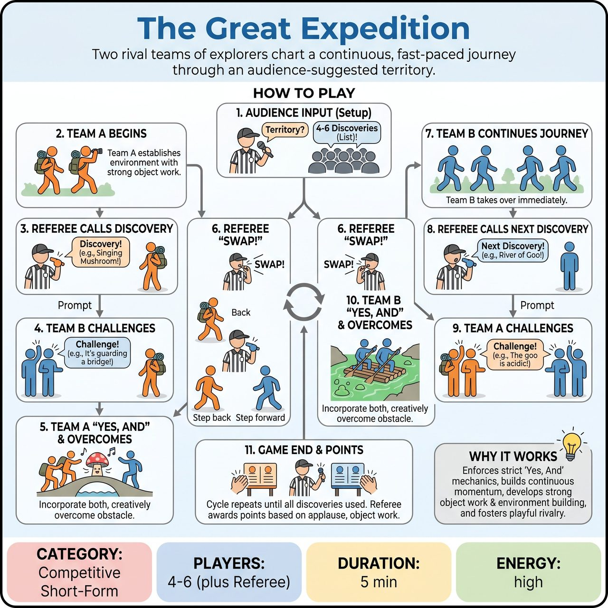

# The Great Expedition

{ .game-hero }

> Two rival teams of explorers chart a continuous, fast-paced journey through an audience-suggested territory.

## Overview
Two rival teams of explorers chart a continuous, fast-paced journey through an audience-suggested territory. Armed with a list of 'discoveries' gathered upfront from the audience, the Referee throws these elements into the scene dynamically. As the active team encounters a discovery, the opposing team throws a verbal 'Challenge' they must overcome, swapping back and forth until the expedition concludes.

## Setup
Two teams line up on opposite sides of the stage. The Referee stands downstage center or off to the side with a clipboard or notepad. No props or set pieces are used; the environment is entirely mimed. The Referee gathers all audience suggestions before the scene begins to ensure continuous play.

## How to Play
1. The Referee asks the audience for an 'Uncharted Territory' (e.g., The Whispering Woods, The Molten Marshes).
2. The Referee then asks the audience for 4 to 6 'Discoveries' (items, creatures, or phenomena) and writes them down (e.g., a singing mushroom, a river of goo, a grumpy rock monster).
3. Team A sends 2-3 explorers center stage to begin exploring the territory, establishing the environment through strong object work and mime.
4. The Referee calls out the first Discovery from their list (e.g., 'Suddenly, you encounter the singing mushroom!').
5. Team A immediately incorporates the discovery. Within 5 seconds, Team B (from the sidelines) shouts exactly one 'Challenge!' to complicate the discovery (e.g., 'It shatters glass when it hits a high note!').
6. Team A must 'Yes, And' both the discovery and the challenge, overcoming the obstacle creatively and physically.
7. Once the challenge is resolved, the Referee blows the whistle and calls 'Swap!' Team A steps back, and Team B immediately steps in to continue the exact same expedition from where it left off.
8. The Referee throws the next Discovery at Team B, Team A shouts a Challenge, and the cycle continues without stopping.
9. The game ends when all discoveries are used. The Referee awards up to 5 points per team at the end of the game based on audience applause, object work, and narrative flow.

## Coaching Notes
- Maintain continuous momentum; upfront suggestions eliminate scene-stopping audience polls.
- Foster playful rivalry through the opposing team providing the obstacles.
- Place heavy emphasis on object work and environment building.
- Call a 'Sabotage Foul' (-1 point) if a challenge is mean-spirited, impossible to play, or breaks the reality of the scene.
- Call a 'content foul' (-1 point) for inappropriate or non-family-friendly content.

## Variations
- Genre Expedition: Every time the Referee calls 'Swap!', they also call out a new movie or theater genre (e.g., Sci-Fi, Western, Noir) that the new team must immediately adopt while continuing the story.
- Gibberish Expedition: The entire exploration is done in gibberish, relying entirely on physical object work, mime, and emotional tone to communicate the discoveries and challenges.

## Why It Works
It enforces strict 'Yes, And' mechanics through the Discovery/Challenge structure, builds continuous momentum without stopping for polls, and develops heavy emphasis on object work and environment building while fostering playful rivalry.

## Safety & Inclusion
The 'Sabotage Foul' explicitly protects players from 'pimping' (forcing a player into an uncomfortable, dangerous, or impossible situation). Challenges must be obstacles for the characters, not the actors. Content remains clean and family-friendly; the Referee filters upfront suggestions to ensure they are safe and appropriate. Players are reminded to respect physical boundaries and personal space during high-energy object work.

