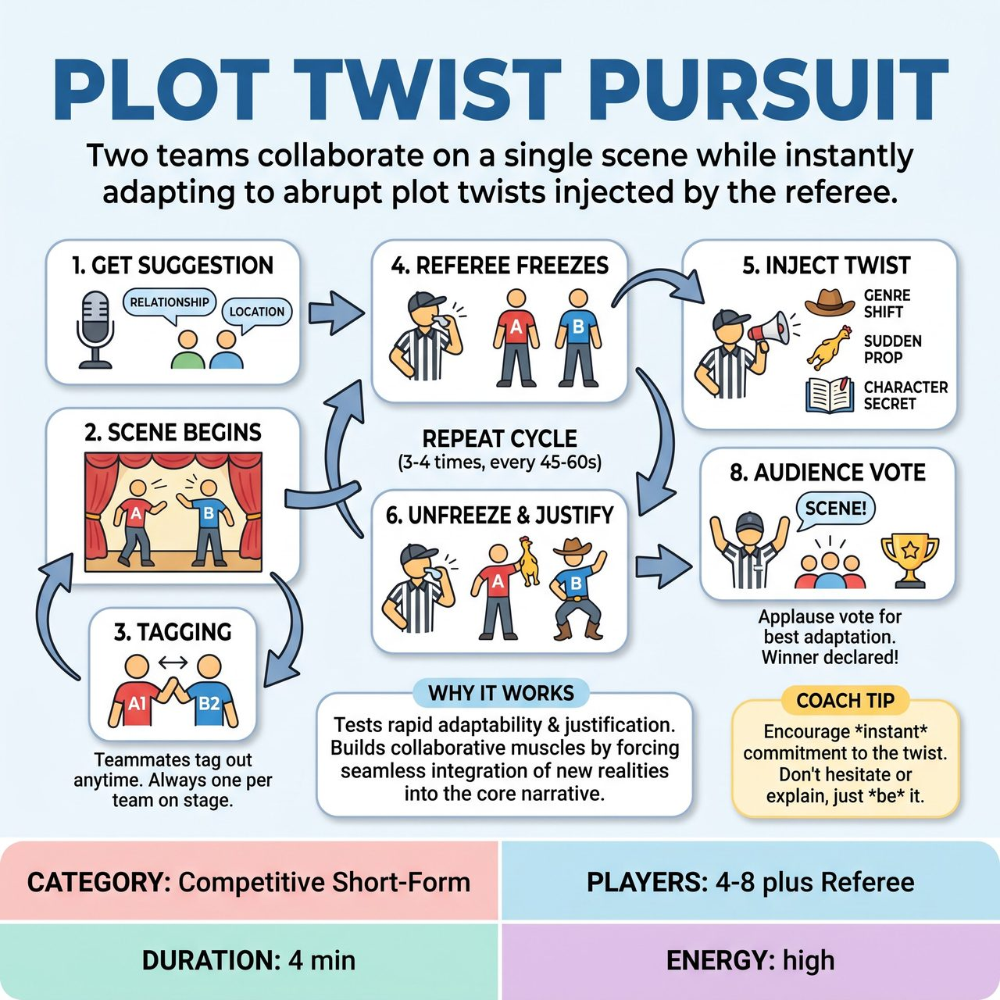

# Plot Twist Pursuit

{ .game-hero }

> Two teams collaborate on a single scene while instantly adapting to abrupt plot twists injected by the referee.

## Overview
A competitive, high-energy short-form game where two teams collaborate on a single scene, but must instantly adapt to abrupt 'Plot Twists' injected by the referee. As the scene unfolds, the referee periodically freezes the action to add new genres, bizarre props, or dramatic secrets, forcing the players to justify the sudden changes while keeping the core narrative alive.

## Setup
Two teams stand on opposite wings of the stage. The Referee stands downstage or in the house with a whistle, a list of 'Twists' (or a bucket of twists written by the audience), and a few safe, physical props nearby. One player from Team A and one player from Team B step center stage to begin.

## How to Play
1. The Referee gets a base suggestion from the audience to start the scene, such as a relationship and a location.
2. One player from Team A and one player from Team B begin improvising the scene based on the suggestion.
3. Players on the wings can tag out their own teammate at any time to enter the scene (Team A tags Team A; Team B tags Team B). There should always be exactly one player from each team on stage.
4. Every 45 to 60 seconds (or whenever the scene establishes a solid reality and needs a bump), the Referee blows the whistle. The players on stage must instantly freeze.
5. The Referee announces a Plot Twist. This can be a Genre Shift, a Sudden Prop, or a Character Secret.
6. The Referee blows the whistle again to unfreeze the action. The players must immediately incorporate and justify the twist, treating it as the new reality of the scene without dropping the original narrative thread.
7. The scene continues, with players tagging in and out, and the Referee injecting a new twist every 45-60 seconds.
8. After 3 to 4 twists (roughly 3-4 minutes), the Referee blows the whistle and calls 'Scene!'
9. The Referee asks the audience to vote by applause for which team did the best job of adapting to the twists and driving the story. The winning team is awarded the match points.

## Coaching Notes
- Pacing is crucial: let the players actually play with the twist before hitting them with another one.
- Encourage players on the wings to use tag-outs to keep the energy high and rescue teammates.
- Players must focus on justifying the twist as the new reality rather than just acknowledging it and moving on.
- The Referee can call standard short-form fouls during the scene (like the 'content foul' for inappropriate content or a 'Groaner' foul for terrible puns) to deduct points from a team's overall match score.

## Variations
- Audience Twist Bucket: Before the show, have the audience write down 'Secrets' or 'Genres' on slips of paper. The Referee draws these blindly from a bucket when calling a twist, making the game highly interactive.
- Director's Cut: Instead of random twists, the Referee plays the role of a demanding Hollywood Director. They yell 'Cut!', give the actors a bizarre note, and yell 'Action!' to resume.

## Why It Works
The game tests rapid adaptability and justification. By forcing players to seamlessly integrate bizarre new realities while maintaining the core narrative, it builds strong collaborative muscles even within a competitive framework.

## Safety & Inclusion
The Referee must ensure twists do not force players into uncomfortable physical situations, non-consensual intimacy, or harmful stereotypes. The 'content foul' strictly enforces family-friendly boundaries. When using the 'Sudden Prop' twist, the Referee should hand the prop safely to the player rather than throwing it. Players are encouraged to focus on emotional reactions and narrative justification rather than physical escalation.

