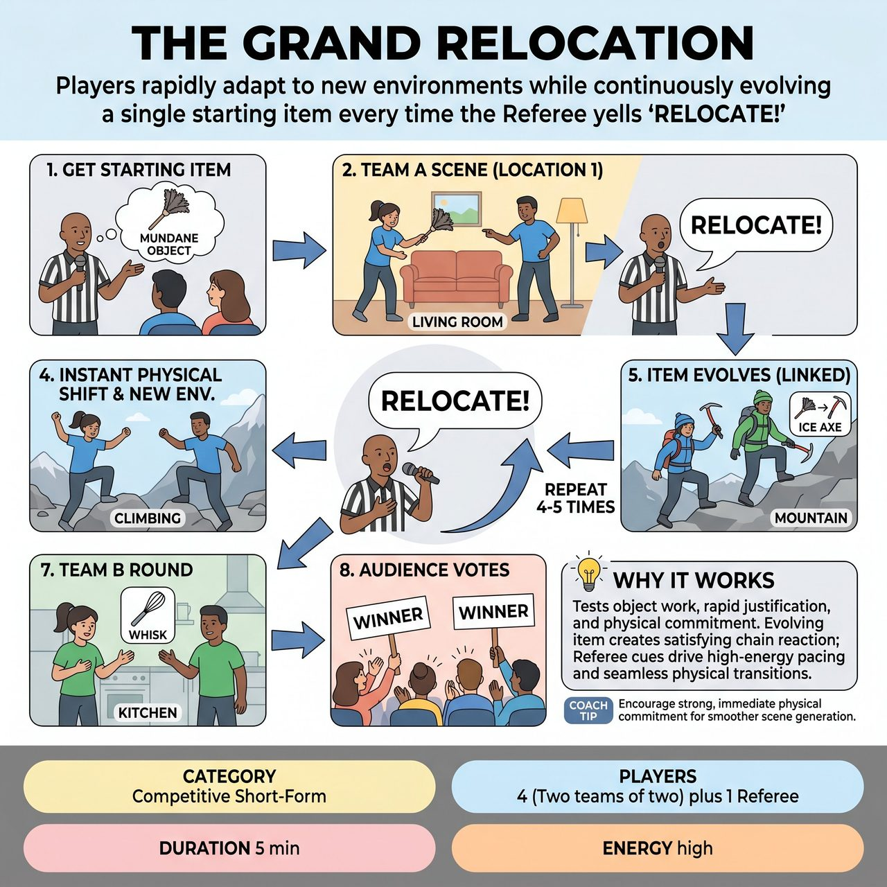

# The Grand Relocation

{ .game-hero }

> Players rapidly adapt to new environments while continuously evolving a single starting item every time the Referee yells 'RELOCATE!'

## Overview
A fast-paced, competitive short-form game where players must rapidly adapt to new environments while continuously evolving a single starting item. Beginning with an audience-suggested mundane object, players establish a scene. Whenever the Referee yells 'RELOCATE!', the players must instantly shift their physicality to organically create a brand-new setting, simultaneously transforming the previous scene's item into something that logically fits the new world.

## Setup
Format: Competitive Short-Form. Two teams of two players. A Referee manages the flow, calls fouls, and keeps score. The Referee asks the audience for a mundane, everyday object (e.g., a spatula, a rubber chicken, a plunger) to serve as the Starting Item. No other suggestions or overarching objectives are needed.

## How to Play
1. The Referee gets a Starting Item from the audience and starts the clock.
2. Team A's two players step forward and immediately begin a scene in a location of their own choosing, heavily featuring the Starting Item through pantomime and dialogue.
3. After 15-20 seconds, or on a strong comedic beat, the Referee shouts 'RELOCATE!'
4. Without pausing the scene, the players must instantly change their physical activity and organically endow a completely new environment based on their new physicality.
5. Crucially, the item from the previous scene must 'evolve' into a new object that fits the new environment, maintaining some conceptual or physical link (e.g., a spatula in a kitchen becomes a rowing paddle in a canoe, which then becomes a giant lever in a mad scientist's lab).
6. The Referee calls 'RELOCATE!' 4 to 5 times per team, forcing rapid, seamless transitions.
7. After Team A's round, Team B takes the stage with a brand-new Starting Item from the audience and completes their own series of relocations.
8. Teams earn 5 points for every successful, seamless relocation where the item logically evolves. The audience determines the overall winner via applause at the end of the match, with their laughter serving as the primary metric for a successful evolution.

## Coaching Notes
- The Referee can call a 'Lost Luggage' foul (-2 points) if players drop the item concept entirely.
- The Referee can call a 'Waffling' foul (-2 points) for hesitation during a transition.
- The Referee actively monitors for family-friendly content, issuing a clean-content foul for inappropriate environments or object uses.
- Encourage rapid justification and creative object work.
- Ensure seamless physical transitions without stopping the scene.
- Focus on evolving the item concept to create a satisfying chain reaction.

## Variations
- The Itinerary: Instead of players organically endowing the locations, the Referee gathers 5 distinct environments from the audience BEFORE the round begins. At each 'RELOCATE!' cue, the Referee announces the next location from the list. This maintains pacing while keeping the audience heavily involved in the locations.
- Prop Relocation: Instead of pantomime, give the players a neutral physical object (like a foam pool noodle or a plain wooden block). They must physically manipulate the real object to represent the evolving item in each new environment.

## Why It Works
It is a high-energy test of object work, rapid justification, and physical commitment. The evolving item concept creates a satisfying chain reaction, while the Referee's cues drive high-energy pacing and force seamless physical transitions.

## Safety & Inclusion
Physical Safety: Because transitions are instantaneous, players must be coached to avoid dangerous physical choices (e.g., jumping, lifting partners, or sudden drops to the floor). 'Keep one foot on the floor' is a good baseline rule for relocations. Accessibility: For players with limited mobility, 'Relocations' can be driven entirely by vocal shifts, emotional changes, or upper-body object work rather than full-stage movement.

