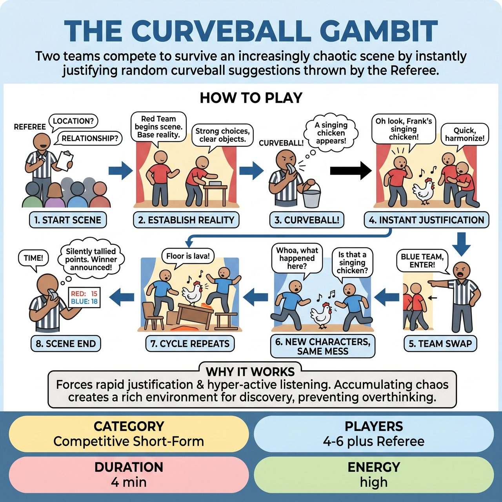

# The Curveball Gambit

{ .game-hero }

> Two teams compete to survive an increasingly chaotic scene by instantly justifying random curveball suggestions thrown by the Referee.

## Overview
Two teams compete to survive an increasingly chaotic scene by instantly justifying random curveball suggestions thrown by the Referee. When teams switch, the new team tags in as entirely new characters arriving at the exact same location, forcing them to deal with the accumulating absurdity left behind. The Referee silently tallies points while the scene plays out to maintain breakneck momentum.

## Setup
Requires two teams (Red and Blue) with 2 to 3 players each, and a Referee. The Referee needs a whistle or buzzer, a clipboard for silent scorekeeping, and a bucket of pre-collected audience curveballs written on slips of paper. Get a starting location and an initial relationship from the audience.

## How to Play
1. The Referee gets a location and a relationship from the audience, then sends the Red Team to center stage to begin the scene.
2. The Red Team establishes the base reality, focusing on strong character choices and clear object work.
3. At a random moment, the Referee blows the whistle and shouts 'CURVEBALL!' followed immediately by reading a random suggestion from the bucket.
4. The active team must instantly justify and incorporate the curveball without breaking the reality of the scene, without ignoring it or pausing to discuss it.
5. After 1 to 2 curveballs, the Referee blows the whistle and shouts 'BLUE TEAM, ENTER!' and the Red Team immediately clears the stage.
6. The Blue Team rushes on as entirely NEW characters arriving at the SAME location. They must acknowledge and interact with the altered environment.
7. The cycle repeats, with the Referee throwing new curveballs and swapping teams. The scene's reality becomes a stacked tower of accumulating chaos.
8. After 3 to 4 minutes, the Referee calls 'Time!', halts the scene, and announces the silently tallied points to declare a winner.

## Coaching Notes
- To keep the game lightning-fast, the Referee does not stop the scene to award points, but silently tallies 5 points for every seamlessly integrated curveball.
- Silently mark a 'Delay of Game' foul (-5 points) if a team ignores a curveball or takes too long to justify it.
- Standard competitive short-form match fouls (a clean-content call for inappropriate content, Groaner for terrible puns) apply and are called out loud.
- At the end of the game, announce the total integration points, then ask the audience to cheer for their favorite team's performance, awarding a final 5-point 'Audience Favorite' bonus.
- Encourage players to focus on rapid justification and hyper-active listening to maintain continuous momentum.

## Variations
- The Gauntlet: Played as an exhibition or warm-up where a single team stays on stage for a full 3 minutes, surviving as many rapid-fire curveballs as the Referee can throw at them.
- Genre Curveballs: Instead of random objects or events, every curveball is a distinct film, television, or theatrical genre, turning the game into a high-speed, accumulating style-shifting challenge.

## Why It Works
The game forces rapid justification and hyper-active listening. The accumulating chaos mechanic creates a rich, hilarious environment for new characters to discover, while the continuous momentum prevents players from overthinking.

## Safety & Inclusion
The Referee acts as the ultimate safety filter, pre-screening all written audience curveballs to ensure they are family-friendly and physically safe to perform. Players must maintain spatial awareness, especially when reacting to environmental curveballs (like 'earthquake' or 'zero gravity') to avoid accidental collisions. Strict enforcement of the clean-content foul ensures all content remains clean and accessible for all ages.

