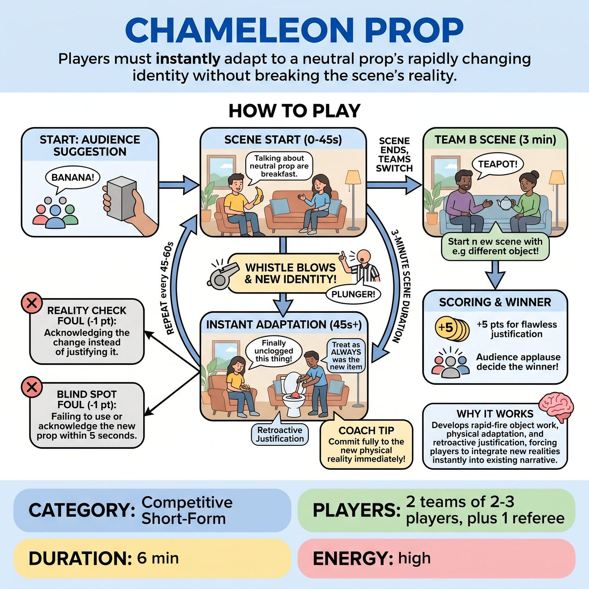

# Chameleon Prop

{ .game-hero }

> Players must instantly adapt to a neutral prop's rapidly changing identity without breaking the scene's reality.

## Overview
A fast-paced, competitive short-form game where a team builds a scene around a single neutral prop. At the referee's whistle, the prop's identity changes entirely, and players must instantly adapt. They must treat the prop as if it had always been the new item without breaking the scene's reality.

## Setup
Requires a referee, two competing teams (2-3 players each), and one neutral, physically safe prop (like a wooden block, a rolled-up towel, or a foam cylinder) placed center stage.

## How to Play
1. The referee asks the audience for an everyday object to serve as the initial identity of the neutral prop.
2. Team A takes the stage for a 3-minute scene, initiating a narrative that utilizes the prop as the audience's suggested object.
3. After a scene beat is established (roughly 45-60 seconds in), the referee blows the whistle and shouts a completely new object (e.g., 'It is a plunger!').
4. Players must immediately adapt their physical object work and dialogue to reflect the new item, retroactively justifying it as if the object was ALWAYS the new item.
5. The referee enforces the 'Reality Check Foul', penalizing players 1 point if they acknowledge the change instead of instantly justifying the new reality.
6. The referee enforces the 'Blind Spot Foul', penalizing players 1 point who fail to physically use or acknowledge the new prop within 5 seconds of the whistle.
7. The referee continues to change the prop's identity every 45-60 seconds while Team A owns the entire 3-minute scene.
8. After 3 minutes, Team A's scene ends. Team B then takes the stage for their own 3-minute scene, starting with a fresh audience suggestion.
9. The referee awards up to 5 points per scene for flawless, instant justifications, and the audience votes by applause to determine the overall winner.

## Coaching Notes
- Focus heavily on rapid-fire object work and physical adaptation.
- Ensure players practice retroactive justification, making the new truth fit the old context seamlessly.
- Strictly call the 'Reality Check Foul' if players say things like 'Whoa, my sword just turned into a plunger!'
- Strictly call the 'Blind Spot Foul' to keep the pace up and force immediate interaction with the new prop.
- Maintain a high-energy, family-friendly competitive format with clear referee mechanics.

## Variations
- Chameleon Location: The prop stays exactly the same, but the referee blows the whistle to change the LOCATION of the scene, forcing players to use the prop in a completely new context.
- Audience Chameleons: Instead of the referee calling the new objects, the referee points to pre-selected audience members who shout out the next prop identity when the whistle blows.

## Why It Works
The game develops rapid-fire object work, physical adaptation, and retroactive justification. It forces players to instantly accept a new reality and weave it into an existing narrative context without dropping the scene's established truth.

## Safety & Inclusion
Use a soft, lightweight neutral prop (like foam or a towel) to prevent injury during fast physical changes. Enforce the standard clean-content call for any inappropriate content to maintain an all-ages environment. Ensure players do not throw the prop at each other during frantic transitions.

