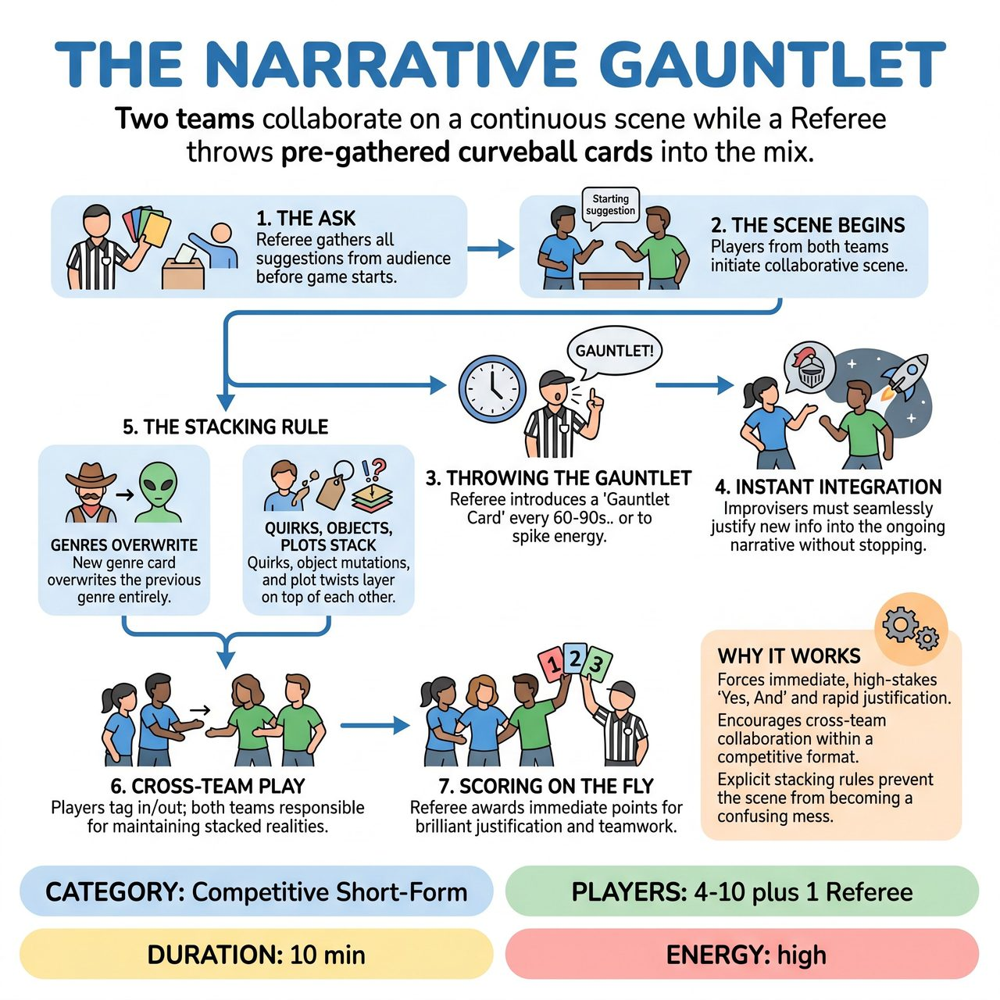

# The Narrative Gauntlet

{ .game-hero }

> Two teams collaborate on a continuous scene while a Referee throws pre-gathered curveball cards into the mix.

## Overview
Two teams collaborate on a single, continuous scene while a Referee periodically throws pre-gathered 'Gauntlet Cards' (genre shifts, character quirks, plot twists) into the mix. Players must instantly justify and integrate these curveballs without breaking the scene's momentum, earning points for seamless teamwork and brilliant 'Yes, And' adaptation.

## Setup
Requires two teams (e.g., Red and Blue) and a Referee. Before the scene begins, the Referee gathers 4 to 5 specific suggestions from the audience (e.g., a bizarre genre, a magical object, a strange physical quirk, a shocking secret) and writes them on physical index cards. The Referee also gets a standard suggestion (like a location or relationship) to start the base scene.

## How to Play
1. The Ask: The Referee gathers all 'Gauntlet' suggestions from the audience before the game starts. This prevents momentum-killing pauses later. The Referee holds these as a deck of cards.
2. The Scene Begins: Players from both teams step forward to initiate the scene based on the starting suggestion. They collaborate to build a grounded narrative.
3. Throwing the Gauntlet: Every 60 to 90 seconds (or whenever the scene plateaus and needs an energy spike), the Referee shouts 'GAUNTLET!' and immediately reads one of the pre-gathered cards aloud (e.g., 'GAUNTLET: The genre is now Sci-Fi Horror!').
4. Instant Integration: The scene does not stop. The improvisers must instantly absorb the new information mid-sentence and seamlessly justify it into the ongoing reality.
5. The Stacking Rule: To maintain clarity, conditions apply as follows: Genres OVERWRITE the previous genre. Character Quirks, Object Mutations, and Plot Twists STACK and remain true for the rest of the scene.
6. Cross-Team Play: Players can tag in and out, but the narrative remains continuous. Both teams are responsible for keeping the stacked realities alive.
7. Scoring on the Fly: The Referee awards points (1 to 3) immediately after a card is integrated, rewarding the specific team(s) whose players brilliantly justified the new element or supported their scene partner.

## Coaching Notes
- The Referee awards points based on integration: +1 for basic acceptance, +2 for clever justification, +3 for 'Narrative Gold' (making the scene exponentially better).
- Fouls include the 'Content Foul' (inappropriate content, loss of points) and the 'Groaner Foul' (lazy or pun-based justification that ignores the reality of the scene).
- The audience provides all the ammunition upfront and is encouraged to cheer for smooth integrations and playfully groan at fouls.
- Pre-gathered prompts preserve scene momentum and eliminate awkward pauses.

## Variations
- Blind Gauntlet: Instead of the audience, the teams write the Gauntlet Cards for each other before the match, handing them to the Referee. Players have no idea what their opponents have cooked up.
- Director's Cut (Long-Form): Remove the points and Referee. A 'Director' uses a pre-written deck of cards to navigate a 10-15 minute narrative, focusing on emotional grounding and theatrical transitions rather than rapid-fire comedy.

## Why It Works
Forces immediate, high-stakes 'Yes, And' and rapid justification. Encourages cross-team collaboration within a competitive format. Explicit stacking rules prevent the scene from becoming a confusing mess.

## Safety & Inclusion
The Referee must filter audience suggestions upfront to ensure they are family-friendly and safe. When asking for 'Character Quirks' or 'Conditions', explicitly guide the audience toward absurd, magical, or behavioral traits (e.g., 'allergic to vowels', 'secretly a werewolf') rather than real-world medical conditions or disabilities. This prevents punching down and keeps the game inclusive.

