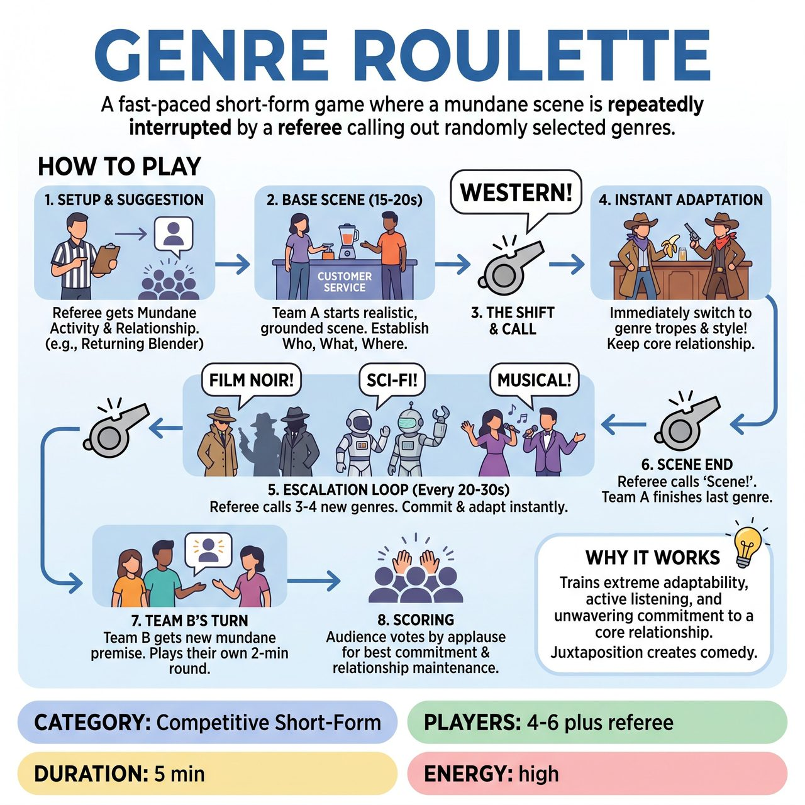

# Genre Roulette

{ .game-hero }

> A fast-paced short-form game where a mundane scene is repeatedly interrupted by a referee calling out randomly selected genres.

## Overview
A fast-paced, competitive short-form game where a team improvises a mundane scene that is repeatedly interrupted by a referee calling out randomly selected genres. Players must instantly adapt their acting style, tropes, and physicalities to the new genre while strictly maintaining the original character relationship and scene objective. The comedy comes from the fierce commitment to playing epic or dramatic styles layered over ordinary, everyday situations.

## Setup
Two teams of 2-3 players each. A referee with a whistle and a curated list of genres (or a physical 'Genre Wheel'). A timekeeper. The game is played in two halves: Team A plays a full round, then Team B plays a full round.

## How to Play
1. 1. Suggestion: The referee asks the audience for a mundane, everyday activity (e.g., 'returning a broken blender to a store') and a specific relationship between two people (e.g., 'dentist and patient') for Team A.
2. 2. Base Scene: Team A begins the scene in a realistic, grounded style. They have 15-20 seconds to establish the who, what, and where, cementing their relationship and the mundane task.
3. 3. The Shift: The referee blows the whistle, pausing the action, and announces a new genre from their list or wheel (e.g., 'Western!').
4. 4. Instant Adaptation: Team A immediately resumes the scene, instantly adopting the tropes, physicality, and dialogue style of a Western. Crucially, they must not change the fact that they are a dentist and patient returning a blender; they simply filter that reality through the new genre.
5. 5. Escalation: Every 20-30 seconds, the referee blows the whistle and calls a new genre (e.g., 'Film Noir!', 'Sci-Fi!', 'Musical!'). Team A plays through 3 to 4 genres total, escalating the stakes of their mundane task each time.
6. 6. Scene End: After the final genre has been played for about 30 seconds, the referee blows the whistle and calls 'Scene!'
7. 7. Team B's Turn: Team B takes the stage. The referee gets a completely new mundane activity and relationship from the audience. Team B plays their own 2-minute round, navigating 3 to 4 different genres called by the referee.
8. 8. Scoring: After both teams have played, the referee asks the audience to vote by applause for the team that best maintained their core premise while fully committing to the genre shifts. The winning team receives 5 points.

## Coaching Notes
- The referee can blow the whistle to call a 'Delay of Game' foul (-1 point) if players hesitate or fail to change their style immediately.
- The referee can call a 'clean-content' foul (-1 point) for inappropriate content.
- Ensure players maintain the juxtaposition of mundane, everyday premises with epic, dramatic, or absurd genres.
- Remind players that the core relationship and objective must remain unwavering despite the genre shifts.

## Variations
- Director's Cut: Instead of a referee calling genres on a timer, a third player from the team acts as a 'Director'. The Director can call 'Cut!', announce a new genre, and force the players to rewind and play the exact same 10-second interaction again in the new style.
- Emotion Roulette: Instead of cinematic genres, the referee calls out extreme, contrasting emotions or physical states (e.g., 'Paranoia!', 'Overwhelming Joy!', 'Zero Gravity!').

## Why It Works
It tests extreme adaptability, active listening, and unwavering commitment to a core relationship. The clean, alternating-team structure prevents stage chaos and makes scoring easy, while the juxtaposition of mundane tasks with epic genres creates natural comedy.

## Safety & Inclusion
Physical safety must be maintained during rapid shifts; players should avoid actual tackling, falling, or dangerous stunts when shifting to high-action genres like 'Action Movie' or 'Slapstick'. To ensure inclusivity, the referee must curate the genre list beforehand to ensure all genres are trope-based rather than identity-based, avoiding any styles that invite cultural stereotyping or offensive caricatures. Strict enforcement of the 'clean-content' rule keeps the content family-friendly and accessible to all ages.

