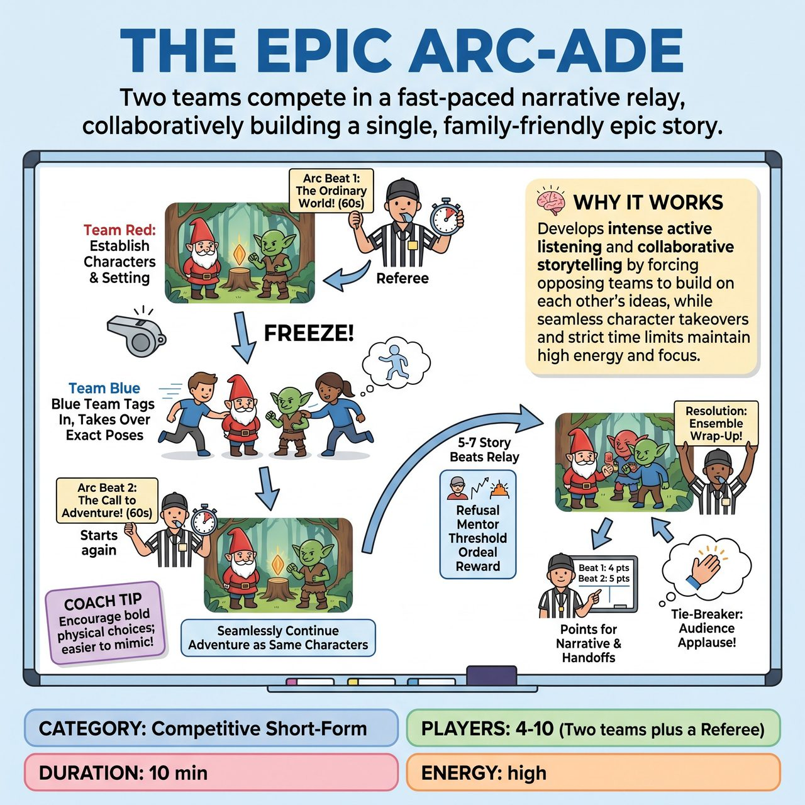

# The Epic Arc-ade

{ .game-hero }

> Two teams compete in a fast-paced narrative relay, collaboratively building a single, family-friendly epic story.

## Overview
Two teams compete in a fast-paced narrative relay, collaboratively building a single epic story. Guided by a Referee who calls out classic narrative story beats, teams take alternating 60-second turns to advance the plot. When the whistle blows, the incoming team tags out the active players, taking over their exact characters and physical positions to seamlessly continue the adventure.

## Setup
Requires a Referee, two teams (e.g., Red and Blue) waiting on the wings, and a clear center stage. The Referee asks the audience for three suggestions: a Main Character (e.g., 'a grumpy gnome'), a Fantastic Setting (e.g., 'a glittering swamp'), and a Mysterious MacGuffin (e.g., 'a magical rubber ducky'). The Referee announces these clearly as the core building blocks of the story.

## How to Play
1. The Referee announces the first story beat (e.g., 'Arc Beat 1: The Ordinary World!') and starts the 60-second clock for Team Red.
2. Two players from Team Red step center stage and begin the scene, establishing the character, setting, and MacGuffin within the context of that specific story beat.
3. At the 60-second mark, the Referee blows the whistle and calls 'FREEZE!'
4. Team Red players freeze in place. Two players from Team Blue immediately rush in, gently tap the Red players on the shoulder, and assume their exact physical positions.
5. Team Blue must now play the exact same characters that Team Red established (e.g., if Red was playing Gnomio and Gnobby, Blue is now playing Gnomio and Gnobby). The outgoing Team Red players immediately leave the stage.
6. The Referee announces the next beat (e.g., 'Arc Beat 2: The Call to Adventure!') and starts the next 60-second clock. Team Blue must seamlessly justify the physical positions and continue the story as those exact characters, advancing the plot to fit the new beat.
7. This relay continues back and forth through 5 to 7 classic story beats (e.g., Refusal of the Call, Meeting the Mentor, Crossing the Threshold, The Ordeal, The Resolution).
8. For the final 'Resolution' beat, the Referee may allow both teams to enter the stage together to wrap up the story as an ensemble.
9. The Referee awards 1 to 5 points per beat based on narrative progression, seamless character handoffs, and adherence to the specific Arc Beat.
10. At the end, if scores are tied, an audience applause meter decides the ultimate winner.

## Coaching Notes
- Classic narrative structure provides clear goals for each scene.
- Seamless character takeover/tag-out mechanics force intense active listening.
- 60-second time limits ensure scenes have enough time to develop while maintaining high energy.
- Deductions (fouls) are given for 'Narrative Disconnect' (-2 points for ignoring established facts or changing characters) or 'Slow Roll' (-1 point for taking more than 3 seconds to tag in).
- The audience provides the initial prompts, and their laughter and cheers heavily influence the Referee's scoring.

## Variations
- Genre Arc-ade: Instead of the classic narrative arc, use beats from a specific genre, such as a Rom-Com (The Meet Cute, The Misunderstanding, The Grand Gesture) or a Heist (Assembling the Crew, The Infiltration, The Double Cross).
- Perspective Shift: Instead of taking over the exact same characters, the incoming team plays the antagonists or sidekicks reacting to the exact same story beat in a parallel location, building out the world.

## Why It Works
It develops intense active listening and collaborative storytelling by forcing opposing teams to build on each other's ideas, while the seamless character takeover mechanics and strict time limits maintain high energy and narrative focus.

## Safety & Inclusion
Physical safety is paramount during the rapid tag-outs; players must tap in gently without shoving or rushing blindly. For players with mobility restrictions, verbal tags ('Tag Gnomio', 'Tag Gnobby') can replace physical touch and exact posture matching. The Referee strictly enforces a content foul for any blue humor, swearing, or unsafe content, ensuring the game remains family-friendly and accessible to all ages.

