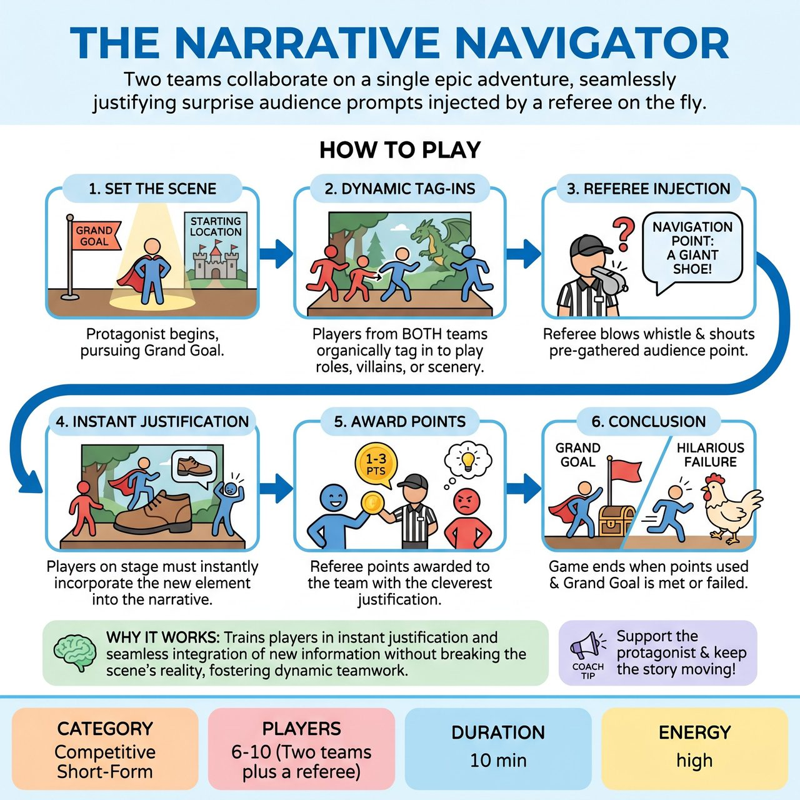

# The Narrative Navigator

{ .game-hero }

> Two teams collaborate on a single epic adventure, seamlessly justifying surprise audience prompts injected by a referee on the fly.

## Overview
A fast-paced, competitive storytelling game where two teams collaborate on a single epic adventure. A core protagonist remains on stage while teammates and opponents organically tag in to play supporting characters, obstacles, and environments. The twist is that the referee injects pre-gathered audience Navigation Points on the fly, forcing the players to instantly justify new locations, emotions, or obstacles without breaking the scene flow.

## Setup
Two teams line up on opposite wings. The referee gets a Protagonist, a Grand Goal, and a Starting Location from the audience. Crucially, the referee also gathers 5 to 7 Navigation Points (random objects, locations, or emotional states) upfront and writes them on a visible board. One player is chosen as the Protagonist and stays on stage for the entire game.

## How to Play
1. The Protagonist begins the scene in the Starting Location, pursuing the Grand Goal.
2. Players from BOTH teams organically tag in and out to play supporting characters, villains, or physical scenery. There are no rigid turns; players enter when they have a strong offer.
3. At random intervals, the referee blows a whistle and shouts one of the pre-gathered Navigation Points (e.g., 'Navigation Point: A giant shoe!').
4. The players currently on stage must instantly incorporate this new element into the continuous narrative without stopping or freezing the scene.
5. The referee awards points (e.g., 1 to 3 points) to the team whose player makes the most clever, seamless, or hilarious justification of the Navigation Point.
6. The game concludes when all Navigation Points have been used and the Protagonist either achieves or hilariously fails the Grand Goal. The team with the most points wins.

## Coaching Notes
- Maintain a continuous narrative flow without stop-and-start interruptions when Navigation Points are called.
- Encourage organic tag-ins to allow for dynamic pacing and teamwork.
- The consistent Protagonist anchors the story and prevents character confusion; remind them to stay grounded.
- Upfront prompt gathering keeps the energy high and gives the referee control over pacing.
- Let audience laughter and cheers guide the referee scoring.
- Apply standard short-form fouls (content foul for inappropriate content, groaner for bad puns), costing teams points.

## Variations
- Buddy Comedy: Two protagonists (one from each team) stay on stage the entire time, forcing direct collaboration between the competing teams.
- Blind Navigation: The referee gathers the Navigation Points on cards and does not reveal them to the players or audience until the exact moment they are shouted out.

## Why It Works
It trains players in instant justification and seamless integration of new information without breaking the reality of the scene. The organic tag-ins develop dynamic pacing and teamwork, while the single protagonist structure prevents the narrative from becoming overly chaotic.

## Safety & Inclusion
The referee actively vets all audience suggestions upfront to ensure they are family-friendly and safe. Organic tag-ins allow players to step in and rescue teammates who might be stuck or uncomfortable. Physical boundaries must be respected during fast-paced tag-outs, and players should avoid aggressive physical choices.

