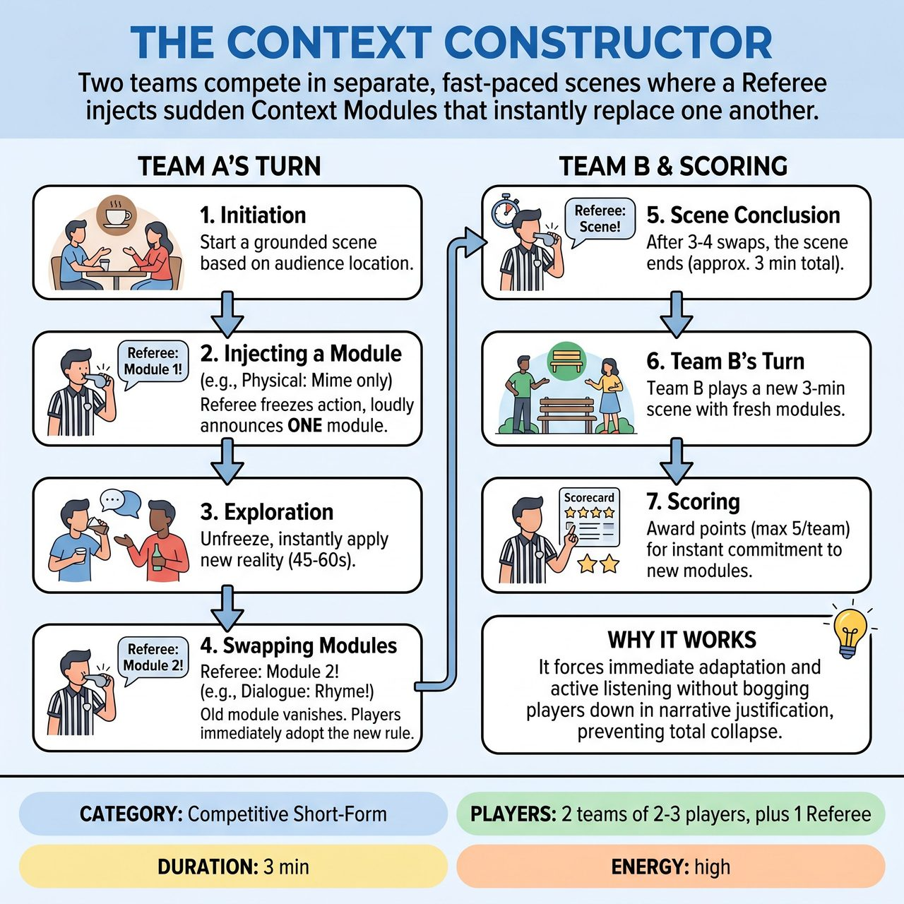

# The Context Constructor

{ .game-hero }

> Two teams compete in separate, fast-paced scenes where a Referee injects sudden Context Modules that instantly replace one another.

## Overview
Two teams compete in separate, fast-paced scenes where a Referee injects sudden 'Context Modules' (a physical constraint, a dialogue rule, or a character quirk). Crucially, only ONE module is active at a time. When the Referee calls a new module, the old one instantly vanishes with no explanation needed, and players must immediately adopt the new reality while continuing their scene. Teams earn points for seamless adaptation, high energy, and keeping the base narrative alive through the chaos.

## Setup
Two teams (e.g., Red and Blue) sit on the sidelines. A Referee stands downstage or off to the side with a whistle and a list of pre-written 'Context Modules' divided into three categories: Environment (e.g., 'The floor is ice'), Dialogue (e.g., 'Speak only in questions'), and Character (e.g., 'You are terrified of eye contact'). The Referee gets a mundane location suggestion from the audience (e.g., a laundromat, a dentist's office) for Team A. The audience can also write module suggestions on slips of paper before the match.

## How to Play
1. 1. Initiation: Team A sends two to three players center stage to begin a grounded, normal scene based on the audience's location suggestion.
2. 2. Injecting a Module: After 30-45 seconds of establishing the base reality, the Referee blows the whistle, freezing the action. The Referee loudly announces ONE Context Module (e.g., 'Environment Module: The room is filling with water!').
3. 3. Exploration: The players unfreeze and instantly apply this new reality to the scene. They play this out for 45-60 seconds, allowing enough time to actually explore and heighten the constraint rather than just reacting to it.
4. 4. Swapping Modules (The Drop): The Referee blows the whistle and announces a NEW module (e.g., 'Dialogue Module: You must rhyme!'). Crucially, the old module is instantly deactivated. Players DO NOT justify why the previous constraint vanished; they simply drop it and immediately adopt the new rule while continuing the scene's plot.
5. 5. Scene Conclusion: After 3-4 module swaps (roughly 3 minutes total), the Referee calls 'Scene!'
6. 6. Team B's Turn: Team B takes the stage, gets a brand new location suggestion from the audience, and plays their own full 3-minute scene with a fresh set of modules called by the Referee.
7. 7. Scoring: The Referee awards up to 5 points per team based on their ability to instantly commit to new modules and maintain a coherent scene. Audience applause breaks any point ties at the end.

## Coaching Notes
- Watch out for fouls like 'Ghosting' (holding onto an old module after a new one is called), 'Module Misfire' (ignoring the active module), and standard fouls like the clean-content call (inappropriate content).
- Ensure players do not bog themselves down in narrative justification when a module changes; they must simply drop the old and adopt the new.
- Give teams full scenes rather than mid-scene tag-outs to allow for actual narrative arcs and relationship development.
- Allow extended time between whistle blows to give players the space to play the game rather than just panic-reacting.
- Enforce the strict 'One Module Only' rule to prevent total narrative collapse and keep the cognitive load manageable.

## Variations
- The Escalator: Instead of random modules, the Referee specifically orders them from subtle (e.g., 'Character: You have a slight itch') to extreme (e.g., 'Environment: Zero gravity') to naturally build the scene's energy.
- Audience Constructor: The Referee invites 3-4 audience members to stand on the sidelines, each holding a giant card with a different module. The Referee points to an audience member, who yells out their module to change the scene.

## Why It Works
It forces immediate adaptation and active listening without bogging players down in narrative justification. The strict 'One Module Only' rule prevents total narrative collapse and keeps the cognitive load manageable, while extended time between swaps allows for genuine exploration.

## Safety & Inclusion
Physical Safety: When physical modules are called (e.g., 'Zero gravity', 'Floor is ice'), players must be mindful of their bodies and avoid dangerous acrobatics or actual falling. Content: The Referee strictly vets all modules to ensure they are all-ages appropriate and avoid harmful stereotypes (e.g., no modules based on mental illness or offensive accents). Accessibility: If a player has mobility restrictions, the Referee should tailor Environment modules to be playable from a seated or stationary position (e.g., 'The room smells terrible' rather than 'The floor is a trampoline').

