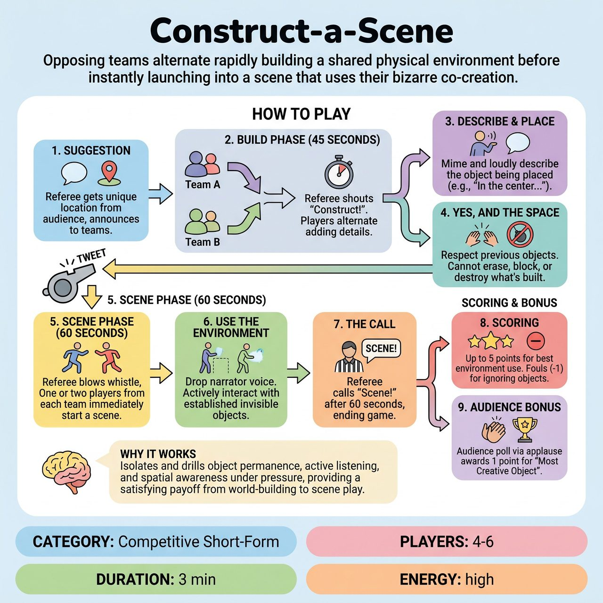

# Construct-a-Scene

{ .game-hero }

> Opposing teams alternate rapidly building a shared physical environment before instantly launching into a scene that uses their bizarre co-creation.

## Overview
A fast-paced competitive short-form game where opposing teams alternate adding physical and descriptive details to a shared environment. After a rapid-fire 45-second 'Build Phase,' the referee blows the whistle, and players must instantly launch into a scene that utilizes the bizarre world they just co-created.

## Setup
Two teams of 2 to 3 players line up on opposite sides of the stage. The Referee stands downstage center. The stage itself is completely clear of physical props or chairs. The Referee asks the audience for a single, unusual location or environment (e.g., 'Inside a giant's pocket' or 'A submarine made of glass').

## How to Play
1. The Suggestion: The Referee gets a unique location from the audience and announces it clearly to both teams.
2. The Build Phase (45 Seconds): The Referee shouts 'Construct!' Players from Team A and Team B alternate stepping into the playing space one at a time to add a single physical object or environmental detail.
3. Describe and Place: As a player steps in, they must physically mime placing or interacting with the object while loudly describing it (e.g., 'In the center of the room is a grandfather clock that ticks backwards'). They freeze for a second to establish the object's location, then step back to the sidelines.
4. Yes, And the Space: Each new addition must respect the previously established objects. Players cannot erase, block, or destroy what the other team has built.
5. The Scene Phase (60 Seconds): After exactly 45 seconds of building, the Referee blows the whistle and calls 'Action!' One or two players from each team immediately step into the center and begin an improvised scene in character.
6. Use the Environment: During the scene, players drop the narrator voice and must actively interact with the invisible objects established during the Build Phase.
7. The Call: The Referee calls 'Scene!' after 60 seconds, ending the game and moving to scoring.
8. Scoring: The Referee awards up to 5 points to the team that best utilized the established environment during the scene phase. Fouls (minus 1 point) are called for 'Object Amnesia' (walking through an established object) or 'Bulldozing' (destroying the other team's contribution during the build).
9. Audience Bonus: The audience is polled by the Referee via applause to award a 1-point bonus for the 'Most Creative Object' added during the build.

## Coaching Notes
- Ensure the alternating build phase is strictly followed so descriptions are clearly heard by the audience and fellow players.
- Maintain strict time limits (45-second build, 60-second scene) to keep the energy high and prevent the descriptive phase from dragging.
- Encourage a direct, immediate transition from world-building into the playable scene to give the setup a satisfying payoff.
- Watch closely for 'Object Amnesia' and 'Bulldozing' to enforce the reality of the co-created space and penalize accordingly.

## Variations
- Solo Team Build: Instead of a shared space, Team A gets 30 seconds to build and 60 seconds to play a scene. Then Team B gets a new suggestion and does the same. Best for newer players who might struggle with tracking a shared competitive space.
- Blind Build: Players must keep their eyes closed or face upstage during the Build Phase, relying entirely on their opponents' verbal descriptions to know where objects are placed. They turn around and open their eyes only when the Scene Phase begins.

## Why It Works
Isolates and drills object permanence, active listening, and spatial awareness under pressure while providing a satisfying payoff from world-building to scene play.

## Safety & Inclusion
Physical safety: Ensure the stage is completely clear of real tripping hazards, as players will be moving quickly to place invisible objects. Accessibility: Players with mobility restrictions can verbally describe an object's placement and direct a teammate to mime the physical placement for them. Content: The Referee strictly enforces family-friendly boundaries; any crude or inappropriate objects added during the build phase receive an immediate content foul, lose a point, and are magically 'erased' from the space.

