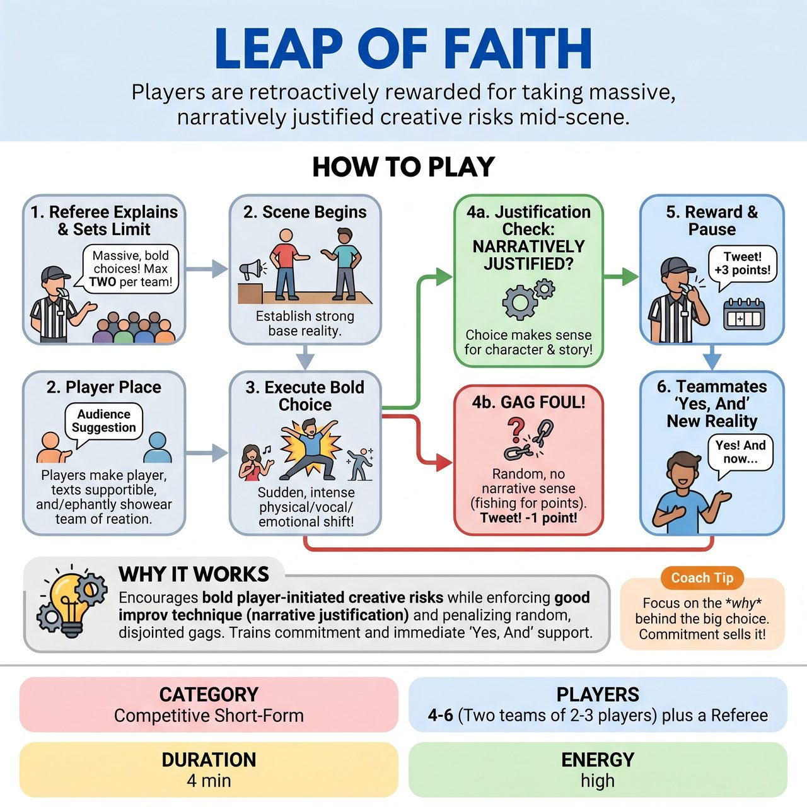

# Leap of Faith

{ .game-hero }

> Players are retroactively rewarded for taking massive, narratively justified creative risks mid-scene.

## Overview
A competitive short-form game where players are retroactively rewarded for taking massive, narratively justified creative risks mid-scene. Instead of stopping the scene to announce a gimmick, players seamlessly execute bold physical, vocal, or emotional choices. The Referee watches closely, blowing a whistle to award bonus points when a player successfully takes a 'Leap of Faith' that elevates the story without breaking the scene's reality.

## Setup
Two teams (2-3 players each) stand ready. A Referee is positioned downstage with a whistle or flag. The Referee gets an audience suggestion of a mundane location and a relationship to ground the scene.

## How to Play
1. The Referee explains the game to the audience: 'In this scene, players will try to make massive, bold, unexpected choices—called Leaps of Faith. If they do it well, and it makes sense in the story, I will award them bonus points on the spot.'
2. The Referee explicitly states the limit: 'To keep the story intact, I will award a maximum of TWO Leap of Faith bonuses per team. Make them count.'
3. The scene begins normally based on the audience suggestion. Players focus on establishing a strong base reality.
4. At any point, a player may execute a bold choice (e.g., a sudden, intense physical transformation, a spontaneous musical number, a dramatic genre shift, or a complex mime sequence). They do NOT announce this choice; they simply commit to it 100% within the flow of the scene.
5. The choice MUST be narratively justified. For example, a player shouldn't just start speaking in opera randomly; they should do it because their character just drank a 'magic theatrical potion' or got struck by 'Broadway lightning' established in the scene.
6. When a player executes a justified bold choice, the Referee blows the whistle, briefly pauses the action, and announces the reward (e.g., 'Tweet! +3 points to Red Team for the fully justified zero-gravity mime sequence!'). The Referee immediately calls 'Action!' and the scene resumes.
7. Teammates must immediately 'Yes, And' the new reality created by the Leap.
8. If a player makes a wild, random choice that makes no narrative sense just to fish for points, the Referee blows the whistle and calls a 'Gag Foul,' deducting 1 point for pandering.
9. The scene concludes after 3-4 minutes, or when both teams have exhausted their Leap attempts and the scene reaches a natural button.

## Coaching Notes
- Award +1 to +5 points retroactively for successful Leaps based on commitment, execution, and narrative justification.
- Retroactive Scoring: Preserve scene flow by rewarding players after they make the choice, rather than forcing them to stop and declare it.
- Narrative Justification: Enforce good improv technique by penalizing random, disjointed gags with a Gag Foul.
- Built-in Pacing: Cap the bonuses at two per team to prevent the scene from devolving into a chaotic point-grab.
- High Energy: Use the sudden whistle and point announcements to create an exciting, sports-like atmosphere.
- At the end of the match, use audience cheers to help decide the overall winner.

## Variations
- Secret Leaps (High Difficulty): Before the scene, the audience provides 4 challenging actions (e.g., 'perform a ballet routine', 'speak only in questions'). These are written on slips of paper. Players can pull a slip mid-scene, read it silently, and must immediately justify executing that action.
- Director's Cut (Non-Competitive / Long-Form): Instead of points, a director sits downstage with a bell. When a player makes a bold choice, the director rings the bell, signaling that the rest of the ensemble must immediately match that energy, heighten the new reality, or physically support the choice.

## Why It Works
It encourages bold player-initiated creative risks while enforcing good improv technique (narrative justification) and penalizing random, disjointed gags. It trains players to commit 100% to big choices and forces teammates to immediately 'Yes, And' the new reality.

## Safety & Inclusion
Bold physical choices must respect personal boundaries and physical limitations; players should never force physical contact or weight-bearing moves on scene partners without prior consent. The Referee strictly enforces the 'clean-content call' (-3 points) for any vulgarity, blue humor, or unsafe physical play, ensuring the game remains clean, accessible, and all-ages.

