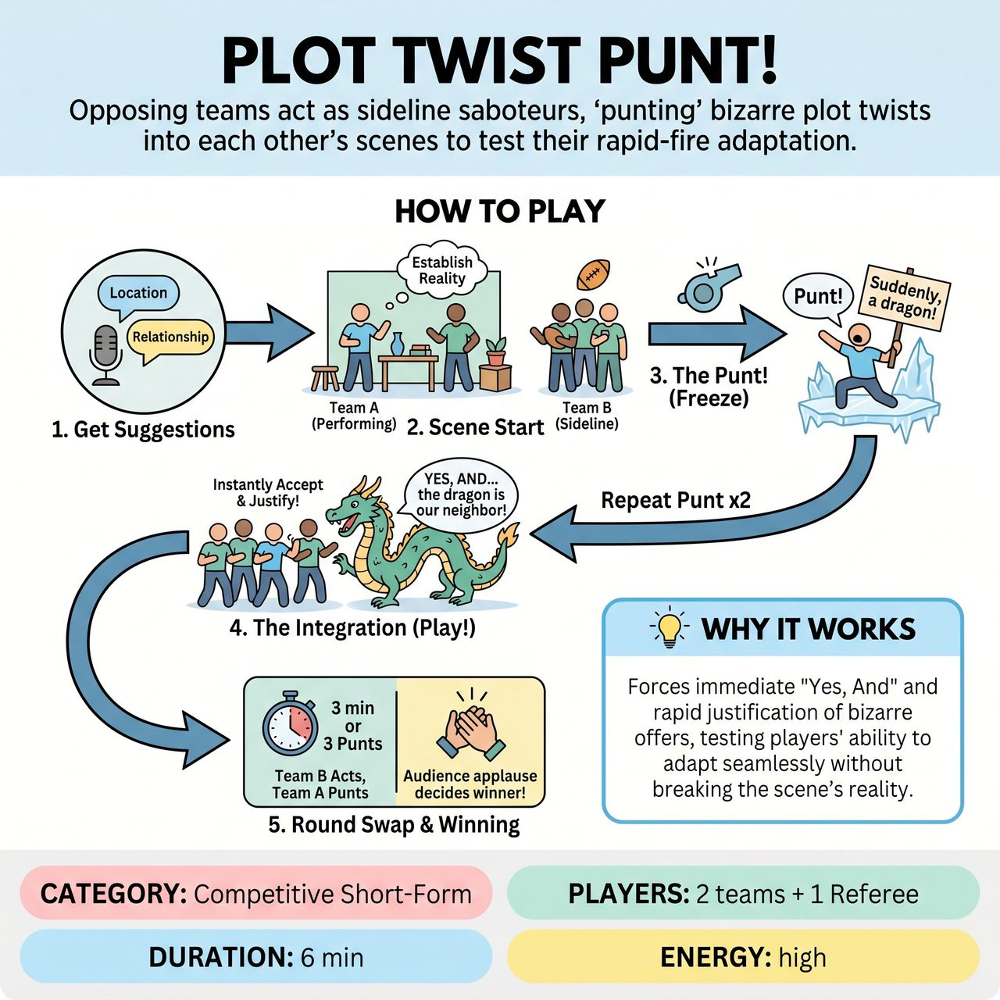

# Plot Twist Punt!

{ .game-hero }

> Opposing teams act as sideline saboteurs, 'punting' bizarre plot twists into each other's scenes to test their rapid-fire adaptation.

## Overview
A fast-paced, competitive short-form game where one team performs a scene while the opposing team acts as sideline saboteurs, 'punting' bizarre plot twists into the narrative. The performing team must immediately 'Yes, And' these twists, justifying them seamlessly without breaking the scene's reality. A Referee manages the pacing, calls fouls for unplayable or mean-spirited twists, and awards points based on audience applause, creating a hilarious test of rapid-fire adaptation and collaborative storytelling.

## Setup
Requires two teams (Team A and Team B) and one Referee. No props or special setup are needed. The stage is neutral. Team A (The Actors) takes the stage. Team B (The Punters) stands on the sidelines with a clear view of the action.

## How to Play
1. Get Suggestions: The Referee gets a location and a relationship from the audience to start the scene.
2. Scene Start: Team A begins the scene, establishing their characters, the environment, and the base reality. Team B watches from the sidelines.
3. The Punt: At any point after the first 30 seconds, a player from Team B yells 'Punt!' The Referee blows the whistle to freeze the scene. The Team B player delivers one clear, concise plot twist (e.g., 'The floor is suddenly made of hot lava,' or 'You realize your scene partner is a disguised alien'). Team B is allowed exactly 3 Punts per scene.
4. The Integration: The Referee calls 'Play!' Team A must instantly accept the twist, justify it within their existing narrative, and keep the scene moving forward. They cannot ignore it or undo it.
5. Round Swap: After 3 minutes, or once all 3 Punts have been successfully integrated, the Referee calls 'Scene!' Team B now takes the stage as the Actors, and Team A goes to the sidelines as the Punters. The Referee gets new suggestions, and the process repeats.
6. Winning: After both teams have performed, the Referee asks the audience to applaud for the team that best integrated their opponent's punts. The winning team is awarded 5 points.

## Coaching Notes
- The Referee simplifies scoring by only tracking Fouls during play (-1 point each).
- Standard fouls apply (content foul for dirty humor, Groaner for bad puns).
- Game-specific fouls include the 'Scene Stopper' (-1 point to the Actors for denying or ignoring a punt) and the 'Malicious Punt' (-1 point to the Punters for an unplayable, overly complex, or mean-spirited twist).
- Ensure a clear division of roles (Actors vs. Punters) to maintain narrative cohesion and prevent stage crowding.

## Variations
- Categorized Punts: To increase the challenge, the Referee dictates the specific type of punt Team B must use for each of their 3 turns (e.g., Punt 1 must be a physical ailment, Punt 2 an environmental disaster, Punt 3 a dark secret).
- Audience Punts: The Referee collects 3-5 written plot twists from the audience before the game. The sideline team draws them blindly from a hat and reads them aloud when they yell 'Punt!', removing the competitive antagonism and uniting the teams against the audience's chaos.

## Why It Works
It forces immediate 'Yes, And' and rapid justification of bizarre offers, testing players' ability to adapt seamlessly without breaking the scene's reality.

## Safety & Inclusion
The 'Malicious Punt' foul is a critical safety tool. It explicitly prevents players from forcing their opponents into unsafe physical actions, inappropriate content, or culturally insensitive tropes. The Referee must strictly enforce that all Punts are 'friendly fire'—designed to be a fun, playable challenge, not a trap. All content must remain clean and all-ages.

