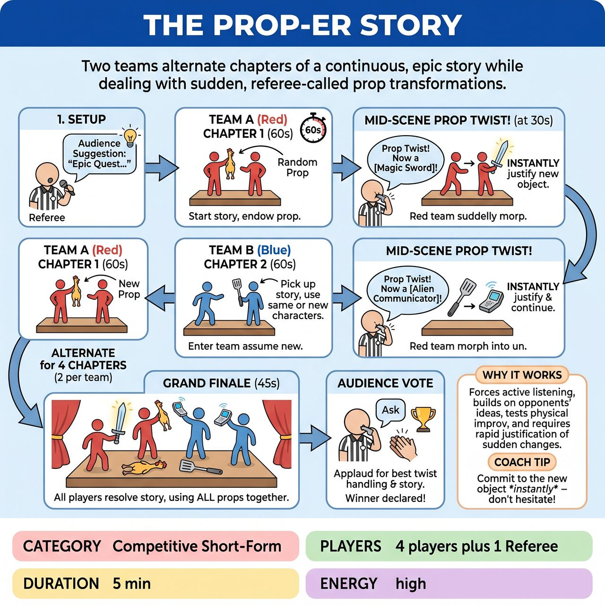

# The Prop-er Story

{ .game-hero }

> Two teams alternate chapters of a continuous, epic story while dealing with sudden, referee-called prop transformations.

## Overview
A fast-paced, competitive short-form game where two teams alternate chapters of a continuous, epic story. Each chapter features a random, mundane prop that players must creatively endow. Mid-scene, the referee calls a 'Prop Twist' from the sidelines, instantly transforming the object into something completely different that the players must immediately justify without breaking the scene.

## Setup
Two teams (e.g., Red and Blue) stand on opposite sides of the stage. A Referee stands on the sidelines with a whistle. A table or bin is placed upstage containing 10-15 safe, mundane, non-specific props (e.g., a pool noodle, a frisbee, a bucket, a whisk, a plunger, an oven mitt).

## How to Play
1. 1. The Referee gets a suggestion from the audience for an epic quest, a movie title, or a broad genre to spark the story.
2. 2. Team A (Red) steps up for Chapter 1. The Referee hands them one random prop from the bin. The team has 60 seconds to begin the story, clearly endowing the prop with a specific use and meaning in the scene.
3. 3. Mid-scene (around the 30-second mark), the Referee blows the whistle from the sidelines and shouts, 'Prop Twist! The object is now a [new, contradictory object]!' (e.g., 'Prop Twist! It is now a ticking time bomb!').
4. 4. The players on stage must instantly 'Yes, And' this twist, treating the prop as the new object and justifying the sudden transformation within the reality of the story.
5. 5. At the 60-second mark, the Referee blows the whistle and calls, 'Next Chapter!' Team A freezes and clears the stage.
6. 6. Team B (Blue) immediately steps up for Chapter 2. The Referee hands them a brand new prop. Team B must pick up the story exactly where Team A left off.
7. 7. When stepping in, Team B can either assume the physical positions of Team A to play the EXACT SAME characters, or they can enter as BRAND NEW characters arriving in that exact location. They must make this choice obvious in their first line of dialogue.
8. 8. Team B gets their own 60-second scene, complete with a sideline 'Prop Twist' called by the Referee.
9. 9. The teams alternate for a total of 4 chapters (2 per team).
10. 10. The game concludes with a 45-second 'Grand Finale' chapter where all four players from both teams enter the stage together to resolve the story, using all the props introduced so far.
11. 11. After the Grand Finale, the Referee asks the audience to applaud for the team that best handled their Prop Twists and advanced the story. The winning team is awarded 5 points.

## Coaching Notes
- Encourage active listening so teams can seamlessly build on the opposing team's narrative continuity.
- Focus on strong object work and endowment; players must clearly mime the weight, texture, and function of both the original and twisted props.
- Coach players to instantly 'Yes, And' the Prop Twist without hesitation, justifying the transformation within the reality of the scene.
- Enforce clean comedy using standard competitive fouls like the 'content foul' for inappropriate content or 'Delay of Game' for ignoring a twist, deducting 1 point per foul called in the moment by the Referee.

## Variations
- Audience Twist: Instead of the Referee choosing the new object, the Referee points to an audience member during the scene and asks them to shout out what the prop turns into.
- Prop Hoarders: Instead of clearing the props after each chapter, the props stay on stage. By Chapter 4, the active team must successfully juggle and utilize four different props simultaneously.
- Genre Twist: Instead of changing the prop, the Referee shouts a new film or theater genre from the sidelines, and the players must instantly adapt the tone of the scene while keeping the same prop.

## Why It Works
It forces players to actively listen and build on the opposing team's ideas while testing physical improv skills and the ability to rapidly justify sudden, high-stakes changes without breaking the scene's reality.

## Safety & Inclusion
All props must be strictly vetted for safety: no glass, no sharp edges, no heavy items, and no actual weapons. Players must be instructed never to throw props at one another. The game relies on a clean-content foul system to ensure all content remains strictly all-ages and family-friendly, creating a safe environment for both performers and the audience.

