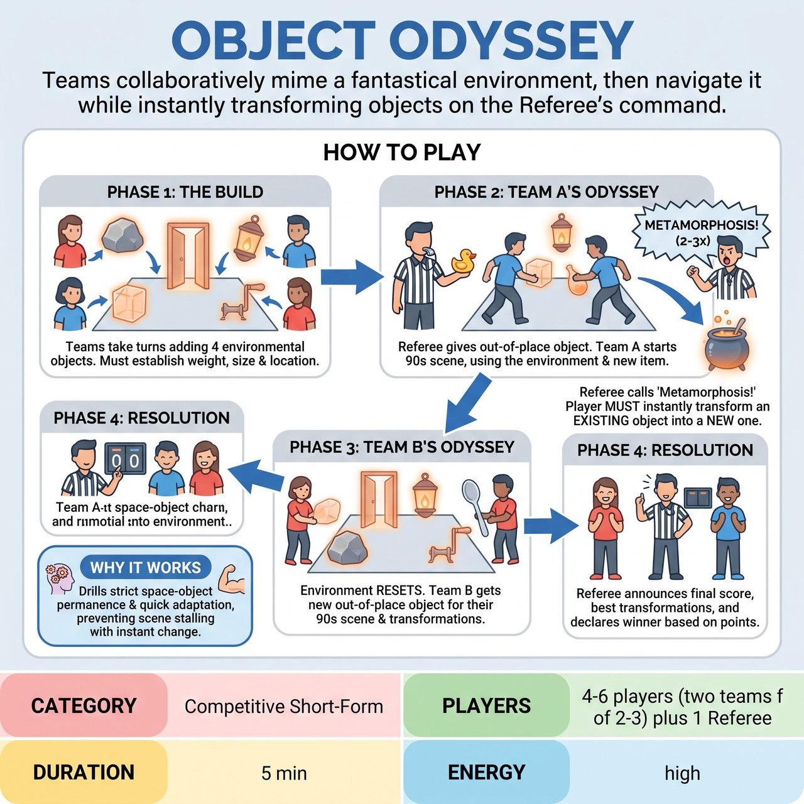

# Object Odyssey

{ .game-hero }

> Teams collaboratively mime a fantastical environment, then navigate it while instantly transforming objects on the Referee's command.

## Overview
A fast-paced, competitive short-form game where two teams collaboratively mime a fantastical environment, then take turns playing scenes within it. Fueled by audience suggestions, players must maintain strict space-object permanence. The game's signature mechanic is the 'Metamorphosis' command, forcing players to instantly transform an existing mimed object into something entirely new.

## Setup
Requires two teams (Red and Blue) of 2-3 players each, and a Referee with a whistle and a clipboard. The stage is completely bare. The Referee asks the audience for a fantastical, imaginary location (e.g., 'Inside a giant's vacuum cleaner') and two everyday objects that do not belong there (e.g., 'a toaster' and 'a unicycle').

## How to Play
1. Phase 1: The Build. The Referee announces the audience's imaginary location. Teams alternate sending one player at a time into the center stage to pantomime and establish exactly ONE environmental feature.
2. The build is strictly capped at 4 objects total (2 per team). Each player must physically interact with their object to establish its weight, size, and exact location, then step back to the sidelines.
3. Phase 2: Team A's Odyssey. The Referee assigns the first out-of-place object to Team A and blows the whistle to start a 90-second scene.
4. Team A steps into the established environment. They must interact with the 4 established environmental objects while justifying their out-of-place object in a narrative scene.
5. The 'Metamorphosis' Call: During the scene, the Referee calls 'Metamorphosis!' 2 to 3 times. Immediately, the active player must take one existing environmental object and pantomime transforming it into something entirely new and absurd, justifying it in the scene (e.g., a mimed dust bunny becomes a fluffy attack dog).
6. Phase 3: Team B's Odyssey. After 90 seconds, the Referee blows the whistle. The environment 'resets' to the original 4 objects. Team B steps in, receives the second out-of-place object, and plays their own 90-second scene, also fielding 'Metamorphosis' calls.
7. Phase 4: Resolution. The Referee, who has been tracking points silently, announces the final score, calls out the best transformations, and declares the winning team.

## Coaching Notes
- The Referee scores silently on a clipboard during the scenes to preserve momentum and comedic timing.
- Award +2 points for clear object permanence/interaction, and +3 points for a seamless and creative 'Metamorphosis'.
- Deduct 1 point (a 'Wobble Foul') for walking through an established object or dropping the mime.
- Deduct 1 point (a 'clean-content foul') for blue humor or inappropriate content to keep the game strictly family-friendly.
- Use the audience's laughter and applause to help gauge the success of a transformation.

## Variations
- Single-Team Showcase: Played by one team as a 3-minute scene where the audience yells 'Metamorphosis!' instead of a referee, making it a great non-competitive long-form opener.
- Invisible Obstacle Course: Instead of a location, the audience suggests a series of traps. The teams must navigate the traps, and 'Metamorphosis' turns a deadly trap into a helpful tool.

## Why It Works
It acts as a strict space-object permanence drill disguised as a high-energy, crowd-pleasing game. The 'Metamorphosis' mechanic forces instant adaptation and prevents scenes from stalling, while the collaborative world-building avoids stage clutter.

## Safety & Inclusion
Physical safety: Mime requires dynamic movement; ensure the stage is completely clear of real physical hazards, props, or tripping risks. Accessibility: Players with limited mobility can establish stationary objects or focus on upper-body/vocal transformations. The referee should adjust the pacing of 'Metamorphosis' calls to suit the players' physical and cognitive processing speeds.

