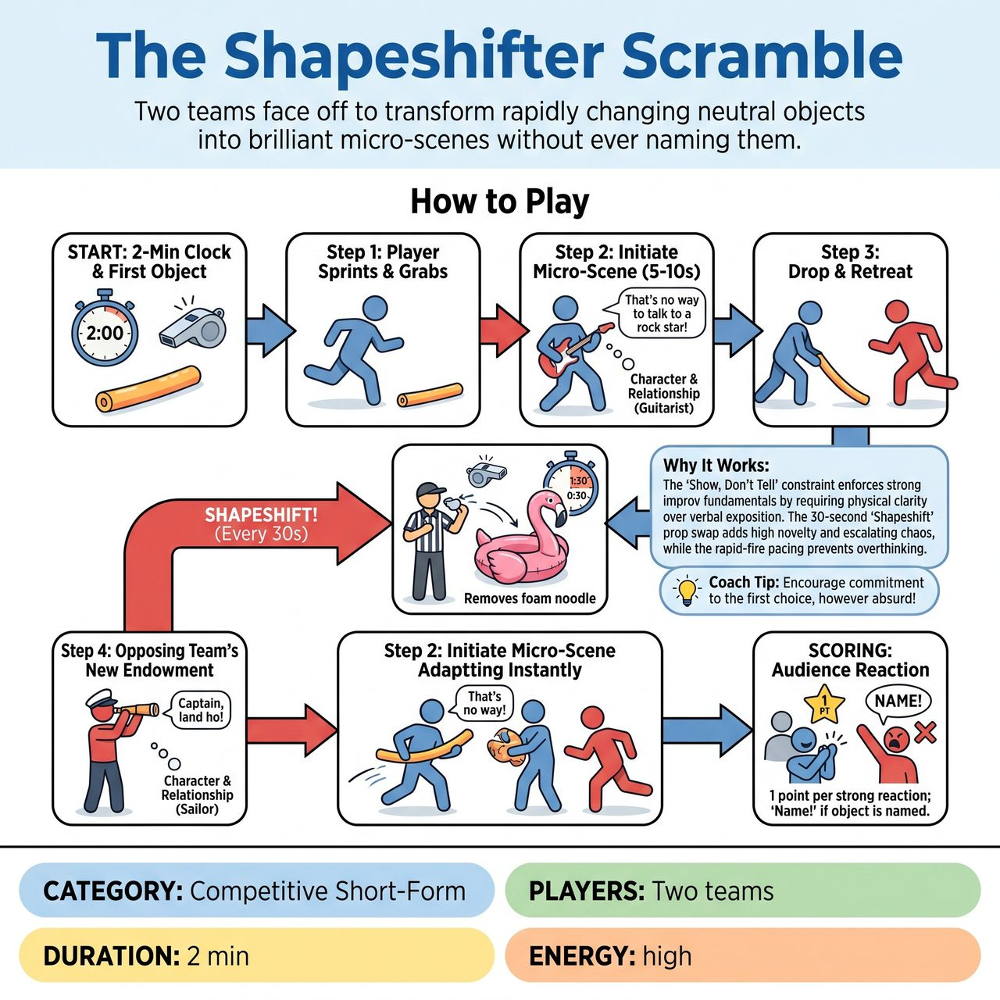

# The Shapeshifter Scramble

{ .game-hero }

> Two teams face off to transform rapidly changing neutral objects into brilliant micro-scenes without ever naming them.

## Overview
A high-energy, competitive short-form game where two teams face off to transform neutral objects into brilliant micro-scenes. To score, players must establish a character and relationship without ever naming the object. To keep players on their toes, the Referee swaps the object for a completely new, bizarre item every 30 seconds, forcing rapid adaptation and escalating the physical comedy.

## Setup
Two teams line up on opposite wings. The Referee has a bucket of 4 distinct, safe props (e.g., a foam noodle, a plastic bucket, a piece of fabric, a rubber ring). The Referee places the first prop center stage, gets an audience suggestion of a 'Non-physical concept' (e.g., Love, Capitalism, Monday Mornings) to inspire the scenes, and sets a 2-minute timer.

## How to Play
1. The Referee blows the whistle, starting the 2-minute clock with the first object center stage.
2. A player from either team sprints to the center, grabs the object, and initiates a 5-10 second micro-scene.
3. The player must physically endow the object and deliver a line of dialogue that establishes a character or relationship (e.g., holding a foam noodle like a guitar: 'This next song is about my ex-wife!'). They may NOT name the object.
4. Once the joke lands, the player drops the object and retreats. The opposing team (or same team) immediately sends a player to create a completely new endowment.
5. The Shapeshift: Every 30 seconds, the Referee blows a double-whistle, throws a completely new object into the center, and removes the old one, forcing an instant reset of physical ideas.
6. The Referee awards 1 point for every successful micro-scene that gets a strong audience reaction. The audience is instructed to yell 'Name!' if a player accidentally says what the object is, triggering a 1-point deduction.

## Coaching Notes
- Maintain rapid-fire pacing to prevent dragging and keep energy high.
- Enforce the 'Show, Don't Tell' constraint to ensure strong physical choices.
- Award points for strong character choices and physical clarity, and call fouls for hesitation, naming the prop, or dragging the scene.
- Apply standard fouls like a content foul for inappropriate content or the Groaner for bad puns.

## Variations
- Thematic Shapeshifter: All endowments must fit a single audience-suggested genre (e.g., Sci-Fi, Western) even as the bizarre props change.
- Tag-Team Morph: Instead of dropping the prop, the next player must run out, tag the current player, and take the prop from their exact physical position to start the next scene.

## Why It Works
The 'Show, Don't Tell' constraint enforces strong improv fundamentals by requiring physical clarity over verbal exposition. The 30-second 'Shapeshift' prop swap adds high novelty and escalating chaos, while the rapid-fire pacing prevents scenes from dragging.

## Safety & Inclusion
Physical safety: Center stage must be clear of tripping hazards. Props must be soft, lightweight, and safe to toss (no sharp edges or heavy wood). Accessibility: Players with mobility limitations can play from a stationary 'Prop Station' downstage; instead of sprinting, the Referee hands them the new objects directly, and they tag in verbally.

