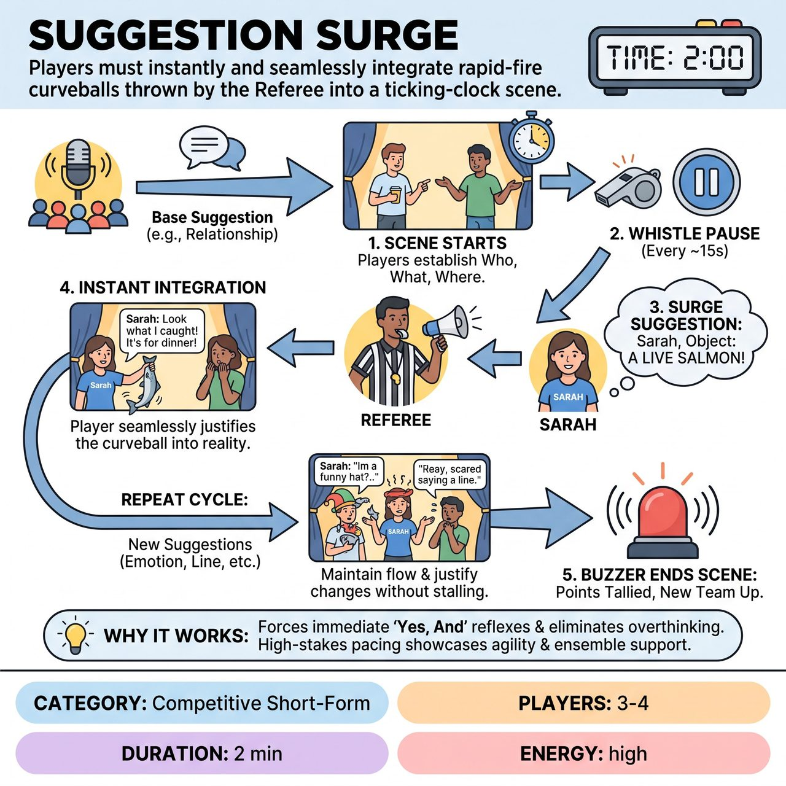

# Suggestion Surge

{ .game-hero }

> Players must instantly and seamlessly integrate rapid-fire curveballs thrown by the Referee into a ticking-clock scene.

## Overview
A high-energy, timed competitive short-form game where one team at a time performs a scene while the Referee relentlessly throws diverse suggestions (emotions, objects, lines of dialogue) at specific players. The challenge is to instantly and seamlessly integrate these rapid-fire curveballs into the narrative without breaking character or stalling the scene.

## Setup
Played by one team at a time (3-4 players on stage). The Referee stands downstage or to the side with a whistle and a clipboard of pre-collected audience suggestions (or takes them live). A timer is set for 2 to 3 minutes per team.

## How to Play
1. The Referee gets a base suggestion from the audience to ground the scene, such as a non-geographical location or a relationship.
2. The clock is set for 2 minutes. The active team begins their scene, establishing the who, what, and where.
3. After about 15 seconds of scene-setting, the Referee blows the whistle to briefly pause the action.
4. The Referee calls out a specific player by name or shirt color and delivers a 'Surge Suggestion' (e.g., 'Sarah, Object: A live salmon!').
5. The action immediately resumes, and the named player must instantly incorporate the suggestion into the reality of the scene through dialogue, action, or character work.
6. The Referee continues to interrupt every 10 to 15 seconds, targeting different players with new suggestions like emotions, objects, lines of dialogue, sound effects, or character traits.
7. Players must justify the sudden changes within the narrative, maintaining the scene's reality rather than just playing the suggestion as a disconnected gag.
8. The scene ends when the buzzer sounds. The Referee tallies the points, and the opposing team takes the stage for their turn.

## Coaching Notes
- The active team earns 1 point for every successfully and instantly integrated suggestion.
- The Referee acts as the judge of success. If a player hesitates, ignores the suggestion, or breaks character, the Referee calls a 'Delay of Game' or 'Block' foul, awarding no points and potentially deducting one.
- Standard short-form fouls apply, including the 'content foul' for inappropriate or vulgar content.
- Encourage intense active listening. Players must track the scene's narrative while waiting for the Referee's whistle.
- Remind the ensemble to support the targeted player to help justify bizarre narrative shifts.

## Variations
- The Gauntlet (Solo Surge): Played by a single improviser performing a monologue or solo scene. The Referee throws suggestions at them every 5-10 seconds, testing their ultimate solo agility.
- Escalating Surge: The time between the Referee's suggestions gets progressively shorter as the clock winds down (e.g., every 15 seconds, then 10 seconds, then 5 seconds for the chaotic finale).

## Why It Works
It forces immediate 'Yes, And' reflexes and eliminates time for players to overthink or plan. The ticking-clock pacing keeps both players and the audience on the edge of their seats while showcasing individual agility and ensemble support.

## Safety & Inclusion
The Referee must act as a strict filter for all suggestions, ensuring they are family-friendly and safe. Players must be mindful of physical safety when pantomiming sudden 'Object' suggestions, ensuring they do not force non-consensual physical contact on scene partners. The 'content foul' strictly enforces clean, all-ages content.

