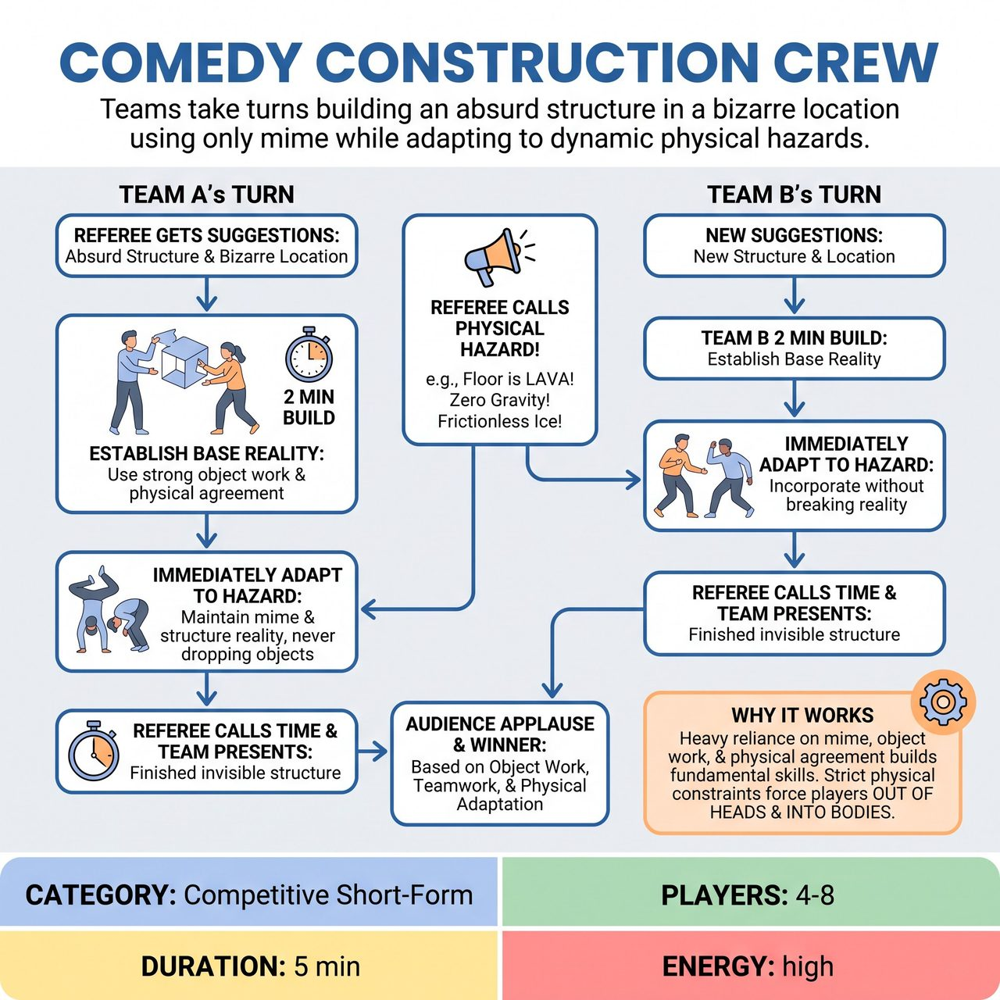

# Comedy Construction Crew

{ .game-hero }

> Teams take turns building an absurd, audience-suggested structure in a bizarre location using only mime while adapting to dynamic physical hazards.

## Overview
A competitive short-form game where teams take turns building an absurd, audience-suggested structure in a bizarre location using only mime and object work. As they build, the Referee throws in dynamic physical and environmental hazards that the team must immediately incorporate without breaking the reality of their construction.

## Setup
Two teams of 2 to 4 players. Played sequentially (Team A plays, then Team B plays). No props or set pieces are used; the game relies entirely on pure object work and mime. A Referee facilitates the game, keeps time, and introduces the hazards.

## How to Play
1. The Referee gets a suggestion for Team A: an absurd structure (e.g., a catapult for launching pizzas) and a bizarre location (e.g., on a cloud).
2. Team A has exactly 2 minutes to build. The clock starts, and they begin establishing the base reality, using strong object work and physical agreement to show the dimensions, weight, and materials of the structure.
3. After 30 to 45 seconds, allowing the base reality to firmly settle, the Referee calls out the first HAZARD. This must be strictly physical or environmental (e.g., HAZARD! Hurricane-force winds from stage left!).
4. Team A must immediately adapt their physical mime to the hazard while continuing to build the structure, never dropping the reality of the objects they are holding.
5. The Referee introduces 1 or 2 more physical hazards at roughly 30-second intervals (e.g., HAZARD! The floor is now frictionless ice! or HAZARD! Gravity is suddenly three times heavier!).
6. At the 2-minute mark, the Referee calls TIME. Team A steps back to present their finished, invisible structure.
7. Team B then takes the stage, gets a new structure and location from the audience, and plays their own 2-minute round with completely new physical hazards.
8. The Referee calls for audience applause to determine the winning crew based on object work, teamwork, and how well they physically adapted to the hazards.

## Coaching Notes
- Sequential play prevents stage chaos and focuses audience attention on one cohesive build at a time.
- Strict physical and environmental constraints force players out of their heads and into their bodies.
- Paced constraint delivery allows the base reality to anchor the scene before the chaos begins.
- Ensure players maintain the reality of the objects they are holding even when hazards are introduced.

## Variations
- Rival Foremen: Instead of the Referee calling the hazards, the opposing team's captain gets to yell out the 2 or 3 physical hazards during the building team's round.
- Silent Site: The entire build is done completely silently with no dialogue, only physical mime and exertion sounds, forcing 100 percent reliance on visual communication and spatial agreement.

## Why It Works
Heavy reliance on mime, object work, and physical agreement builds fundamental improv skills, while strict physical and environmental constraints force players out of their heads and into their bodies.

## Safety & Inclusion
Emphasize physical safety: Mime the struggle, do not actually struggle. Players must keep both feet on the floor (no climbing on each other to build high). Constraints must be accessible and not force players into physically painful or unsafe postures. Referees should tailor physical hazards to the mobility levels of the players on stage.

