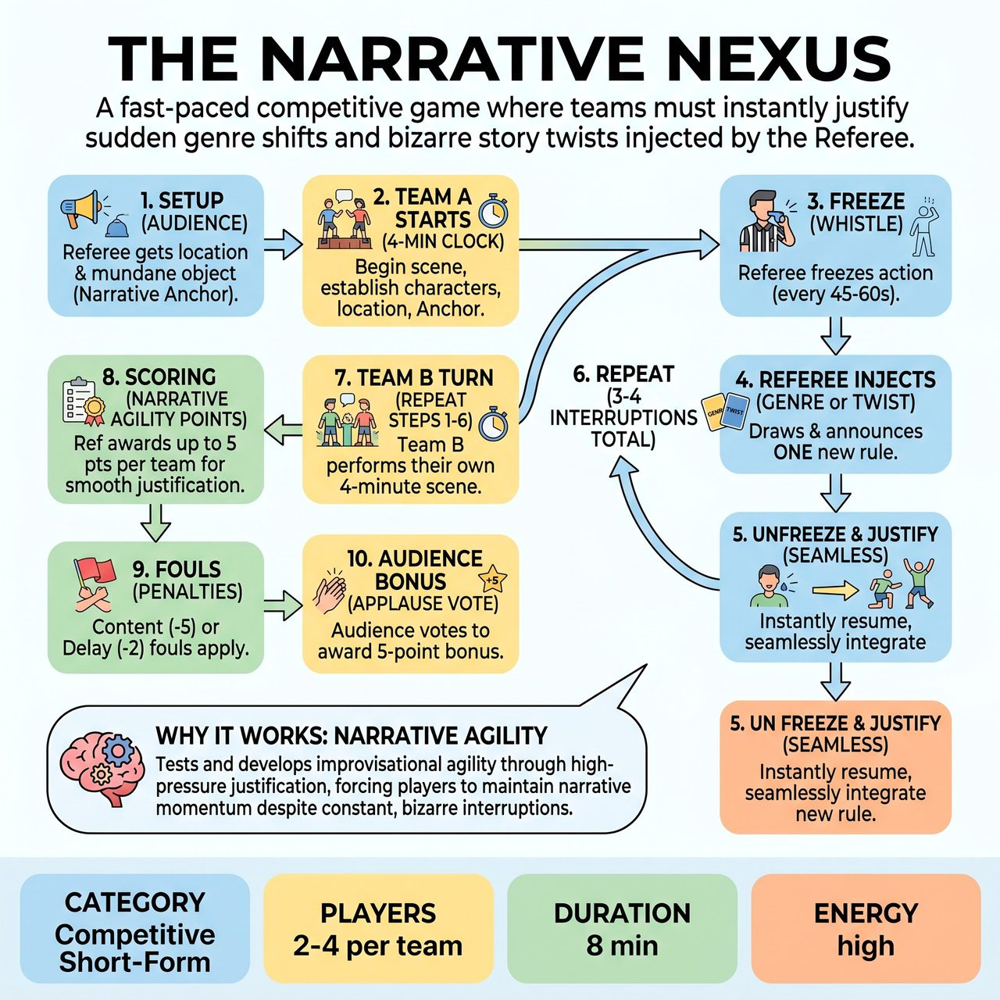

# The Narrative Nexus

{ .game-hero }

> A fast-paced competitive game where teams must instantly justify sudden genre shifts and bizarre story twists injected by the Referee.

## Overview
A fast-paced competitive short-form game where a team performs a scene that is repeatedly interrupted by the Referee. The Referee injects either a sudden Genre Shift or a bizarre Story Twist drawn from a deck, which the team must instantly justify and integrate without breaking the scene's core narrative.

## Setup
Format: Competitive Short-Form. You will need a whistle for the Referee, a deck of 'Genre' cards (e.g., Western, Sci-Fi, Soap Opera), and a deck of 'Story Twist' cards (e.g., Gravity reverses, Someone is an alien, All dialogue must rhyme). The game is played in two halves: Team A plays their scene, followed by Team B playing a completely new scene.

## How to Play
1. The Referee asks the audience for a non-geographical location and a mundane object (the 'Narrative Anchor') to inspire the scene.
2. Team A takes the stage. The Referee starts a strict 4-minute clock, and the team begins their scene, establishing characters, the location, and the Anchor object.
3. Every 45 to 60 seconds, the Referee blows the whistle to freeze the action.
4. The Referee draws exactly ONE card from either the Genre deck OR the Twist deck (never both at the same time) and announces the new rule to the players.
5. The Referee blows the whistle again to unfreeze the scene. The players must instantly resume the action, seamlessly justifying the new genre or twist into their ongoing narrative while keeping the original Anchor object relevant.
6. The Referee interrupts 3 to 4 times total during the 4-minute scene.
7. At the 4-minute mark, the Referee calls 'Scene!' Team A's turn ends, and Team B takes the stage to perform their own 4-minute scene with a new location, a new Anchor object, and new random card draws.
8. The Referee awards up to 5 points per team based on narrative agility: how instantly and smoothly they justified the shifts without stalling or breaking character.
9. Standard short-form fouls apply, such as the clean-content foul (-5 points for inappropriate content) or the Delay of Game Foul (-2 points for failing to adopt the new genre/twist).
10. After both teams have played, the audience votes by applause to award a 5-point bonus to the winner.

## Coaching Notes
- Focus on high-pressure justification; players must instantly and smoothly integrate the shifts without stalling or breaking character.
- The single-team scene structure preserves narrative momentum and prevents the story from collapsing.
- Maintain the strict 4-minute time limit to keep energy high and prevent the scene from dragging.
- Ensure the 'Narrative Anchor' object remains relevant throughout all the shifts.

## Variations
- Audience Nexus: Instead of using pre-written card decks, the Referee collects 5 to 6 written twists and genres from the audience in a bucket before the match, drawing them randomly during the game.
- The Gauntlet: For smaller groups or non-competitive exhibitions, both teams mix together to form one super-team, trying to survive a single 5-minute scene with shifts happening at an accelerated pace every 30 seconds.

## Why It Works
It tests and develops improvisational agility through the high-pressure justification of random prompts, forcing players to maintain narrative momentum and character integrity despite constant, bizarre interruptions.

## Safety & Inclusion
The Referee strictly enforces family-friendly boundaries using a clean-content call. Story twists must be interpreted safely; physical twists like 'gravity reverses' should be played through mime and acting rather than dangerous tumbling. Players are encouraged to tag out if a specific twist makes them uncomfortable, allowing a teammate to seamlessly enter the scene.

