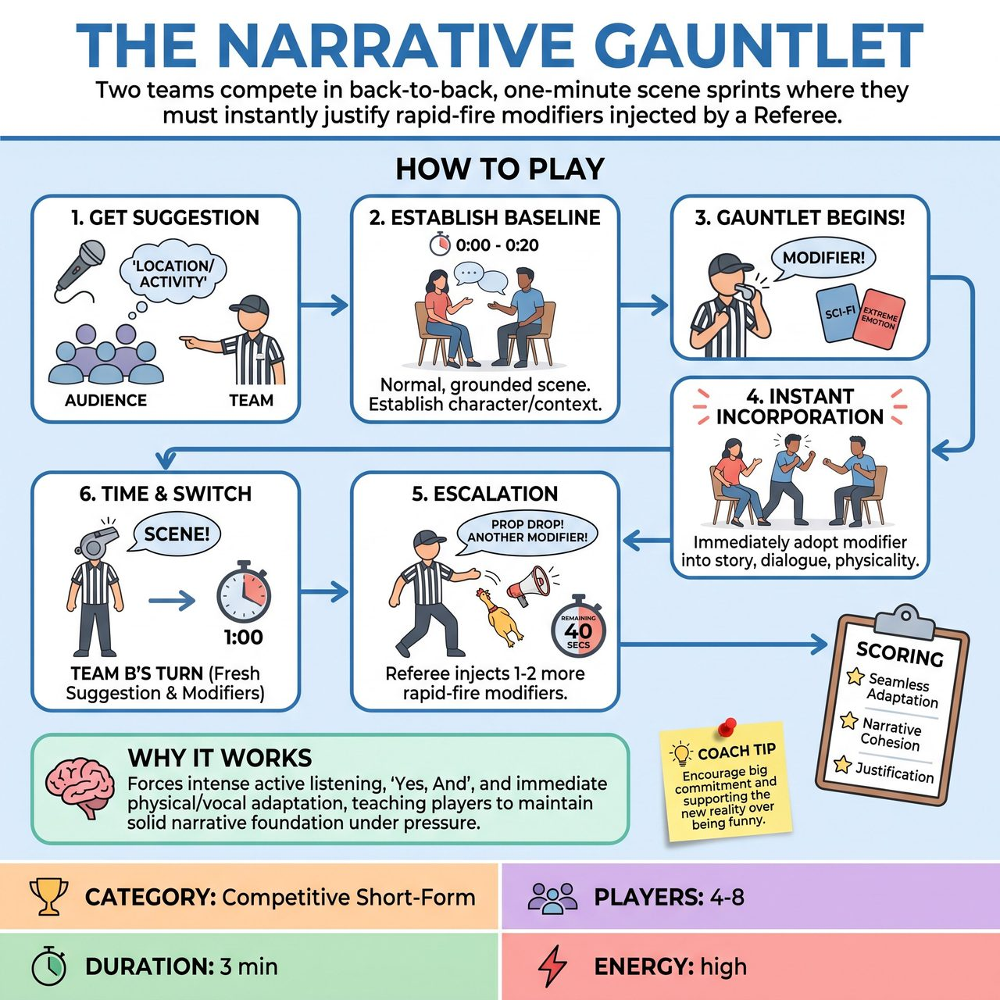

# The Narrative Gauntlet

{ .game-hero }

> Two teams compete in back-to-back, one-minute scene sprints where they must instantly justify rapid-fire modifiers injected by a Referee.

## Overview
Two teams compete in back-to-back, one-minute scene sprints. A Referee allows a team to establish a grounded narrative baseline, then suddenly injects 2-3 rapid-fire 'Modifiers' (genre shifts, emotional endowments, or physical props) that the players must instantly justify and incorporate. After both teams run the gauntlet, points are awarded based on seamless adaptation, narrative cohesion, and audience reaction.

## Setup
Two teams (2-4 players each) stand ready. A Referee (the 'Gauntlet Master') stands downstage with a whistle, a stopwatch, a 'Modifier Deck' (a stack of index cards with random genres, emotions, and physical constraints), and a bag of safe, soft props. The game is played in two distinct one-minute halves, one for each team.

## How to Play
1. Get a Suggestion: The Referee asks the audience for a clean, everyday location or mundane activity (e.g., 'At the dentist' or 'Washing the car') for Team A.
2. Establish the Baseline: Team A takes the stage. The Referee starts a 1-minute timer. For the first 15-20 seconds, Team A performs a normal, grounded scene, establishing the Who, What, and Where without interruption.
3. The Gauntlet Begins: Once the baseline is set, the Referee blows the whistle and shouts a Modifier from their deck (e.g., 'MODIFIER: Sci-Fi!' or 'MODIFIER: Extreme Paranoia!').
4. Instant Incorporation: The players must immediately adopt the new modifier into their characters, dialogue, and physicality, while continuing the core story they already established. They cannot drop the plot; they must weave the modifier into it.
5. Escalation: Over the remaining 40 seconds, the Referee injects 1 or 2 more Modifiers (e.g., tossing a rubber chicken on stage and yelling 'MODIFIER: Prop Drop!'). Players must layer these new challenges on top of the existing scene.
6. Time: At exactly 1 minute, the Referee blows the whistle and calls 'Scene!'
7. Team B's Turn: Team B takes the stage, gets a fresh audience suggestion, and runs their own 1-minute gauntlet with a completely new set of Modifiers.
8. Scoring: After both teams have performed, the Referee awards up to 5 points per team based on how well they maintained the story, justified the modifiers, and entertained the audience.

## Coaching Notes
- End-of-round scoring preserves the fast-paced, frantic flow of the scene.
- Delayed modifier injection allows players to build a solid narrative foundation before the chaos begins.
- Fouls are actively called during the scene: 'Clean-Content Foul' (-3 points) for any inappropriate, non-family-friendly content (the Referee may theatrically signal the foul to the offending player), and 'Groaner Foul' (-1 point) for stalling, ignoring a modifier, or making a terrible pun.
- The audience provides the initial suggestions and their laughter/applause heavily influences the Referee's final 1-5 point allocation at the end of the game.

## Variations
- The Shared Gauntlet: Both teams are given the exact same suggestion and the exact same sequence of modifiers. Team B waits offstage (or covers their ears) while Team A performs, then Team B attempts the same gauntlet to see who handles it better.
- Director's Cut: Instead of the Referee choosing random modifiers, the opposing team gets to select the 3 modifiers from the deck that will be thrown at the performing team, increasing the competitive rivalry.

## Why It Works
It forces intense active listening, 'Yes, And', and immediate physical/vocal adaptation, while teaching players to maintain a solid narrative foundation under chaotic pressure.

## Safety & Inclusion
The 'Clean-Content Foul' strictly enforces a clean, all-ages environment. When using 'Prop Drop' modifiers, ensure all objects are soft, lightweight, and tossed safely toward the floor, never directly at a player's face or body. Players must be reminded that 'Emotion' or 'Genre' shifts (like 'Action Movie' or 'Extreme Anger') must be played out through character choices and dialogue, never through actual physical aggression or breaking personal boundaries.

