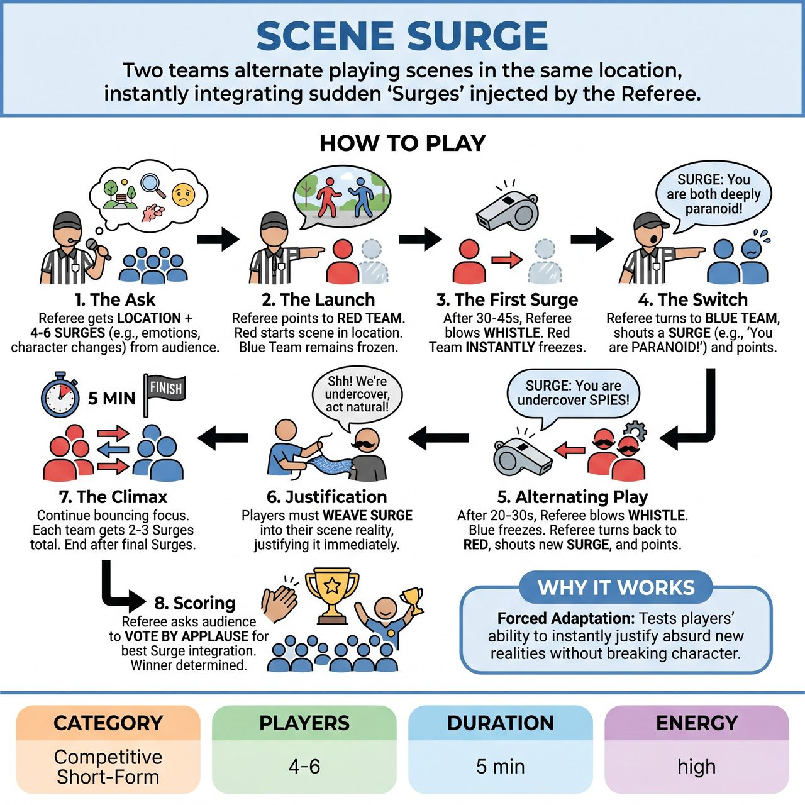

# Scene Surge

{ .game-hero }

> Two teams alternate playing scenes in the same location, instantly integrating sudden 'Surges' injected by the Referee.

## Overview
A high-energy, competitive split-screen game where two teams alternate playing scenes in the exact same location. The Referee frequently blows the whistle to switch focus between the teams, instantly injecting pre-gathered 'Surges' - sudden changes in emotion, character, or circumstance - that the newly active team must immediately justify and integrate into their ongoing narrative.

## Setup
Two teams of 2 to 3 players each. The stage is divided into two halves (split-screen format): Red Team on stage left, Blue Team on stage right. The Referee stands downstage center with a whistle. No props or chairs are required. Before the game begins, the Referee gets one location from the audience, plus a list of 4 to 6 random 'Surges' (e.g., an unusual object, a strong emotion, a bizarre secret, a weird physical ailment).

## How to Play
1. 1. The Ask: The Referee asks the audience for a single, family-friendly location where both teams will base their scenes. Then, the Referee rapidly gathers 4-6 'Surges' from the audience (e.g., 'Give me a strong emotion,' 'Give me a household object,' 'Give me a strange hobby'). The Referee writes these down or memorizes them.
2. 2. The Launch: The Referee points to the Red Team and says 'Go!' The Red Team begins a scene in the suggested location. The Blue Team remains frozen in neutral positions on their side of the stage.
3. 3. The First Surge: After 30-45 seconds - giving the Red Team enough time to establish a base reality - the Referee blows the whistle. The Red Team instantly freezes.
4. 4. The Switch: The Referee turns to the Blue Team, shouts a Surge from the pre-gathered list (e.g., 'Surge: You are both deeply paranoid!'), and points to them. The Blue Team unfreezes and begins their scene in the same location, immediately incorporating the paranoia into their narrative.
5. 5. Alternating Play: After 20-30 seconds of Blue Team's scene, the Referee blows the whistle again. Blue Team freezes. Referee turns back to Red Team, shouts a new Surge (e.g., 'Surge: A magical rubber duck!'), and Red Team unfreezes, picking up exactly where they left off but seamlessly justifying the new element.
6. 6. Justification: Players must not just acknowledge the Surge and drop it; they must weave it into the reality of their scene and let it alter their trajectory.
7. 7. The Climax: The Referee continues bouncing focus back and forth, giving each team 2 to 3 Surges total. After both teams have navigated their final Surges and reached a comedic peak, the Referee blows the whistle and calls 'Scene!'
8. 8. Scoring: At the end of the game, the Referee asks the audience to vote by applause for the team that best integrated their Surges. The winning team receives 5 points.

## Coaching Notes
- The audience provides all suggestions up front, ensuring the game's fast pace is never interrupted by polling.
- The Referee actively calls competitive short-form match fouls during play: 'Content Foul' (loss of points for inappropriate/blue content), 'Groaner Foul' (-1 point for a terrible pun), and 'Delay of Game' (-1 point for ignoring or failing to immediately integrate a Surge).
- Alternating turns completely eliminates audio chaos while maintaining high competitive energy.
- Gathering all suggestions before the scene starts keeps the pacing relentless and theatrical.

## Variations
- Surge Gauntlet (Warm-up/Non-Competitive): Played with one large group. Two players start a scene. Every 30 seconds, the facilitator yells a Surge. After 3 Surges, the facilitator sweeps the stage and two new players start a fresh scene.
- Genre Surge: Instead of random objects or emotions, all pre-gathered Surges are film, television, or theatrical genres (e.g., 'Surge: Film Noir!', 'Surge: Children's TV Show!').

## Why It Works
Forced Adaptation: Tests players' ability to instantly justify absurd new realities without breaking character.

## Safety & Inclusion
Strictly family-friendly; the Referee must aggressively enforce the 'Content Foul' to maintain an all-ages environment. To ensure emotional safety, the Referee must filter audience suggestions so that Surges dictate circumstances, objects, or emotions, NEVER physical attributes, stereotypes, or identity markers. Because players freeze and unfreeze rapidly, they must maintain spatial awareness to avoid physical collisions.

