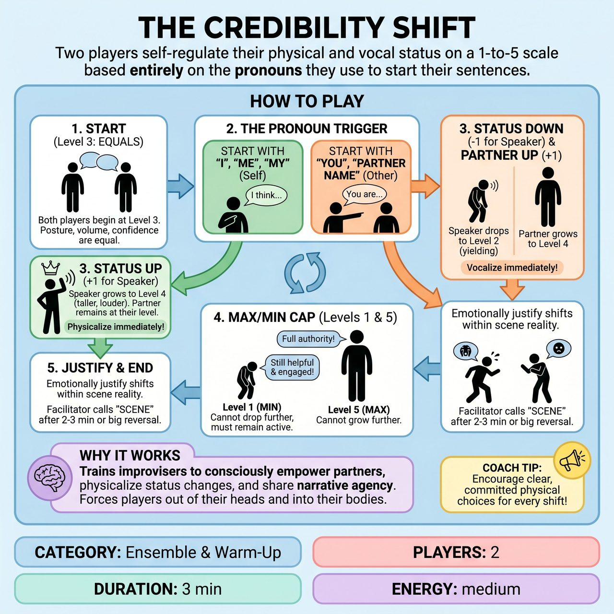

# The Credibility Shift

{ .game-hero }

> Two players self-regulate their physical and vocal status on a 1-to-5 scale based entirely on the pronouns they use to start their sentences.

## Overview
A facilitator-led workshop exercise where two players self-regulate their physical and vocal status on a scale of 1 to 5 based on a single, objective trigger: the pronouns they use to start their sentences. It trains improvisers to consciously empower their partners, physicalize status changes, and share narrative agency without needing a judge or scorekeeper.

## Setup
Two players take the stage. The facilitator establishes a 1-to-5 'Credibility Scale' where 3 is neutral (peers on equal footing), 5 is maximum authority (taking up space, confident, booming), and 1 is maximum submission (yielding space, hesitant, physically smaller). The facilitator gets a suggestion for a shared task or relationship (e.g., 'two chefs preparing a banquet' or 'astronauts fixing a satellite').

## How to Play
1. Both players begin the scene at Status Level 3, acting as absolute equals in posture, volume, and confidence.
2. The Objective Trigger: Status shifts are dictated entirely by how players start their sentences. If a player starts a sentence with 'I', 'Me', or 'My', their status goes UP one level, and their partner's status goes DOWN one level.
3. If a player starts a sentence with 'You' or their partner's character name, their status goes DOWN one level (yielding), and their partner's status goes UP one level (empowered).
4. Players must immediately physicalize and vocalize these shifts. For example, if Player A says 'I know how to fix this,' Player A grows to Level 4 (taller, louder) and Player B shrinks to Level 2 (yielding, quieter).
5. If Player B responds, 'You are the only one who can save us,' Player B drops to Level 1, and Player A maxes out at Level 5.
6. The scale is capped at 1 and 5. If a player is at Level 1, they cannot drop further, but they MUST remain actively engaged, vocal, and helpful to the scene-they do not become invisible or silent.
7. Players must emotionally justify the shifts within the reality of the scene (e.g., a sudden drop in status becomes a moment of awe, realization, or fear).
8. The facilitator calls 'Scene' after 2-3 minutes, or when a massive status reversal has been fully explored, followed by a brief debrief on how the pronouns affected the power dynamic.

## Coaching Notes
- Self-Regulated Status: Players track their own shifts, keeping them present and listening closely to their partner's dialogue.
- Objective Trigger: Removes subjective judgments about what constitutes a 'good' or 'bad' move, replacing it with a simple grammatical rule.
- Immediate Physicalization: Forces players out of their heads and into their bodies by tying dialogue directly to posture and volume.
- Active Submission: Replaces the stalling 'invisible' trope with a requirement to play low-status actively and supportively.
- Non-competitive format: There are no points, judges, or scorekeepers. The 'score' is entirely internal and physicalized by the players.
- Debrief: Have the workshop group observe the physical shifts and discuss how focusing on the partner ('You') vs. focusing on the self ('I') naturally alters narrative control.

## Variations
- The 'Yes/No' Trigger: Instead of pronouns, the trigger is agreement. Starting a sentence with 'Yes' or agreeing lowers your status and raises your partner's (yielding). Starting with 'No' or blocking raises yours and lowers theirs. This variation brilliantly demonstrates how blocking ruins collaboration by forcing one player into an unearned dominant position.
- The Proximity Trigger: Status is dictated purely by height in the room. If one player sits, the other must stand. If one lies down, the other must sit. Players must justify why they are changing levels while maintaining the scene.

## Why It Works
It trains improvisers to consciously empower their partners, physicalize status changes, and share narrative agency. By tying dialogue directly to posture and volume, it forces players out of their heads and into their bodies, demonstrating how focusing on the partner versus the self naturally alters narrative control.

## Safety & Inclusion
Status play can sometimes bleed into uncomfortable real-world power dynamics. Facilitators must ensure the scene remains focused on the characters, not the actors, and avoid suggestions involving systemic oppression. For accessibility, 'High' and 'Low' status do not strictly require standing tall or crouching; they can be fully expressed through eye contact, vocal volume, or the amount of metaphorical space taken up, making the game fully playable for improvisers with limited mobility.

