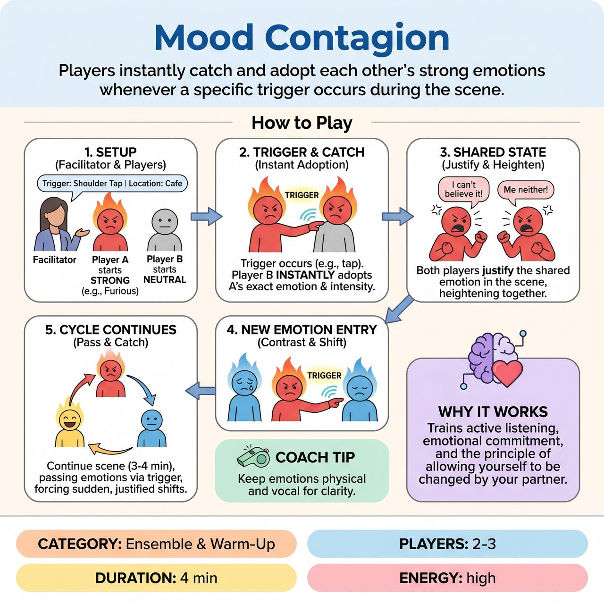

# Mood Contagion

{ .game-hero }

> Players instantly catch and adopt each other's strong emotions whenever a specific trigger occurs during the scene.

## Overview
Mood Contagion is a facilitator-led workshop exercise where 2 to 3 players perform a scene, but emotions are highly contagious. It trains active listening, emotional commitment, and the improv principle of allowing yourself to be changed by your partner.

## Setup
2 to 3 players on stage. No props or chairs needed. The facilitator gets a location suggestion and assigns a strong, distinct starting emotion to Player A, while Player B starts emotionally neutral. Establish a clear Contagion Trigger before starting, such as a consensual tap on the shoulder or handing over an imaginary object.

## How to Play
1. The facilitator establishes the Contagion Trigger and gets a location suggestion from the group.
2. Player A and Player B begin a scene. Player A starts with a strong, obvious emotion like furious, heartbroken, or ecstatic, while Player B starts completely neutral.
3. Player A initiates the Contagion Trigger with Player B, for example, by tapping their shoulder while speaking a line of dialogue.
4. Instantly, Player B must catch the emotion. They drop their neutral state and completely adopt Player A's exact emotion, matching their intensity, physicality, and vocal tone.
5. Both players are now playing the same emotion. They continue the scene, justifying this shared emotional state through their dialogue and actions.
6. To keep the scene dynamic and prevent stagnation, a third player, Player C, enters the scene with a brand new, highly contrasting emotion.
7. Player C interacts with either A or B and uses the Contagion Trigger. The triggered player instantly drops the old emotion and adopts Player C's new emotion.
8. The scene continues for 3 to 4 minutes, with players passing and catching emotions via the trigger, forcing sudden, justified shifts in character behavior.

## Coaching Notes
- Side-coach to ensure players are fully committing to the emotional shifts and not muddying the waters by layering emotions.
- Success is measured by the clarity of the emotional transfer and the players' ability to instantly justify their new state.
- Encourage strong physical and vocal choices to communicate clear internal states.
- Remind players to fully adopt, rather than layer, the new emotion for maximum clarity.

## Variations
- Eye Contact Contagion: Instead of physical touch, the trigger is locking eyes for three seconds. This is excellent for groups practicing spatial awareness and non-verbal connection without physical contact.
- The Emotional Virus: Played in a circle rather than a scene as a rapid-fire warm-up. One person turns to the person on their right with a strong emotion and a line of dialogue. The receiver mirrors the emotion perfectly, replies, then turns to the next person with a brand new emotion.

## Why It Works
It trains active listening, emotional commitment, and the improv principle of allowing yourself to be changed by your partner. It simplifies emotional shifts by requiring players to fully adopt the new emotion, forcing sudden, justified shifts in character behavior.

## Safety & Inclusion
If using physical touch as the trigger, the facilitator must establish clear boundaries beforehand, such as limiting touch to the shoulder, arm, or upper back. Players always have the right to opt out of physical touch. The Eye Contact or Passing an Imaginary Object triggers are perfect, accessible alternatives. Keep the player count strictly to 2 or 3 to prevent sensory overload and emotional soup.

