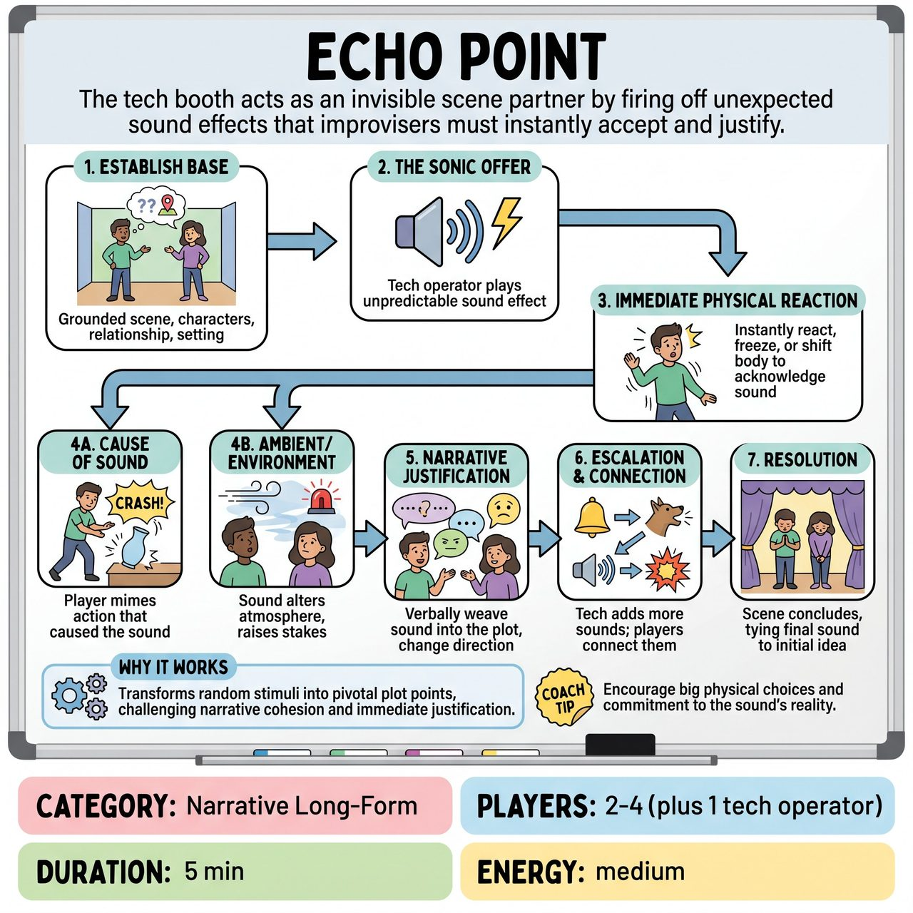

# Echo Point

{ .game-hero }

> The tech booth acts as an invisible scene partner by firing off unexpected sound effects that improvisers must instantly accept and justify.

## Overview
In this narrative-driven long-form game, the tech booth acts as an invisible scene partner by firing off unexpected sound effects. The improvisers must instantly accept the sound into their reality—either as an action they just performed or an environmental event—and justify how it impacts the story, their relationship, and their status. It transforms random sonic stimuli into pivotal plot points, challenging players to build a cohesive narrative rather than just reacting with quick gags.

## Setup
Requires 2-4 improvisers on stage and 1 tech operator in the booth with a soundboard of distinct, non-verbal sound effects (e.g., glass breaking, thunder, a cat meowing, a doorbell, wind). A panel of judges is used for a competitive format. Get an audience suggestion for a location or relationship to ground the scene.

## How to Play
1. 1. Establish the Base: The improvisers begin a grounded scene based on the audience suggestion, establishing character, relationship, and setting.
2. 2. The Sonic Offer: At an unpredictable moment (usually when the scene settles or needs a jolt), the tech operator plays a sound effect.
3. 3. Immediate Physical Reaction: The moment the sound plays, the improvisers must immediately react physically, freezing or shifting their bodies to acknowledge the stimulus.
4. 4. Cause or Environment: Players must instantly decide how the sound exists in their world. They can be the cause of the sound (e.g., a player mimes knocking over a vase to match a shattering noise) or react to it as an environmental or ambient event (e.g., a distant dog bark prompts a player to complain about the neighbor's pet).
5. 5. Handling Ambient Sounds: If the sound is ambient (like howling wind or distant sirens), players should use it to alter the scene's atmosphere, raising the stakes or shifting their emotional status.
6. 6. Narrative Justification: The players must verbally and emotionally justify the sound, weaving it into the plot. The sound must change the scene's direction or the characters' status.
7. 7. Escalation and Connection: The tech operator continues to pepper in sounds (3-5 per scene). The improvisers must remember previous sounds and tie them together, creating a cohesive, escalating narrative.
8. 8. Resolution: The scene concludes when the narrative arc resolves, often tying the final sound effect back to the original suggestion or the first sound.

## Coaching Notes
- Judges award points (typically 1 to 5) based on narrative integration, emotional commitment, and how seamlessly the sounds were justified without breaking character.
- Force immediate justification of external stimuli rather than just reacting with quick gags.
- Encourage strong physical choices and emotional commitment the moment the sound plays.
- Elevate the tech operator to a co-creator and active scene partner; they should choose bizarre or unexpected sounds to entertain the audience.

## Variations
- Human Foley: Instead of a tech booth, 1-2 improvisers stand on the sidelines with microphones, creating vocal sound effects for the onstage players to justify.
- Soundtrack Shift: Instead of sound effects, the tech booth plays 5-second clips of drastically different music genres (horror, romance, action), forcing the players to instantly shift the scene's genre and emotional tone.

## Why It Works
It transforms random sonic stimuli into pivotal plot points, challenging players to build a cohesive narrative. It forces immediate justification of external stimuli and encourages strong physical choices and emotional commitment.

## Safety & Inclusion
Content Warnings: The tech operator must avoid inherently traumatic sounds (e.g., realistic gunshots, air raid sirens, car crashes) unless explicitly agreed upon by the cast beforehand. Stick to quirky, natural, or cartoonish sounds. Accessibility: For players who are Deaf or hard of hearing, the tech operator (or a designated side-coach) can provide a simultaneous visual cue (e.g., flashing a colored light or holding up a cue card) when a sound is played, allowing them to react to the timing of the stimulus. Physical Safety: When reacting physically to sudden sounds, players should avoid reckless movements that could cause injury.

