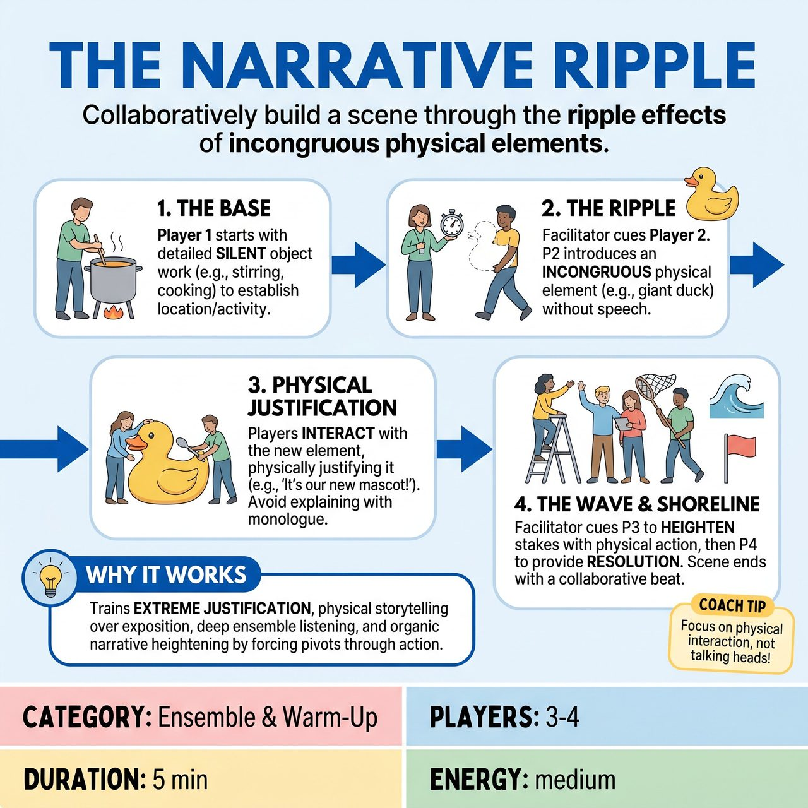

# The Narrative Ripple

{ .game-hero }

> Collaboratively build a scene through the ripple effects of incongruous physical elements.

## Overview
A facilitator-led workshop exercise where an ensemble builds a scene by progressively introducing and justifying unexpected physical elements. By forcing players to pivot the reality through action rather than exposition, the game trains extreme justification, deep listening, and physical storytelling while avoiding 'talking heads'.

## Setup
3 to 4 players step onto the stage. The facilitator gets an audience suggestion for a mundane, everyday location or activity. The rest of the group observes.

## How to Play
1. The Base: Player 1 begins the scene by establishing the location and activity through silent, detailed object work for the first 10 to 15 seconds before any dialogue occurs.
2. The Ripple: The facilitator cues Player 2 to enter. Player 2 must introduce a 'ripple'—a physical action or imaginary object that seems completely incongruous to the established mundane reality (e.g., carrying an imaginary bazooka into a bakery).
3. Physical Justification: Players must NOT explain the ripple with a monologue. Instead, Player 1 and Player 2 must immediately interact with the new element, justifying its presence through action and brief, organic dialogue. They must 'Yes, And' the physical reality.
4. The Wave: Once the ripple is justified, the facilitator cues Player 3. Player 3 enters to heighten the stakes of this new reality, again leading with a physical choice or strong emotional reaction rather than exposition. All three players remain actively engaged in the scene.
5. The Shoreline: The facilitator cues Player 4, who enters to provide a physical or emotional resolution to the heightened stakes. The scene ends when a natural, cohesive conclusion is reached.
6. Continuous Engagement: No player leaves the stage or stands idly by. Once you enter, you are part of the ensemble and must continuously react, support, and build the scene alongside your partners.

## Coaching Notes
- Side-coach during the exercise with prompts like 'Show us, don't tell us,' 'React to that physically,' or 'Justify that together.'
- Afterwards, discuss with the group how the reality shifted and what physical offers were most effective.

## Variations
- Silent Ripple: The entire exercise is performed completely silently or in gibberish. This forces players to rely entirely on object work, physicality, and emotional reactions to introduce and justify the ripples.
- The Swell (Large Group): Instead of a 4-person scene, the entire workshop forms a circle. Two players start in the center. Anyone can tap in to replace a player, but they must immediately introduce a new physical ripple that completely changes the context of the remaining player's physical position.

## Why It Works
It trains extreme justification, physical storytelling over exposition, ensemble listening and support, and organic narrative heightening by forcing players to pivot reality through action.

## Safety & Inclusion
When introducing physical 'ripples,' players must respect personal space and avoid aggressive or startling physical choices. 'Incongruous' should mean absurd or unexpected in the context of the narrative (e.g., a magic wand at a bus stop), not inappropriate, unsafe, or boundary-crossing content. Facilitators should ensure all physical abilities are accommodated by allowing ripples to be vocalized or adapted if physical object work is a barrier.

