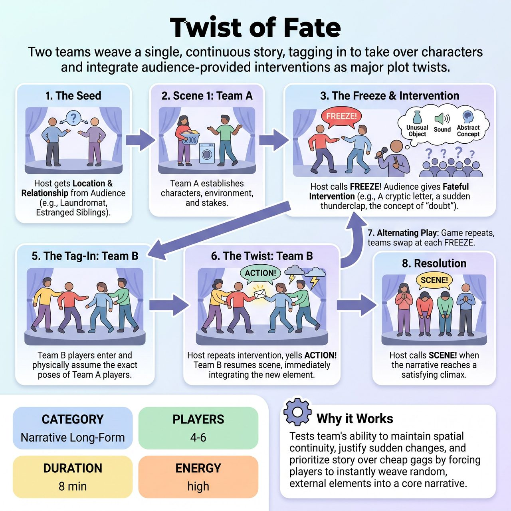

# Twist of Fate

{ .game-hero }

> Two teams weave a single, continuous story, tagging in to take over characters and integrate audience-provided interventions as major plot twists.

## Overview
Twist of Fate is a collaborative narrative game where two teams weave a single, continuous story. At moments of rising tension, the host freezes the action and elicits a 'Fateful Intervention' from the audience. The opposing team then physically tags into the exact poses of the current players, taking over their characters and immediately integrating the new element as a major dramatic plot twist.

## Setup
Two teams (2-3 players each) on the sidelines. A host/director center stage. Judges (if played in a competitive format).

## How to Play
1. 1. The Seed: The host asks the audience for a grounded starting location and a relationship (e.g., 'a laundromat,' 'two estranged siblings').
2. 2. Scene 1: Team A begins the scene, establishing the characters, the environment, and the initial stakes.
3. 3. The Freeze: At a moment of tension, discovery, or a plateau in the narrative, the host yells 'FREEZE!' Team A freezes instantly in their current physical poses.
4. 4. The Intervention: The host turns to the audience for a 'Fateful Intervention' by asking for a specific category (e.g., an unusual object, a sound, an abstract noun). The host actively filters out joke/gag suggestions, selecting one that adds dramatic weight.
5. 5. The Tag-In: Team B enters the stage. Player by player, they gently tap the shoulders of Team A's players and assume their exact physical poses, taking over their characters. Team A exits to the sidelines.
6. 6. The Twist: The host repeats the chosen intervention and yells 'ACTION!' Team B resumes the scene from the exact moment it stopped. They must immediately and significantly integrate the intervention into the plot as a catalyst for change or a major revelation.
7. 7. Alternating Play: The game continues, alternating teams at each 'FREEZE!' call, building a cohesive, escalating story.
8. 8. Resolution: The host calls 'SCENE!' when the narrative reaches a satisfying climax or natural conclusion.

## Coaching Notes
- Spatial Continuity: The physical tag-in mechanic ensures the physical reality of the scene remains intact even as the cast changes. Emphasize precision during the transition.
- Forced Justification: Players must exercise strong 'Yes, And' skills to instantly weave random, external elements into the core narrative rather than treating them as passing comments.
- Collaborative Competition: Teams may compete for judges' scores, but they must cooperate to build a single, coherent story, honoring the previous team's character choices.
- Host as Editor: The host plays a crucial role in pacing the scene and curating suggestions to maintain narrative integrity and prevent narrative chaos.
- Scoring: In a competitive format, judges award points (0-5) based on narrative continuity, the precision of the physical tag-ins, and how brilliantly the teams justified the interventions to advance the story.

## Variations
- Ensemble Fate (Non-Competitive): Played with a single cast. Any player on the backline can call 'Freeze,' ask the audience for an intervention, and tag in to take over a character.
- Genre Roulette: To increase difficulty, the host can also ask the audience for a new film or theater genre along with the intervention, forcing the incoming team to shift the stylistic tone while maintaining the narrative reality.

## Why It Works
It tests a team's ability to maintain spatial continuity, justify sudden changes, and prioritize story over cheap gags by forcing players to instantly weave random, external elements into a core narrative.

## Safety & Inclusion
Physical Tagging: Players must establish consent for physical touch prior to the show; a gentle tap on the shoulder is the standard tag. Mobility Accommodations: If an incoming player cannot safely assume the exact physical pose of the outgoing player due to mobility limitations, they should adopt a modified pose that conveys the same status, emotion, and spatial relationship. Content Filtering: The host's explicit role in filtering suggestions ensures the scene remains safe, avoiding inappropriate or non-consensual themes introduced by the audience.

