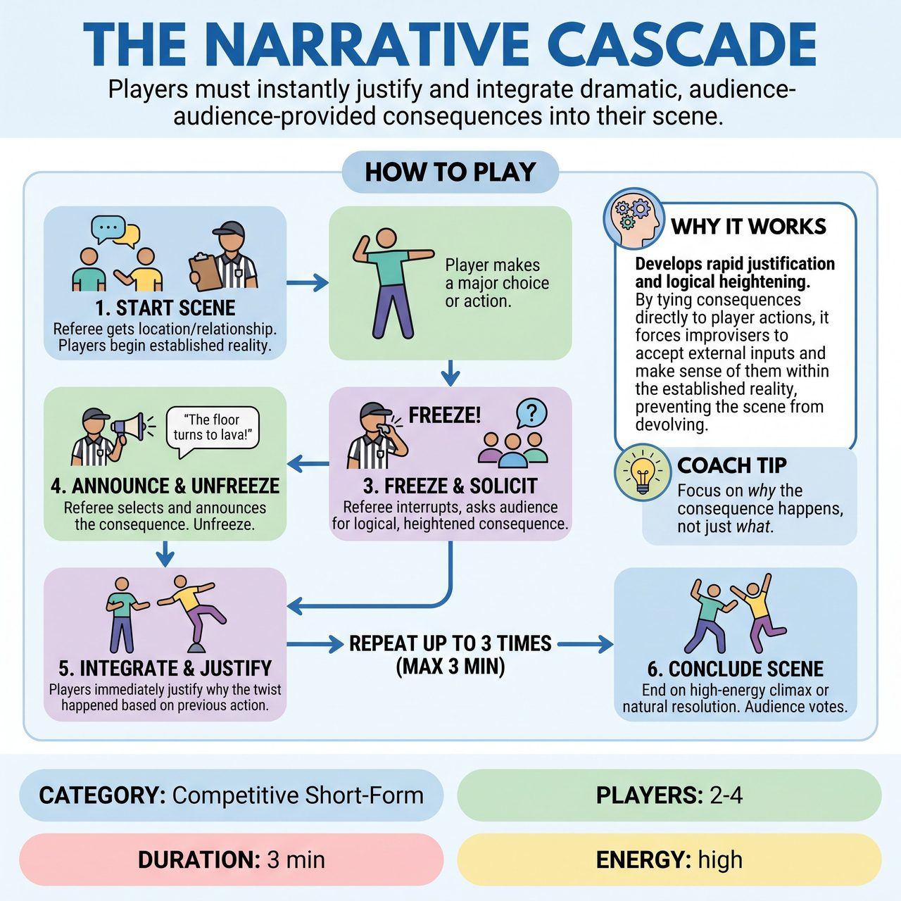

# The Narrative Cascade

{ .game-hero }

> Players must instantly justify and integrate dramatic, audience-provided consequences into their scene.

## Overview
A fast-paced, competitive short-form game where players adapt to audience-provided consequences on the fly. Whenever a player makes a bold choice or action, the Referee interrupts to solicit a logical but heightened consequence from the audience. Players must integrate these twists while maintaining the scene's reality.

## Setup
Requires 2 to 4 players and a Referee with a whistle. The stage is bare except for standard improv chairs. The Referee explains the game to the audience, emphasizing that they will provide logical but disastrous consequences to the players' actions. Get a starting location and relationship from the audience to begin.

## How to Play
1. The Referee gets a suggestion for a location and a relationship, then starts the scene.
2. Players begin the scene, focusing on establishing a grounded reality, clear characters, and physical actions.
3. When a player makes a significant physical action, a bold declaration, or a major choice, the Referee blows the whistle and yells 'Freeze!'
4. The Referee turns to the audience and asks for a logical but heightened consequence to that specific action (e.g., 'What is a terrible consequence of kicking this machine?').
5. The Referee selects the best audience shout and announces it clearly to the players.
6. The Referee yells 'Unfreeze!' and the players must immediately integrate this consequence, justifying why it happened based on their previous action rather than treating it as a random magic trick.
7. The Referee limits these interruptions to a maximum of 3 times during a 3-minute scene, allowing the players enough time to actually build the narrative and explore the fallout.
8. The scene concludes on a high-energy climax or a natural resolution of the final consequence, and the audience cheers to award points based on how seamlessly the team justified the consequences.

## Coaching Notes
- Rapid Justification: Players must instantly accept and make sense of external inputs, treating them as real outcomes of their actions.
- Logical Heightening: Ensure consequences are directly tied to player actions, preventing scenes from devolving into random non-sequiturs.
- Paced Interruptions: Limiting freezes to 3 per scene ensures the narrative has room to breathe and develop.
- The Referee can call a 'Denial Foul' (deducting points) if players ignore the consequence, or a 'content foul' if the content becomes inappropriate.

## Variations
- Consequence Cards: Instead of real-time shouts, the audience writes 'dramatic consequences' on slips of paper before the show. The Referee pulls these cards and applies them logically to the players' actions.
- The Golden Touch: Instead of disastrous consequences, the Referee asks the audience for overwhelmingly positive consequences (e.g., 'They find a million dollars in the machine'). This challenges players to maintain dramatic tension when everything goes perfectly.

## Why It Works
It develops rapid justification and logical heightening. By tying consequences directly to player actions, it forces improvisers to accept external inputs and make sense of them within the established reality, preventing the scene from devolving into random non-sequiturs.

## Safety & Inclusion
The Referee acts as a safety buffer, filtering out audience shouts that are inappropriate, unsafe, or offensive, ensuring the game remains clean and all-ages. Players are reminded to mime physical consequences (like explosions or falling objects) safely, without making dangerous physical contact with each other or the stage.

