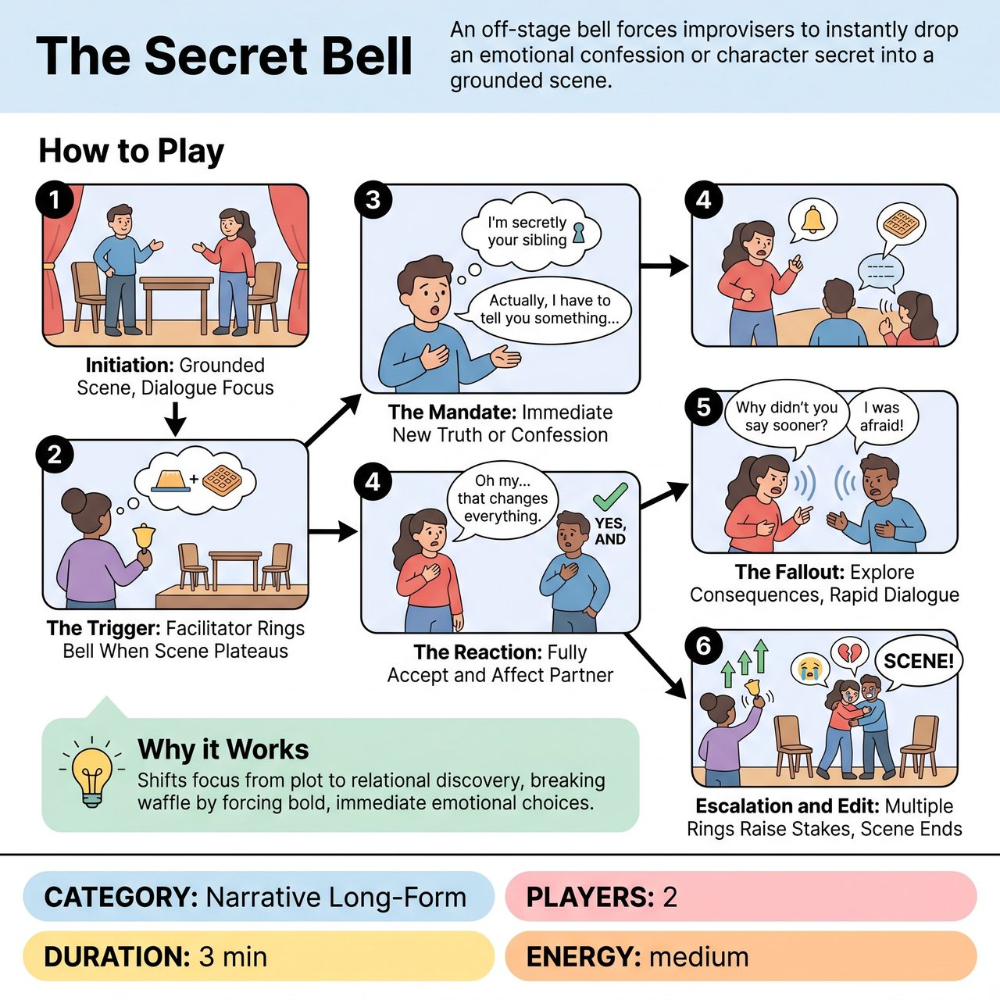

# The Secret Bell

{ .game-hero }

> An off-stage bell forces improvisers to instantly drop an emotional confession or character secret into a grounded scene.

## Overview
A facilitator-led scene exercise where players engage in grounded dialogue until an off-stage trigger prompts an immediate emotional confession or character secret. It trains improvisers to make bold, definitive choices that deepen relationships rather than relying on chaotic plot twists.

## Setup
Two players on stage. A facilitator stands off-stage with a bell (or simply uses their voice to call 'Reveal!'). The class or audience provides a mundane relationship or location to start the scene.

## How to Play
1. Initiation: Two players begin a scene based on the suggestion. They must focus on natural, back-and-forth dialogue and establish their environment through physical object work.
2. The Trigger: The facilitator observes from off-stage. Whenever the scene plateaus, players start waffling, or they avoid making a definitive choice, the facilitator rings the bell.
3. The Mandate: The player who is currently speaking (or whose turn it is to speak) must immediately drop a new emotional truth, personal confession, or character secret into the conversation (e.g., 'I've always resented your success,' or 'I'm terrified of the ocean').
4. The Reaction: The partner must fully accept this revelation ('Yes, And') and allow it to genuinely affect their character's emotional state, changing the dynamic of the scene.
5. The Fallout: Players continue the scene, exploring the consequences of the secret through rapid-fire dialogue. They must avoid launching into long, explanatory monologues.
6. Escalation and Edit: The facilitator rings the bell 3 to 4 times over the course of a 3-minute scene to continuously raise the emotional stakes, then calls 'Scene' on a high note.

## Coaching Notes
- Use the off-stage trigger to free players' hands, allowing them to maintain object work and stage pictures.
- Shift the focus from chaotic plot mechanics to grounded, relational discoveries.
- Break the habit of waffling by forcing immediate, bold choices from timid players.
- Encourage active listening, emotional vulnerability, and natural dialogue.
- Ensure players avoid launching into long, explanatory monologues after a reveal.

## Variations
- Positive Secrets Only: A great constraint for groups that default to arguing or dark themes. All triggered reveals must be complimentary, joyful, or supportive secrets (e.g., 'I secretly bought you that car,' or 'I admire your courage').
- The Inner Voice: When the bell rings, the player turns to the audience to confess their secret as a theatrical aside, then resumes the scene without their partner knowing the secret.

## Why It Works
It shifts the focus from chaotic plot mechanics to grounded, relational discoveries, breaking the habit of waffling by forcing immediate, bold choices from timid players.

## Safety & Inclusion
Emotional scenes can escalate quickly and sometimes veer into intense territory. The facilitator should brief players to keep secrets grounded in the fictional reality of the scene and avoid crossing personal boundaries. Ensure players know they can tap out or edit the scene themselves if it becomes emotionally exhausting. The Positive Secrets Only variation is highly recommended for younger or newer groups to maintain a supportive atmosphere.

