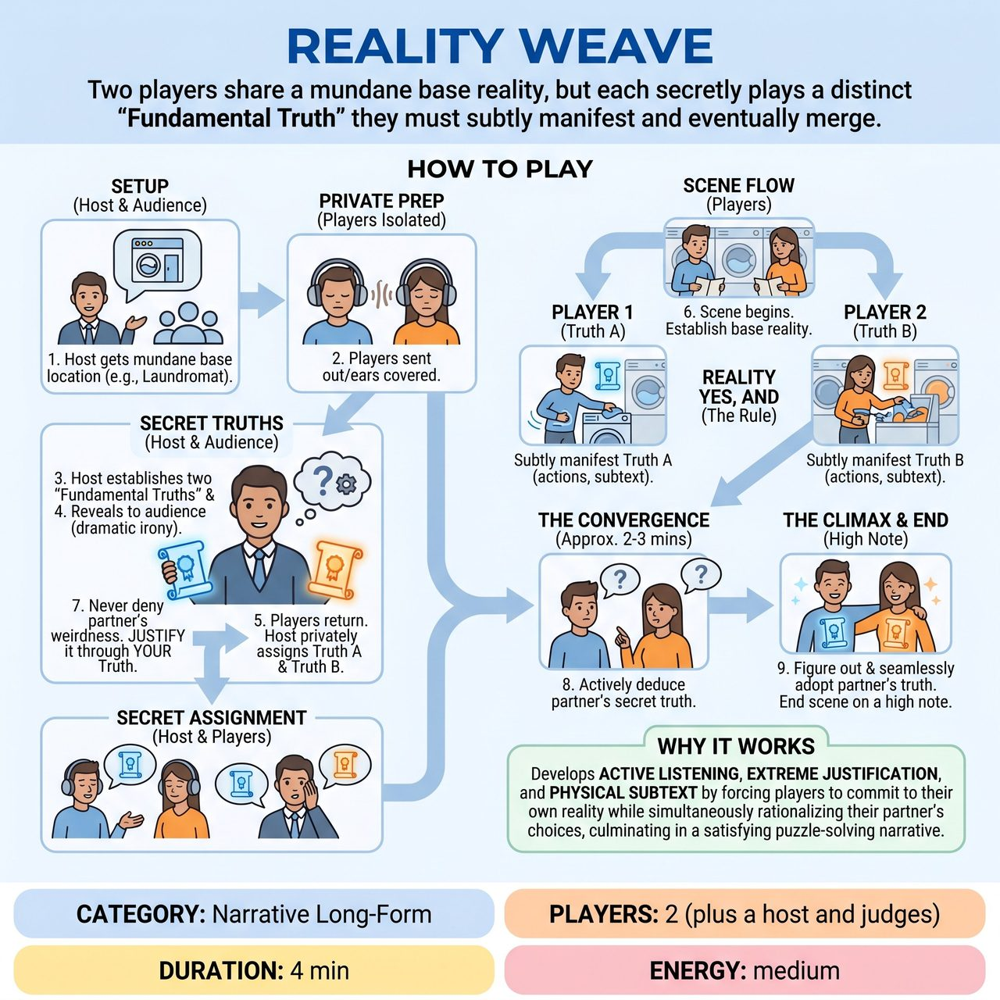

# Reality Weave

{ .game-hero }

> Two players share a mundane base reality, but each secretly plays a distinct 'Fundamental Truth' they must subtly manifest and eventually merge.

## Overview
A two-player narrative scene where both improvisers share a mundane base reality, but each is secretly given a distinct, complementary 'Fundamental Truth' about the world. These truths are revealed to the audience beforehand for maximum dramatic irony. Players must subtly manifest their own truth while using 'extreme justification' to explain away their partner's bizarre behavior through their own lens, eventually guessing and adopting their partner's reality.

## Setup
Requires 2 players, a host/referee, and a panel of judges (for competitive play). You also need a whiteboard, screen, or large cue cards to reveal the secret truths to the audience while the players' eyes are closed or they are out of the room.

## How to Play
1. 1. The host gets a mundane, grounded base location from the audience (e.g., a laundromat, a dentist's waiting room, a bus stop).
2. 2. The players are sent out of earshot (or wear noise-canceling headphones/close their eyes).
3. 3. The host establishes two 'Fundamental Truths' about the scene's reality. These must be complementary, physical, or genre-based, rather than mutually exclusive (e.g., Truth A: 'The floor is increasingly sticky.' Truth B: 'We are in a musical, but the music hasn't started yet.').
4. 4. The host reveals these truths to the audience so they are in on the joke, creating dramatic irony.
5. 5. The players return. The host privately assigns Truth A to Player 1 and Truth B to Player 2.
6. 6. The scene begins. Players must establish the base reality while subtly manifesting their secret truth through physical choices, subtext, and dialogue.
7. 7. The 'Reality Yes, And' Rule: Players must never deny their partner's weird behavior. Instead, they must justify it through the lens of their own secret truth (e.g., If Player 1 is struggling to lift their feet because the floor is sticky, Player 2 might justify it as Player 1 doing a warm-up dance for the impending musical number).
8. 8. The Convergence: Around the 2-to-3-minute mark, players must actively try to deduce their partner's secret truth based on context clues.
9. 9. The Climax: Once a player figures out their partner's truth, they must seamlessly adopt it alongside their own. The scene ends on a high note when both players are fully and overtly playing both realities simultaneously.

## Coaching Notes
- Lean into the dramatic irony; the audience enjoys knowing the secrets and laughing as players wildly misinterpret each other's clues.
- If playing in a competitive match, judges score the scene from 1 to 5 based on three criteria: 1) Commitment to the physical/subtextual truth without explicitly stating it, 2) The creativity of their 'extreme justifications' for their partner's actions, and 3) The narrative satisfaction and timing of the final convergence.
- Encourage players to focus on physical subtext and active listening to create a puzzle-solving narrative arc.

## Variations
- Emotional Weave: Instead of physical realities, players are given secret, complementary emotional stakes (e.g., 'I owe a massive debt to the mob' + 'I think I am about to be proposed to'). The convergence happens when the emotional subtexts finally clash in the open.
- Three-Way Weave: Add a third player with a third complementary truth (e.g., 'I am a ghost who thinks they are still alive'). This significantly increases the complexity of the justifications and the final convergence, recommended only for advanced ensembles.

## Why It Works
It develops active listening, extreme justification, and physical subtext by forcing players to commit to their own reality while simultaneously rationalizing their partner's bizarre choices, culminating in a satisfying puzzle-solving narrative arc.

## Safety & Inclusion
The host must ensure that 'Fundamental Truths' do not involve trauma, phobias, or non-consensual physical touch (e.g., avoid 'We are trapped by a killer' or 'I am irresistibly drawn to touch you'). Keep truths focused on physics, genre, or absurd situational constraints. Players should maintain physical boundaries and rely on space object work and solo physicality to manifest their realities.

