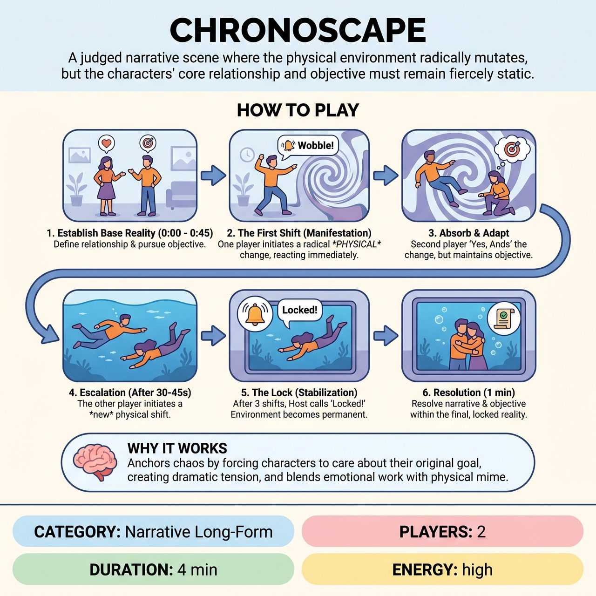

# Chronoscape

{ .game-hero }

> A judged narrative scene where the physical environment radically mutates, but the characters' core relationship and objective must remain fiercely static.

## Overview
In this judged narrative scene, the physical environment radically mutates while the characters' core relationship and objective remain fiercely static. Players must physically adapt to the new reality while fighting to complete their original goal. The scene culminates in a 'locked' reality for the final resolution.

## Setup
2 players on a neutral stage with no props. The Host asks the audience for a grounded relationship (e.g., 'two siblings') and a specific, urgent physical objective (e.g., 'packing a moving box before the truck leaves'). A panel of judges is ready to score the scene.

## How to Play
1. Establish the Base Reality (0:00 - 0:45): The players begin the scene, establishing their relationship, status, and actively pursuing their audience-given objective in a normal, grounded environment.
2. The First Shift (Manifestation): One player initiates a radical, purely PHYSICAL change to the environment by declaring it and immediately reacting physically (e.g., 'The floor is turning into thick, sticky honey!'). Crucial rule: No temporal, causal, or plot shifts. Only physical environmental changes.
3. Absorb & Adapt: The second player must instantly 'Yes, And' the physical change through their own body and voice. However, their character's objective and relationship MUST remain exactly the same.
4. Escalation: After 30-45 seconds of playing in the new reality, the other player initiates a new physical shift (e.g., 'The gravity is shifting to the ceiling!'). Both players adapt physically while continuing to pursue the exact same objective.
5. The Lock (Stabilization): After 3 total shifts, the Host rings a bell and calls 'Locked!' The current environment becomes permanent.
6. Resolution: The players have 1 minute to resolve their objective and bring the narrative to a satisfying, coherent conclusion within this final, locked environment.
7. Scoring: A panel of Judges scores the scene from 1-5 based on three criteria: 1) Commitment to the physical environment, 2) Stubbornly maintaining the core objective despite the chaos, and 3) Delivering a satisfying narrative resolution.

## Coaching Notes
- Static Objectives: Anchor the chaos by forcing characters to care about their original goal, creating instant dramatic tension.
- Physical Constraint: Limit changes to the physical environment, removing the massive cognitive load of plot-twists and time-jumps.
- The Lock Mechanic: Ensure the scene doesn't spiral into infinity, providing a clear runway for a narrative ending.
- High Contrast: Blend grounded, emotional relationship work with surreal, highly physical mime.

## Variations
- Host-Driven Shifts (Easier): Instead of the players initiating the shifts, the Host calls out the environmental changes (e.g., 'Shift: The room is shrinking!'). This allows players to focus 100% on reacting and maintaining their objective.
- Solo Crucible (Exercise): Played as a 1-person warm-up where an improviser must complete a mundane task (like making a sandwich) while the facilitator calls out rapid-fire physical environmental shifts.

## Why It Works
It anchors the chaos by forcing characters to care about their original goal, creating instant dramatic tension, and blends grounded, emotional relationship work with surreal, highly physical mime.

## Safety & Inclusion
Physical changes must be played through muscular tension, mime, and vocal adjustment, not dangerous acrobatics, throwing oneself to the floor, or unsafe stunts. A shifting environment is never an excuse for non-consensual physical contact; players must navigate the space independently unless consent is established. All physical endowments can and should be adapted to the performers' specific mobility levels (e.g., 'heavy gravity' can be played entirely through facial tension and breathing).

