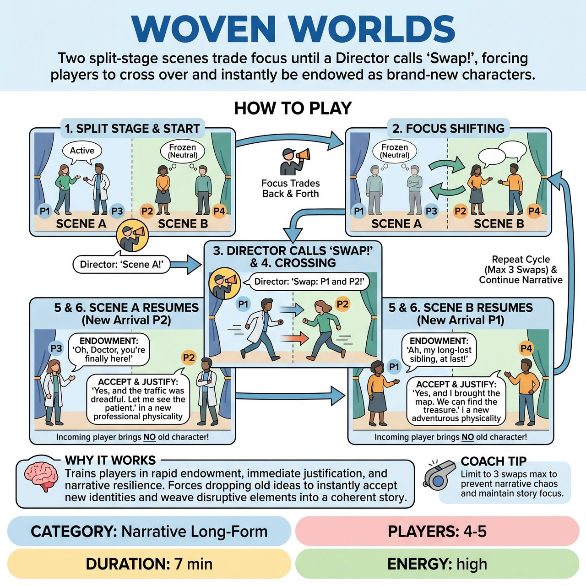

# Woven Worlds

{ .game-hero }

> Two split-stage scenes trade focus until a Director calls 'Swap!', forcing players to cross over and instantly be endowed as brand-new characters.

## Overview
Two distinct scenes unfold on a split stage, with a Director shifting focus back and forth between them. Periodically, the Director calls a 'Swap!', forcing one player from each scene to physically trade places. The remaining player must instantly endow the new arrival as a brand-new character, forcing both improvisers to rapidly justify the entrance, redefine their relationship, and weave the new dynamic into the existing narrative.

## Setup
Requires 4 players (two pairs) and a Director/Host. Divide the stage into two distinct playing areas (Stage Left for Scene A, Stage Right for Scene B). The Director stands downstage center or in the booth. Ask the audience for two completely unrelated locations and relationships (one set for Scene A, one for Scene B).

## How to Play
1. 1. Start with both pairs in their respective stage areas. The Director points to Scene A to begin; Scene B remains frozen in neutral positions.
2. 2. Focus Shifting: To prevent players from talking over each other, only one scene is active at a time. The Director shifts focus by calling 'Scene B!' or simply pointing. The active scene freezes, and the newly called scene instantly springs to life.
3. 3. The Swap: At a moment of high tension or a natural beat (usually 1-2 minutes in), the Director calls, 'Swap: [Player 1] and [Player 2]!'
4. 4. The Crossing: The two named players safely and quickly cross the stage to join the opposite scene. The scene that was active before the swap resumes immediately once the new player arrives.
5. 5. Rapid Endowment: The incoming player does NOT bring their old character. Instead, the player already in the scene must immediately speak to the new arrival, endowing them with a new identity, status, and relationship (e.g., 'Thank god you're here, Doctor, the readings are off the charts!').
6. 6. Justification: The incoming player must instantly accept the endowment ('Yes, and...'), adopt a new physicality, and justify why they just entered the scene.
7. 7. Pacing and Limits: To prevent the narrative from devolving into a chaotic series of disjointed walk-ons, the Director should limit the game to a maximum of 3 swaps total. The goal is to let the new relationships breathe and affect the story.
8. 8. Resolution: The Director continues to bounce focus between the two now-altered scenes, looking for a strong narrative climax or a thematic link between the two worlds to call 'Scene!'

## Coaching Notes
- Split-Screen Focus: Train players to hold their physical and emotional state while frozen.
- Rapid Endowment: Force the remaining player to make strong, immediate choices for their partner.
- Justification: Test the incoming player's ability to drop their previous idea and instantly 'be changed'.
- Narrative Resilience: Challenge improvisers to maintain a cohesive story arc despite massive disruptions.
- Scoring/Judging: If playing in a competitive short-form match, judges can score 1-5 points based on narrative coherence, emotional commitment, and seamless justification of sudden character additions.

## Variations
- The Understudy (Narrative Continuity): Instead of becoming a new character, the incoming player takes over the EXACT character that just left. They must mimic the departed player's physical choices, voice, and emotional arc, maintaining strict narrative continuity.
- Genre Swap: Each side of the stage is assigned a different genre (e.g., Sci-Fi vs. Soap Opera). When a player crosses over, their new character must perfectly fit the tropes and tone of the new genre.
- Lighting Focus: If you have a tech booth, use stage lighting to shift focus between Scene A and Scene B instead of the Director pointing, creating a highly cinematic feel.

## Why It Works
It trains players in rapid endowment, immediate justification, and narrative resilience. By forcing a sudden character swap, improvisers must drop their previous ideas, instantly accept new identities, and weave disruptive elements into a cohesive story arc.

## Safety & Inclusion
Physical Safety: Ensure the path between the two stage areas is completely clear of props or set pieces to prevent tripping during the 'Swap'. Players should move swiftly but never run. Consent: When endowing new characters, players must adhere to standard boundaries—avoiding forced intimate, degrading, or physically aggressive relationships. Accessibility: If physical crossing is a barrier for any performer, 'Swaps' can be executed verbally or via lighting changes where players simply swap roles/voices without changing physical locations.

