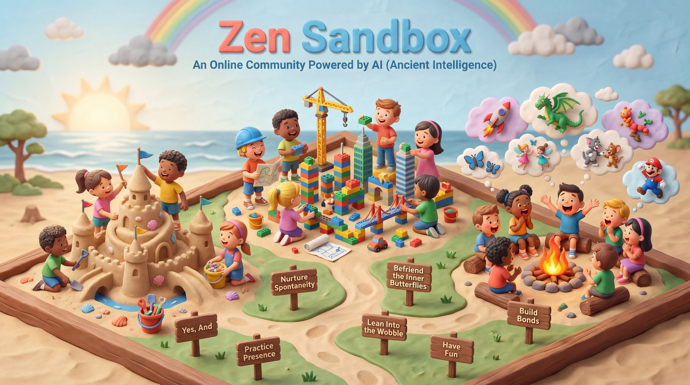

---
hide:
  - toc          # no right-hand table of contents on the landing page — the hero image uses that space
---

# About Zen Sandbox : Online Improv Practice Community.

> *Playfully "Powered by AI" - Ancient Intelligence.*
>
> *Rediscover the timeless human capacity for presence, laughter, and connection. No machines required.*

{ .hero-image loading=lazy }

#### Who We Are

Zen Sandbox is an online, non-profit community built around the playful and profound art of improvisation. We're a small, trusted circle of friends, colleagues, and collaborators who gather to step away from the over-scripted nature of daily life.

We believe improvisation is far more than "making up jokes on the spot." It's a practice of presence, collaboration, and openness. Whether you're leading a meeting, navigating a personal transition, or simply looking to unwind, improv offers a way of meeting an unpredictable world with a resilient, playful spirit.

#### The Sandbox Vibe: Low Expectations, High Fun

Life is unscripted, yet we often forget how to navigate it without a plan. Zen Sandbox is a safe, low-pressure space where no prior experience is needed and there's nothing to prepare.

Our premise is simple: **the lower the expectations, the higher the fun.** By setting aside our daily agendas, we give our inner kid room to explore, laugh, and let go of perfectionism.

#### What We Explore Together

In our weekly meetups, we dive into interactive exercises designed to cultivate:

- **The Improv Mindset** — Embracing "Yes, and…", nurturing spontaneity, and befriending the inner butterflies of uncertainty.
- **Stories & Connection** — Practicing presence, exploring storytelling, and building genuine, empathetic bonds.
- **Playfulness** — Bringing a little more fun and laughter back into our routines.

---

#### Core Principles for the Stage and Everyday Life

A few beautifully simple ideas sit at the heart of our community — and they happen to mirror some of life's best principles:

| Core Principle | In the Sandbox | In Everyday Life |
|---|---|---|
| **"Yes, and…"** | Accept the reality your partner offers ("Yes"), then add your own contribution to move the scene forward ("And"). | Instead of resisting unexpected shifts, we pivot, adapt, and build on new realities. |
| **Deep Listening** | You can't pre-plan your next move; you respond to what your partner actually said. | Setting aside our agendas makes relationships more authentic and empathetic. |
| **Team Support** | Improv is a team sport — we focus on making our partners shine, not boosting our own ego. | We build trust, so everyone feels safe to contribute. |
| **No Mistakes** | A misstep becomes an unexpected gift; you weave the stumble right into the scene. | We trade the fear of failure for curious exploration. |

---
