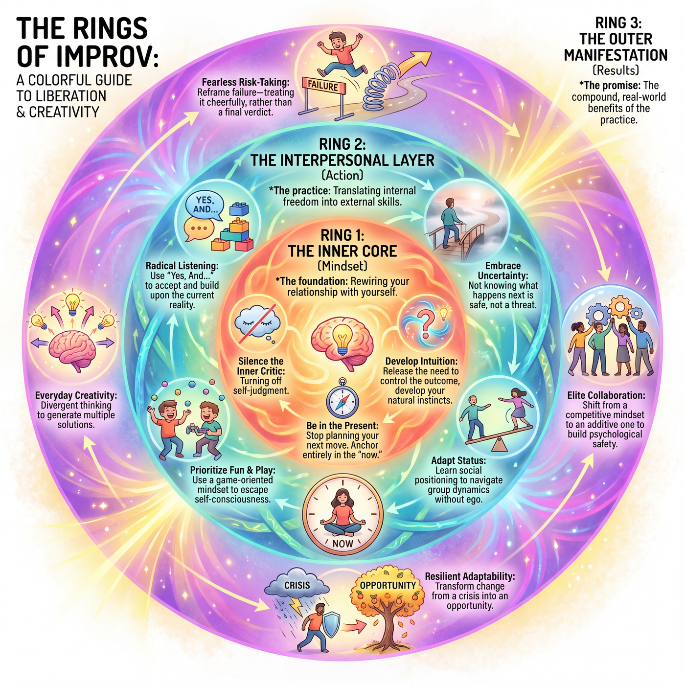

---
hide:
  - toc          # no right-hand table of contents on the landing page — the hero image uses that space
---

# Zen Sandbox : Online Improv Community. 

> *Playfully "Powered by AI" - Ancient Intelligence.*
>
> *Rediscover the timeless human capacity for presence, laughter, and connection. No machines required.*

{ .hero-image loading=lazy }

#### Who We Are

Zen Sandbox is a non-profit community built around the playful and profound art of improvisation. We're a small, trusted circle of friends, colleagues, and collaborators who gather to step away from the over-scripted nature of daily life.

We believe improvisation is far more than "making up jokes on the spot." It's a practice of presence, collaboration, and openness. Whether you're leading a meeting, navigating a personal transition, or simply looking to unwind, improv offers a way of meeting an unpredictable world with a resilient, playful spirit.

  <iframe style="width:100%; aspect-ratio:16/9; border:0; border-radius:.4rem;"
    src="https://www.youtube-nocookie.com/embed/9Qi_dvZmFyI"
    title="Our Improv Song"
    allow="accelerometer; autoplay; clipboard-write; encrypted-media; gyroscope; picture-in-picture; web-share"
    referrerpolicy="strict-origin-when-cross-origin"
    allowfullscreen></iframe>

🎵 [Our Improv Song](https://www.youtube.com/watch?v=9Qi_dvZmFyI)

#### The Sandbox Vibe: Low Expectations, High Fun

Life is unscripted, yet we often forget how to navigate it without a plan. Zen Sandbox is a safe, low-pressure space where no prior experience is needed and there's nothing to prepare.

Our premise is simple: **the lower the expectations, the higher the fun.** By setting aside our daily agendas, we give our inner kid room to explore, laugh, and let go of perfectionism.

#### What We Explore Together

In our weekly meetups, we dive into interactive exercises designed to cultivate:

- **The Improv Mindset** — Embracing "Yes, and…", nurturing spontaneity, and befriending the inner butterflies of uncertainty.
- **Stories & Connection** — Practicing presence, exploring storytelling, and building genuine, empathetic bonds.
- **Playfulness** — Bringing a little more fun and laughter back into our routines.

---

#### Core Principles for the Stage and Everyday Life

A few beautifully simple ideas sit at the heart of our community — and they happen to mirror some of life's best principles:

| Core Principle | In the Sandbox | In Everyday Life |
|---|---|---|
| **"Yes, and…"** | Accept the reality your partner offers ("Yes"), then add your own contribution to move the scene forward ("And"). | Instead of resisting unexpected shifts, we pivot, adapt, and build on new realities. |
| **Deep Listening** | You can't pre-plan your next move; you respond to what your partner actually said. | Setting aside our agendas makes relationships more authentic and empathetic. |
| **Team Support** | Improv is a team sport — we focus on making our partners shine, not boosting our own ego. | We build trust, so everyone feels safe to contribute. |
| **No Mistakes** | A misstep becomes an unexpected gift; you weave the stumble right into the scene. | We trade the fear of failure for curious exploration. |

---

## The Rings of Improv

Improvisation is often mistaken for a performance skill — the art of "being quick" or "being funny." In truth, it is a discipline of *unlearning*. It works from the inside out: it begins with a shift in your relationship to yourself, radiates outward to transform how you connect with others, and finally shows up as tangible advantages in your creative, professional, and relational life — three concentric rings, each one growing from the ring within it.

| Ring | Layer | What it holds |
|---|---|---|
| **Ring 1 — The Inner Core** | Psychological essence | The internal, neurological shifts within the individual mind. |
| **Ring 2 — The Interpersonal Layer** | Improv skills | How that inner shift transforms real-time interaction with others. |
| **Ring 3 — The Outer Manifestation** | Material benefits | The measurable, tangible outcomes in life, work, and relationships. |

Each ring depends on the one beneath it. You cannot fake collaborative agility (Ring 3) without genuine listening (Ring 2), and you cannot truly listen while your inner critic is screaming (Ring 1).

### Ring 1 · The Inner Core — Psychological Essence

*The foundation of improv is fundamentally rewiring your relationship with yourself.*

**Silence the Inner Critic.** Keith Johnstone built his life's work around defeating the internal **"Censor"** — the voice that insists our ideas are too weird, too obvious, or not clever enough. His antidote was to instruct students to **"be average" and "be obvious."** By removing the pressure to be a genius, spontaneity flows freely: "The improviser has to realize that the more obvious he is, the more original he appears."

!!! note "The Science"
    Dr. Charles Limb (Johns Hopkins / UCSF) ran fMRI scans on jazz musicians and freestyle rappers mid-improvisation. The **dorsolateral prefrontal cortex** — the seat of self-monitoring and censorship — literally *deactivates*, while the **medial prefrontal cortex** — associated with self-expression — lights up. Improv doesn't just *feel* liberating; it measurably quiets the brain's critic.

**Be Fully Present.** You cannot pre-write your next line; the moment you plan, you stop listening and miss the offer your partner just handed you. This is **W. Timothy Gallwey's** *Inner Game of Tennis*: **Self 1** (the judging, anxious ego) must quiet so **Self 2** (the natural, present body-mind) can act. Presence isn't a mood; it's the prerequisite for responsiveness.

**Trust the First Impulse.** Viola Spolin taught that intuition emerges the instant we stop trying to *control the outcome*. Her Space Object work pulls the brain out of planning and into immediate, sensory reaction. Intuition is not a gift; it is what remains when interference is removed (Gallwey's formula: *Performance = Potential − Interference*).

### Ring 2 · The Interpersonal Layer — Improv Skills

*Once the inner critic is quieted, your external skills sharpen. The essence becomes action.*

**Radical Listening ("Yes, And…").** In ordinary conversation we rarely listen — we wait for our turn to speak. Improv demands absorbing your partner's reality *completely* in order to build on it: you **accept** the offer ("Yes") and **add** to it ("And"). Its opposite, "blocking," is the death of a scene — and of most collaborations.

**The "Fun Muscle."** Spolin rooted her methodology in **Theater Games**, recognising that humans learn best when they play. Focusing on the game rather than on ourselves lets us escape the **"Approval/Disapproval Syndrome"** — the lifelong habit of seeking validation. Play is not the opposite of seriousness; it is the opposite of *self-consciousness*.

**Comfort in Discomfort.** Improv is the practice of stepping onstage with zero plan and discovering you survive. Over repetition, the nervous system re-learns that "not knowing what happens next" is *safe*, not threatening.

!!! note "The Science"
    Research by Dr. Peter Felsman shows that even brief improv training significantly **increases tolerance of uncertainty, reduces social anxiety, and boosts divergent thinking.** Uncertainty stops being a threat and becomes raw material.

**Status Flexibility.** Johnstone's analysis of **Status** reveals how we constantly, often unconsciously, raise or lower ourselves relative to others. Training to play **high or low status consciously** makes you adaptable in any social or professional dynamic — you learn to *choose* your position rather than default to habit.

### Ring 3 · The Outer Manifestation — Material Benefits

*This is the "honest promise" of improv. When the core is solid and the skills are practiced, these are the life-changing results.*

**Fearless Risk-Taking.** Johnstone encouraged students to **"celebrate the failure"** — to fail cheerfully rather than apologetically. By stumbling onstage and realising you are *fine*, the muscle for real-world risk strengthens. Failure stops being a verdict and becomes information.

**Everyday Creativity.** Studies in **applied improvisation** (Theresa Robbins Dudeck) show marked increases in **divergent thinking** — generating many diverse solutions to a single problem. The "Yes, And" reflex replaces premature judgment with generative momentum.

**Elite Collaboration.** Johnstone's golden rule — **"Make your partner look good"** — may be improv's most valuable transferable skill. You shift from a *competitive* mindset (I win by being smartest) to an *additive* one (we win by building together), fostering the **psychological safety** that Google's Project Aristotle identified as the top predictor of high-performing teams.

**Resilient Adaptability.** When presence, listening, and comfort-with-uncertainty combine, you become someone who *responds* rather than *reacts*. Change stops being a crisis and becomes a scene to be played — improv's deepest promise.

### A living system

The three rings are not steps to be completed and abandoned — they are a **living system**. A seasoned improviser continually returns to Ring 1 (quieting the critic, returning to presence) precisely so that Rings 2 and 3 stay alive. The inner work never ends; it simply becomes the ground everything else stands on.

---
