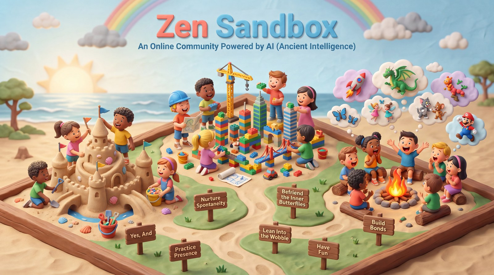

# 🎭 An Invitation to Practice Failing Joyfully

> *Mastering 'ai' in the Age of AI.*

I have been practicing the art form of Improvisation for some time now, and believe it is one of the most critical skills for the current era. While the world chases Artificial Intelligence, I call **Improv** the essential **'ai'** skill — **Ancient Intelligence**.

It is a counter-intuitive approach to polishing essential life skills. Think of it as a modern practice of the Zen philosophy *Wu wei* (Effortless Action).

At its core, to improvise is to invent or make something using whatever is available at the time, without prior planning. But beneath the surface, it is an essential tool for navigating the **VUCA** (Volatility, Uncertainty, Complexity, and Ambiguity) world we live in. It trains us to think on our feet, stay in the present, and handle the inner critic's relentless judgemental chatter, while maintaining a reasonably joyous state of mind.

{ .hero-image loading=lazy }

## 🧠 The Science and Soul of the Unscripted Mind

Why does making up scenes on the spot feel so transformative? Cognitive science and ancient philosophy point to the same answers:

* **Silencing the Inner Critic:** Neurological studies show that during deep improvisation, the brain's Default Mode Network (responsible for conscious self-monitoring and judgment) essentially powers down. We naturally enter a "Flow state" where we tap into pure intuition rather than overthinking.
* **The Power of "Yes, And":** Humans suffer from an illusion of control. We step into a dynamic situation without a script and accept whatever reality our partner offers ("Yes"), and add to it ("And"). We accept the truth of present reality as it is (not as we want it to be), and act with a positive mindset to overcome our fear of the unknown.
* **Embracing Imperfection (*Wabi-Sabi*):** In improv, there are no mistakes, only opportunities. If you drop a prop or misspeak, it becomes a deliberate part of the story. It is a safe space for the inner kid to have fun and build resilience.

## 🔍 Honest Expectations & The "Shoshin" Mindset

Let me be completely honest: **Improv does not guarantee anything.** There is a fair chance you will not get anything (or any skill), if you come weighed down by expectations. The inner critic would be busier with its chatter on seeking results than enjoying the learning process.

Do not expect a magic bullet for corporate charisma or public speaking. The magic of improv *only* happens if you approach it with **Shoshin** (Beginner's Mind), approaching the space with total openness, eagerness, zero ego, and no expectations.

!!! note "In-person training first, if you can"
    I highly recommend pursuing a 6-to-8-week professional, in-person improv course at a local theater (like Second City, ComedySportz, UCB or similar thought leaders in this domain). SC and UCB also have great online improv courses by professional teachers. In-person training is super incredible, and I am a big fan of it.

But, realizing many of us have busy schedules and cannot travel, a few friends and I decided to build a not-for-profit online community alternative.

We have compiled and open-sourced our [theory](improv-maturity-framework.md), [practice games](games/index.md), and [workshop curriculum](workshops/index.md). Anyone with basic theater or improv experience can run these sessions, and you can even contribute to our [GitHub repository](https://github.com/khanna-vijay/Zen-Sandbox) with more games and session plans.

After a successful 3-week experimental phase, we are ready to pilot our full beginners program.

## 🗓️ The 8-Week Intensive Beginner Course

We are piloting an intense, 8-week online improv course. Each session builds upon the last, requiring serious commitment.

| | |
|---|---|
| **When** | Saturdays at 8:00 AM Pacific Time (8:30 PM IST) — starting **September 5th** |
| **Duration** | 2 hours 30 minutes (150 minutes) per weekend session |
| **Homework** | 30 minutes of daily homework tasks between weekend sessions |

!!! info "How this maps to the published curriculum"
    The pilot runs a condensed version of [Format #2 — The 8-Week Deep Dive](workshops/format-2/index.md), the beginners course published on this site. That curriculum is written for 180-minute sessions; the pilot compresses each one into 150 minutes.

[🎭 Apply for the September cohort](https://forms.gle/mTu57wvF2A1dihUB7){ .md-button .md-button--primary }

Because this is a deeply interactive, vulnerable online environment, we must maintain strict boundaries to ensure the psychological safety and quality of the class. **Please review the requirements carefully before applying.**

## 🛡️ Community Ground Rules

* **Commitment:** If you miss 2 sessions, you will be asked to step out and rejoin a future batch. Each module builds on the previous one, so missing classes will impact the group's learning experience.
* **Respect:** Zero tolerance for political, religious, or discriminatory discussions.
* **Safety First:** Your well-being is paramount. If you feel anxious or uncomfortable, you may drop out anytime, no explanation needed.
* **Physicality:** This is almost like theater training. Expect to move around, make funny faces, gibberish noises, and do acting warmups!

## 💻 Technical & Space Requirements

* **Device:** This course is engineered for Zoom on a PC/laptop only. Students cannot join via mobile, iPad, or tablet.
* **Connection:** 30Mbps+ stable internet. Heavy lag or jitter impacts group activities, interactions and everyone's learning.
* **Presence:** This is a highly interactive course with lots of interactive activities. Camera and microphone must be ON for the entire 150-minute session.
* **Privacy:** You must be in a private, distraction-free room where you can act and speak freely. Many folks do not like justifying to their partners and relatives why they were making funny faces and acting childish on a Zoom call 🙂.

## 🌱 The Reported Benefits

Mileage always varies depending on how much energy you invest and the depth of your *Shoshin* mindset. However, participants who practice this art form regularly report:

* Improved spontaneity and risk-taking ability.
* Increased comfort operating in a changing, VUCA world.
* Ability to quiet the inner critic — being able to take action and move ahead despite the self-doubt chatter in the head.
* Heightened intuition and creativity.
* Strengthened "fun muscles!"

## Ready to let go of the illusion of control?

Claim your spot in the upcoming **September 5th** cohort, and let's navigate the unscripted world together.

[🎭 Apply for the September cohort](https://forms.gle/mTu57wvF2A1dihUB7){ .md-button .md-button--primary }
