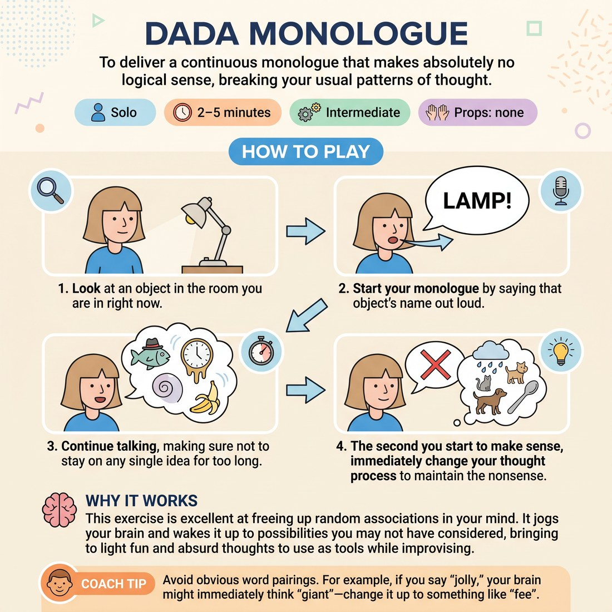

# 🧠 Dada Monologue
> *To deliver a continuous monologue that makes absolutely no logical sense, breaking your usual patterns of thought.*

{ .infographic }

`🧑 Solo` · `⏱️ 2–5 minutes` · `📈 Intermediate` · `🎒 none`

**Trains:** Free association · breaking logic · spontaneity

## 🎯 Objective
To deliver a continuous monologue that makes absolutely no logical sense, breaking your usual patterns of thought.

## ▶️ How to play
1. Look at an object in the room you are in right now.
2. Start your monologue by saying that object's name out loud.
3. Continue talking, making sure not to stay on any single idea for too long.
4. The second you start to make sense, immediately change your thought process to maintain the nonsense.

## 💡 Why it works
This exercise is excellent at freeing up random associations in your mind. It jogs your brain and wakes it up to possibilities you may not have considered, bringing to light fun and absurd thoughts to use as tools while improvising, as opposed to the limited range of associations we usually rely on.

## 🎓 Coach's tips
- Avoid obvious word pairings. For example, if you say "jolly," your brain might immediately think "giant"—change it up to something like "feet" instead to avoid making too much sense.
- Example of a Dada monologue: "Candles are dogs when books tell a story of peanuts from heaven. When I was only seven dollars I went to my own factor brush, see? No one knows my father knew his cat was a green in the Texas town of pig boy. Do you understand the flypaper jolly feet? I'll bet your desk wheel knows me."
- Try doing this while walking to a rehearsal or show to warm up your brain.

---
`Solo Practice` · Theme: **Spontaneity & Free Association**  
[← Back to all solo exercises](index.md)

*Next:* [Word Association](02_word-association.md) ➡️
