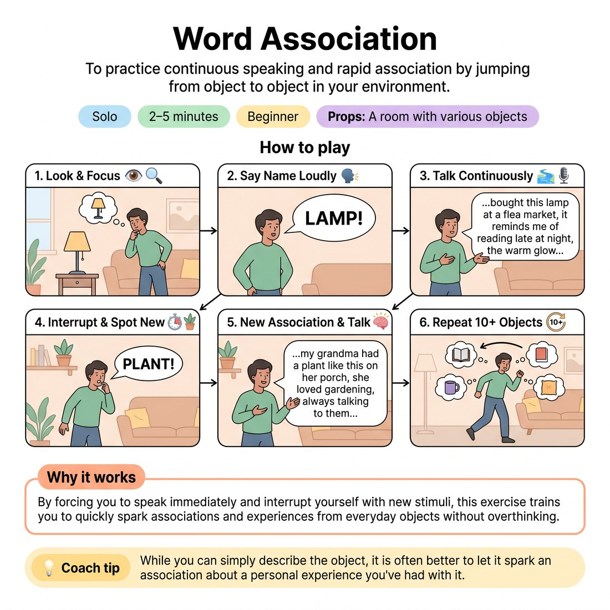

# 🧠 Word Association
> *To practice continuous speaking and rapid association by jumping from object to object in your environment.*

{ .infographic }

`🧑 Solo` · `⏱️ 2–5 minutes` · `📈 Beginner` · `🎒 A room with various objects`

**Trains:** Word association · spontaneity · continuous talking · Free association · storytelling

## 🎯 Objective
To practice continuous speaking and rapid association by jumping from object to object in your environment.

## ▶️ How to play
1. Look around the room and focus on an object.
2. Say the name of the object out loud.
3. Without pausing, immediately begin to talk about that object.
4. After about ten seconds, interrupt yourself by saying the name of another object out loud.
5. Without pausing, start talking about something associated with that new object.
6. Repeat this process for at least ten objects (or as long as you like).

## 🔁 Variations
- **Another way to play it:** Identify an object in the room or come up with a random word off the top of your head. Say the word out loud (e.g., "ocean"). Without pausing, immediately launch into a story or association about that word.
- **Advanced:** Don't rely on objects in the room. Instead, come up with disparate words off the top of your head (e.g., *Bible, puppy, envy, frog gigging, cigar*). Really make the words different.

## 💡 Why it works
By forcing you to speak immediately and interrupt yourself with new stimuli, this exercise trains you to quickly spark associations and experiences from everyday objects without overthinking.

## 🎓 Coach's tips
- While you can simply describe the object, it is often better to let it spark an association about a personal experience you've had with it.
- Don't worry about finishing your thought; just abruptly interrupt yourself after about ten seconds to move to the next object.
- Do not pause before you start talking.
- In the beginning, people will often say the word out loud, then repeat the word to give themselves a buffer before launching into the association. Try to avoid repeating the word.

---
`Solo Practice` · Theme: **Spontaneity & Free Association**  
[← Back to all solo exercises](index.md)

⬅️ *Prev:* [Dada Monologue](01_dada-monologue.md) · *Next:* [Write an Improvised Scene](03_write-an-improvised-scene.md) ➡️
