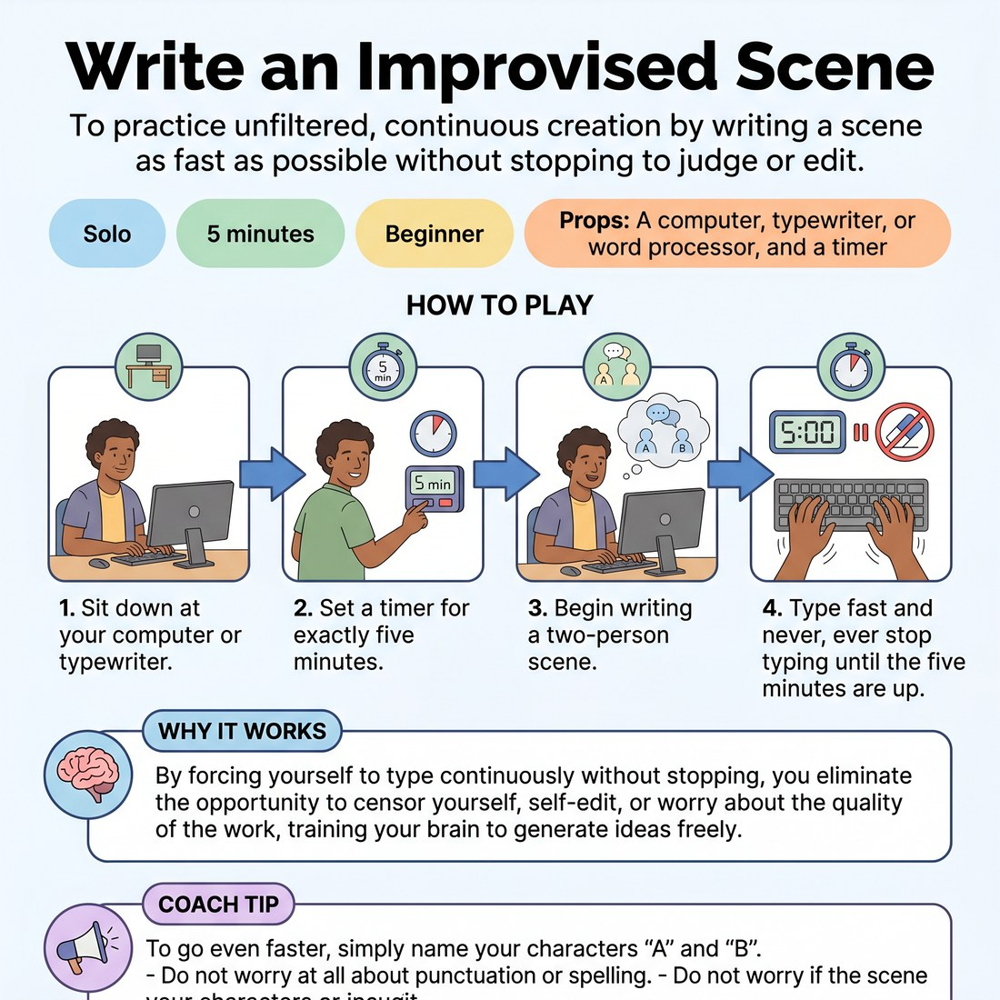

# 🧠 Write an Improvised Scene
> *To practice unfiltered, continuous creation by writing a scene as fast as possible without stopping to judge or edit.*

{ .infographic }

`🧑 Solo` · `⏱️ 5 minutes` · `📈 Beginner` · `🎒 A computer, typewriter, or word processor, and a timer`

**Trains:** Bypassing the inner censor · continuous creation · speed

## 🎯 Objective
To practice unfiltered, continuous creation by writing a scene as fast as possible without stopping to judge or edit.

## ▶️ How to play
1. Sit down at your computer or typewriter.
2. Set a timer for exactly five minutes.
3. Begin writing a two-person scene.
4. Type fast and never, ever stop typing until the five minutes are up.

## 💡 Why it works
By forcing yourself to type continuously without stopping, you eliminate the opportunity to censor yourself, self-edit, or worry about the quality of the work, training your brain to generate ideas freely.

## 🎓 Coach's tips
- To go even faster, simply name your characters "A" and "B".
- Do not worry at all about punctuation or spelling.
- Do not worry if the scene is bad or if it doesn't make sense.
- Depending on your typing speed, you should hit between three-quarters of a page to a page and a half.
- Be prepared for a workout—it is hard and your fingers will be tired at the end of the five minutes!

---
`Solo Practice` · Theme: **Spontaneity & Free Association**  
[← Back to all solo exercises](index.md)

⬅️ *Prev:* [Word Association](02_word-association.md) · *Next:* [Continuous Typing Exercise](04_continuous-typing-exercise.md) ➡️
