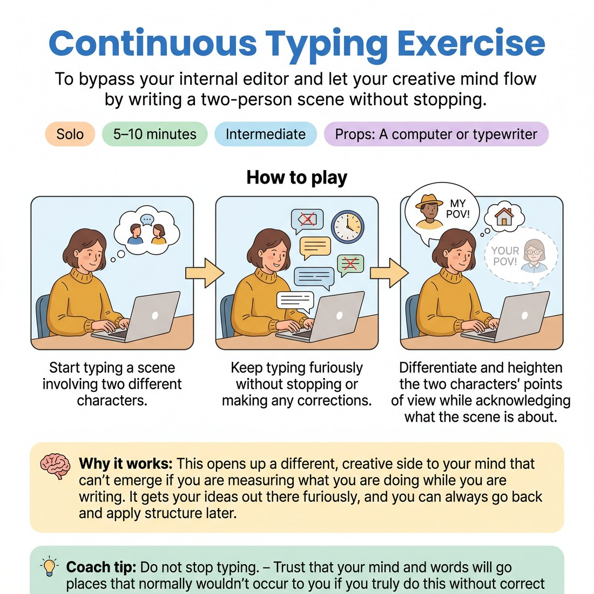

# 🧠 Continuous Typing Exercise
> *To bypass your internal editor and let your creative mind flow by writing a two-person scene without stopping.*

{ .infographic }

`🧑 Solo` · `⏱️ 5–10 minutes` · `📈 Intermediate` · `🎒 A computer or typewriter`

**Trains:** Unedited writing · character POV · heightening · flow

## 🎯 Objective
To bypass your internal editor and let your creative mind flow by writing a two-person scene without stopping.

## ▶️ How to play
1. Start typing a scene involving two different characters.
2. Keep typing furiously without stopping or making any corrections.
3. Differentiate and heighten the two characters' points of view while acknowledging what the scene is about.

## 💡 Why it works
This opens up a different, creative side to your mind that can't emerge if you are measuring what you are doing while you are writing. It gets your ideas out there furiously, and you can always go back and apply structure later.

## 🎓 Coach's tips
- Do not stop typing.
- Trust that your mind and words will go places that normally wouldn't occur to you if you truly do this without corrections.

---
`Solo Practice` · Theme: **Spontaneity & Free Association**  
[← Back to all solo exercises](index.md)

⬅️ *Prev:* [Write an Improvised Scene](03_write-an-improvised-scene.md) · *Next:* [Solo Character Switches](05_solo-character-switches.md) ➡️
