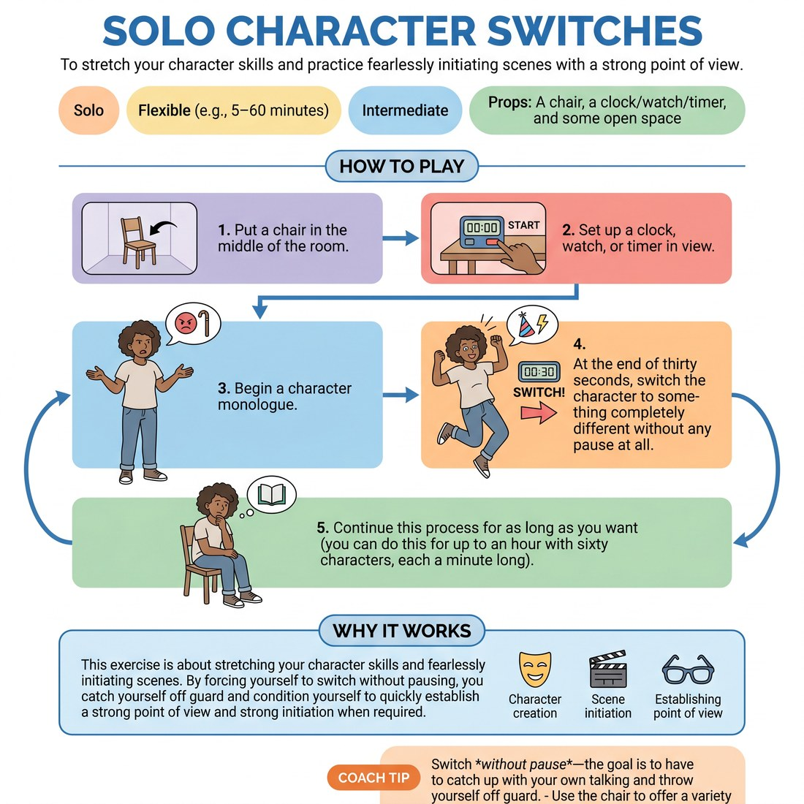

# 🎭 Solo Character Switches
> *To stretch your character skills and practice fearlessly initiating scenes with a strong point of view.*

{ .infographic }

`🧑 Solo` · `⏱️ Flexible (e.g., 5–60 minutes)` · `📈 Intermediate` · `🎒 A chair, a clock/watch/timer, and some open space`

**Trains:** Character creation · scene initiation · establishing point of view

## 🎯 Objective
To stretch your character skills and practice fearlessly initiating scenes with a strong point of view.

## ▶️ How to play
1. Put a chair in the middle of the room.
2. Set up a clock, watch, or timer in view.
3. Begin a character monologue.
4. At the end of thirty seconds, switch the character to something completely different without any pause at all.
5. Continue this process for as long as you want (you can do this for up to an hour with sixty characters, each a minute long).

## 🔁 Variations
- Write down character types (such as "Russian dancer" or "crazy clown") on slips of paper and put them in a hat. Alternate between drawing a character type from the hat and making one up on the spot.

## 💡 Why it works
This exercise is about stretching your character skills and fearlessly initiating scenes. By forcing yourself to switch without pausing, you catch yourself off guard and condition yourself to quickly establish a strong point of view and strong initiation when improvising with a partner.

## 🎓 Coach's tips
- Switch *without pause*—the goal is to have to catch up with your own talking and throw yourself off guard.
- Use the chair to offer a variety of physical space. Have some of the characters on their feet and others sitting.
- Variety of character is the key. If you notice your last two characters were quiet, make the next one loud.
- Be prepared: this is a physically strenuous exercise!

---
`Solo Practice` · Theme: **Character & Point of View**  
[← Back to all solo exercises](index.md)

⬅️ *Prev:* [Continuous Typing Exercise](04_continuous-typing-exercise.md) · *Next:* [Character Interview](06_character-interview.md) ➡️
